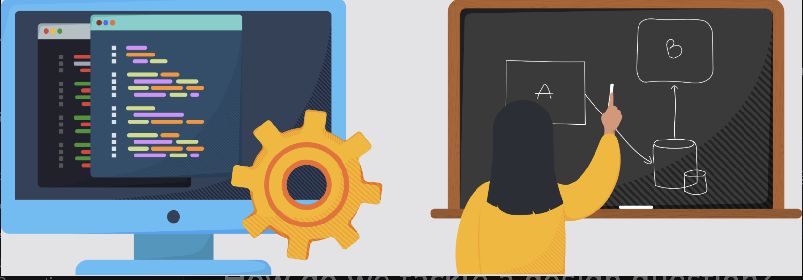

# What is System Design Interview?

Learn about system design interviews (SDIs) and how to strategically approach them.

> We'll cover the following:
>
> - How are SDIs different from other interviews?
> - How do we tackle a design question?
>   > - Present the high-level design
> - Possible questions for every SDI
>   > - The design evolution of Google
>   > - Design challenges
>   > - The responsibility of the designer
> - Who gets a system design interview?
> - Theory and practice
>
> We highlight different aspects of a system design interview (SDI) and some helpful tips for those who are preparing for an upcoming interview.
>
> Some of the topics covered in this chapter can be applied broadly.

## How are SDIs different from other interviews?

> Just like any other interview, approach the system design interview strategically.
>
> SDIs are different from coding interviews. There's rarely any coding required in this interview.
>
> 

An SDI takes place at a much higher level of abstraction.  
We figure out the requirements and map them on to the computational components and the high-level communication protocols that connect these subsystems.

The final answer doesn't matter. What matters is the process and the journey that a good applicant takes the interviewer through.

> **NOTE:** As compared to coding problems in interviews, system design is more aligned with the tasks we'll complete on our jobs.

## How do we tackle a design question?

Design questions are open ended, and they're intentionally vague to start with. Such vagueness mimics the reality of modern day business.

> Interviewers often ask about a well-known problem, - for exmaple, designing WhatsApp.  
> Now, a real WhatsApp application has numerous features, and including all of them as requirements for our WhatsApp clone might not be a wise idea due to the following reasons:
>
> - First, we'll have limited time during the interview.
> - Second, working with some core functionalities of the system should be enough to exihibit our problem-solving skills.
>
> We can tell the interviewer that there are many other things that a real WhatsApp does that we don't intend to include in our design. If the interviewer has any objections, we can change our plan of action accordingly.

Here are some best practice that we should follow during a system design interview:  
 

- An applicant should ask the right questions to solidify the requirements.
- Applicant also need to scope the problem so that they're able to make a good attempt at solving it within the limited time frame of the interview. (SDIs are usually about 35-40 minutes long.)
- Communication with the interviewer is critical.  
  It's not a good idea to silently work on the design. Instead, applicant should engage with the interviewer to ensure that they understand our thought process.

#### Present the high-level design

> At a high level, components could be frontend, load balancers, caches, data processing, and so on. System design tells us how these components fit together.
>
> An architectural design often represents components as boxes. The arrows between these boxes represent who talks to whom and how the boxes or components fit together collectively.
>
> 
>
> we can draw a diagram like the one for the given problem and present it to the interviewer.

## Possible question for every SDI

> SDIs often include questions related to how a design might evolve over time as some aspect of the system increases by some order of magnitude - example, number of users, number of queries per second, and so on.
>
> It's commonly believed in the system community that when some aspect of the system increases by a factor of ten or more, the same design might not hold and might require change.

Designing and operating a bigger system **requires careful thinking** because designs often don't linearly scale with increasing demands on the system.

Another question in an SDI might be related to why we don't design a system that's already capable of handling more work than necessary or predicted.  
 The dollar cose associated with complex projects is a major reason why we don't do that.

#### The design evolution of Google

The design of the early version of Google Search may seem simplistic today, but it was quite sophisticated for its time.  
It also kept costs down, which was necessary for a startup like Google to stay afloat.  
The upshot is that whatever we do as designers have implications for the business and its customers.

We need to meet or exceed customer needs by efficiently utilizing resources.

#### Design challenges

Things will change, and things will break over time because of the following:

- There's no single correct approach or solution to a design problem.
- A lot is predicted on the assumption we make.

#### The responsibility of the designer

As designers, we need to provide fault tolerance at the design level because almost all modern systems use off-the-self components, and there are millions of such components.  
 So, something will always be breaking down, and we need to hide this undesirable reality from our customers.

## Who gets a system design interview?

Traditionally, mid-to-senior level candidates with more than two years of experience get at least one system design interview.  
For more senior applicants, two or three system design interviews are common.

It's never too early to learn system design to grow or even expedite our careers.

## Theory and practice

Most of the theory of system design comes from the domain of distributed systems.

Distributed systems give us guideposts for mature software principles. These include the following:

- Robustness (the ability to maintain operations during a crisis)
- Scalability
- Availability
- Performance
- Extensibility
- Resiliency (the ability to return to normal operations over an acceptable period of time post disruption)

> Such terminology also act as a lingua franca between the interviewer and candidate.
>
> As an example, we might say that we need to make **a trade-off between availability and consistency when network components fail** _because the CAP theorem indiacates that we can't have both under network partitions._
>
> Such common language helps with communication and shows that we're well versed in both theory and practice.

Remember: It's a candidate's job to exhibit their skills to the interviewer.
