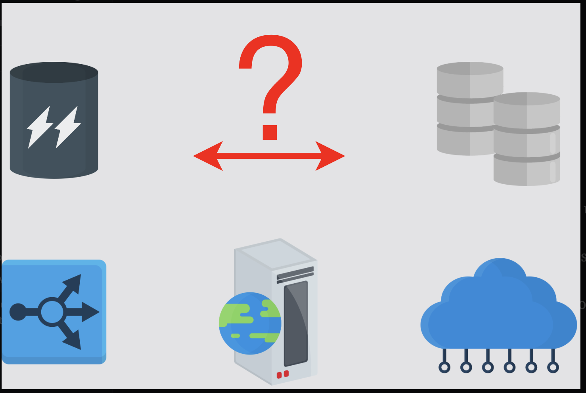

# How to perform well

Learn some helpful tips on how to perform during a system design interview.

> We'll cover the following:
>
> - What to do during the interview.
>
>   > - Strategize, then divide and conquer.
>   > - Ask refining questions.
>   > - Handle data.
>   > - Discuss the components.
>   > - Discuss trade-offs.
>
> - What not to do in an interview.

## What to do during the interview

- Stress that a candidate should make an effort to avoid looking unoriginal.
- At the same time, an interview can be a stressful situation. Having a plan to attack the problem might be a good strategy.
  > Depending on the candidate, there can be multiple strategies to attack a design problem.
  >
  > We suggest the following technique:
  >
  > ### Strategize, then divide and conquer
  >
  > We recommend including the following activities somewhere in the interview:
  >
  > 
  >
  > ### Ask refining questions
  >
  > We need to understand the design problem and its requirements.
  >
  > To do this, we can put on our product manager hat and prioritize the main features by asking the interviewer refing questions.
  >
  > The idea is to go on a journey with the interviewer about why our design is good.

These interviews are designed to guage if we're able to logically derive a system out of vague requirements.

Often, it helps to divide the requirements into two groups:

- Requirements that the clients need directly - eg: the ability to send messages in near real-time to friends.
- Requirements that are needed indirectly - eg: messaging service performance shouldn't degrade with increasing user load.

> **Note:** Professionals call these functional and nonfunctional requirements.

## Handle data

We need to identify and understand data and its characteristics in order to look for appropriate data storage systems and data processing components for the system design.

> Some important questions to ask ourselves when searching for the right systems and components include the following:
>
> 
>
> - What's the size of the data right now?
> - At what rate is the data expected to grow over time?
> - How will the data be consumed by other subsystems or end users?
> - Is the data read-heavy or write-heavy?
> - Do we need strict consistency of data, or will eeventual consistency works?
> - What's the durability target of the data?
> - What privacy and regulatory requirements do we require for storing or transmitting user data?

## Discuss the components

At some level, our job might be perceived as figuring out which components we'll use, where they'l be placed, and how they'll interact with each other.

An example could be the type of database - will a conventional database work, or should we use a NoSQL database?

> There might be cases where we have strong arguments to use NoSQL databases, but our interviewer may insist that we use a traditional database. What should we do in such a case?
>
> > As designers, we'd have a harder job because we'd need to use a traditional database and do extra work to ameliorate the shortcomings or challenges.  
> > In this case, we'd have invented a new component.
>
> Such interactions during interviews are also excellent oppurtunities to exhibit our design skills.

**Note:** We often abstract away the details of the components as boxes and use arrows to show the interactions between them.

It might help to define the user-facing APIs at a high level to further understand system data and interaction requirements.  
 Front-end components, load balancers, caches, databases, firewalls, and CDNs are just some examples of system components.

## Discuss trade-offs

> Remember that there's not one correct answer to a design problem. If we give the same problem to two different groups, they might come up with different designs.

There are some of the reasons why such diversity exists in design solutions:

- **Different components have different pros and cons.** We'll need to carefully weigh what works for us.
- **Different choices have different costs** in terms of money and technical complexity. We need to effeciently utilize our resources.
- **Every design has its weakness.** As designers, we should be aware of all of them, and we should have a follow-up plan to tackle them.

We should point out weakness in our design to our interviewer and explain why we haven't tackled them yet.

> An example could be that our current design can't handle ten times more load, but we don't expect our system to reach that level anytime soon.
>
> We have a monitoring system to keep a very close eye on load growth over time so that a new design can be implemented in time. This is an example where we intentionally had a weakness to reduce system cost.

Something is always failing in a big system. We need to integrate fault tolerance and security into our design.

## What not to do in an interview

Here are a few things that we should avoid doing in a system design interview:

- Don't write code in system design interview.
- Don't start building without a plan.
- Don't work in silence.
- **Don't describe numbers without reason.** We have to frame it.
- If we don't know something, we don't paper over it, and we don't pretend to know it.

> **NOTE:** If an interviewer asks us to design a system we haven't heard of, we should just be honest and tell them so. The interviewer will either explain it to us or they might change the question.
