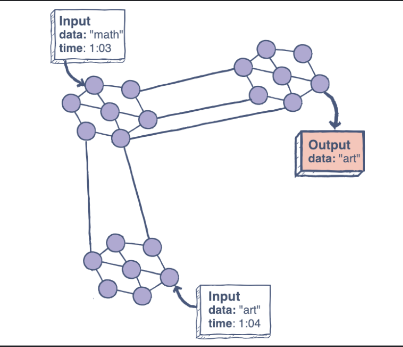
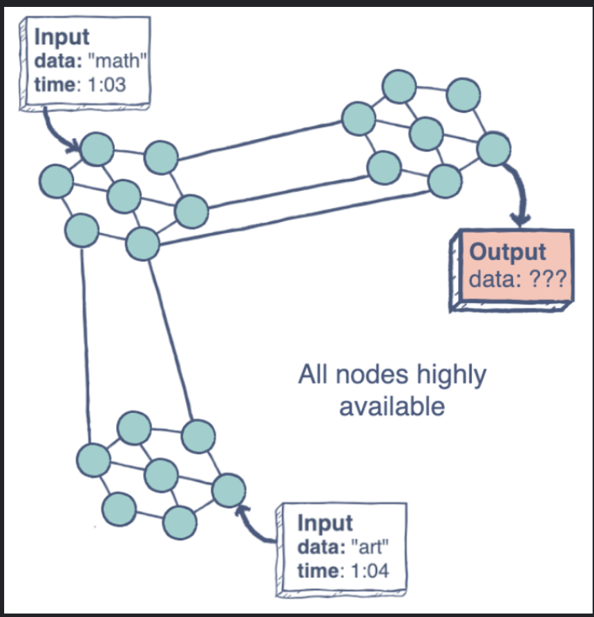

# What is CAP theorem?

The **CAP theorem** (also called **Brewer's theorem**) states that a distributed database system can only guarantee two out of these three characteristics:  
 Consistency, Availability, and Partition Tolerance.

## Consistency

A system is said to be consistent if all the nodes see the same data at the same rate.

Simply, if we perform a read operation on a consistent system, it should return the value of the most recent write operation. This means that, the read should cause all nodes to return the same data, i.e., the value of the most recent write.

## Availability

Availability in a distributed system ensures that the system remains operational 100% of the time.  
 Every request gets a (non-error) response regardless of the individual state of a node.

Note: this does not gurantee that the response contains the most recent write.

## Parition Tolerance

This condition states that the system does not fail, regardless of if messages are dropped or delayed between nodes in a system.

Partition tolerance has become more of a necessity than an option in distrinuted system.  
 It is made sufficiently replicating records across combinations of nodes and networks.

## Trade-offs

In the CA (Consistency and Availability) scenerio, the focus on achieving both data consistency and system availability, with trade-offs including potential performance adjustments to maintain data accuracy.

The CP (consistency and partition) scenerio emphasizes maintaining data consistency even during network partitions, potentially leading to temporary unavailability to uphold data integrity.

Finally, the AP (availability and partition) scenerio prioritizes system availability despite network disruptions, accepting temporary data deviations to maintain operational resilience.

> Each scenerio presents distinct trade-offs that influenve the priorities of distributed systems in balancing consistency, availability, and partition tolerance.

To understand how to balance between Consistency, Availability and Partition in detail.

---

# CAP theorem: Consistency, availability, and partition tolerance

The CAP theorem, which abbreviates consistency, availability, and partition tolerance, posits that in a distributed system, it’s typically possible to achieve two out of these three properties concurrently. This theorem highlights the trade-off between maintaining consistency and ensuring availability in the presence of network partitions. This means that we can achieve at most two out of the three properties at the same time.

This principle is also referred to as Brewer’s theorem, because it was originally put forth by Eric Brewer, a computer science professor at U.C. Berkeley.

In short, this theorem suggests that at any given point in time, multiple nodes in a distributed system share a single state while performing their operations concurrently.

Let’s delve into the meaning behind each abbreviation, i.e. consistency, availability, and partitions.

Consistency
Consistency entails the concept that within a distributed system, all nodes possess identical data at any specific moment, regardless of the node from which a read or write action occurs. This ensures that regardless of where we interact with the system, we’ll always receive the most up-to-date and consistent information.

Availability
Availability relates to the uninterrupted movement of data, regardless of nodes that might fail. The entire distributed network should uphold its operational capabilities, even when several nodes are not responding due to setbacks. This ensures that the system remains functional and responsive even when certain parts of it encounter difficulties.

Partition tolerance
Partition tolerance refers to the ability of a distributed system to handle situations where communication is temporarily disrupted between its nodes. This disruption could be caused by network issues or node failures. For a distributed system to be partition tolerant, it means it can navigate around these interruptions, ensuring that even if some nodes are not able to communicate with each other for a while, the system can still function and carry out read and write operations. This is important because it allows the system to maintain its overall operation and data consistency even when there are temporary communication glitches or node failures.

Trade-offs
In the domain of the CAP theorem, three distinctive scenarios present themselves, each encompassing a set of trade-offs that influence the priorities of a distributed system, i.e., consistency and availability (CA), consistency and partition tolerance (CP), and availability and partition tolerance (AP).

Consistency and availability
This scenario revolves around achieving both consistency and availability. This aspiration entails ensuring that all nodes within the system maintain an identical dataset at any given instance, while simultaneously being responsive to read and write requests. However, this pursuit might necessitate certain performance or response time adjustments, particularly during periods of network instability or partition. The objective is to prioritize data accuracy and coherence, even if it requires temporary deviations in performance to maintain uniformity.

Consistency and partition tolerance
This scenario emphasizes the alignment of consistency and partition tolerance. In this context, the central objective revolves around sustaining a consistent view of data across nodes, even in the face of network partitions. The system’s commitment to maintaining data uniformity remains steadfast, even when some nodes experience temporary disconnections. Consequently, the system might opt for temporary unavailability during instances where it can’t ensure the preservation of data integrity due to network challenges. The trade-off here is the restriction of certain read and write operations to uphold the overarching goal of consistency.

Availability and partition tolerance
This scenario prioritizes availability and partition tolerance. In this landscape, the primary focus centers on the system’s capability to remain operational and accessible despite network partitions. The system strives to respond to read and write requests, preserving its functionality and responsiveness even during instances of communication disruptions between nodes. However, the pursuit of availability might lead to a compromise in stringent data consistency. During network partitions, data inconsistencies might arise across nodes. The system’s resilience and availability during challenging conditions are the primary goals, accepting temporary data deviations to maintain operational prowess.
