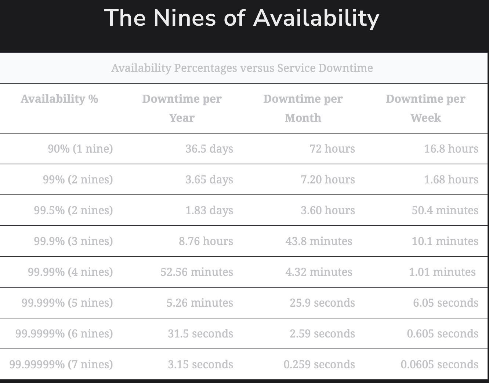

# Availability

Learn about availability, how to measure it, and its importance.

> We'll cover the following:
>
> - What is availability?
>   > - Measuring availability
>   > - Availability and service providers

## What is availability?

Availability is the percentage of time that some service or infrastructure is accessible to clients and is operated upon under normal conditions.  
 For example, if a service has 100% availability, ite means that the service functions and responds as intended (operates normally) all the time.

### Measuring availability

> Mathematically, availability, A, is a ratio.  
>  The higher the A value, the better.  
>  We can also write this up as a formula:
>
> A(in percent) = (Total Time - Amount Of Time Service Was Down) \* 100 / (Total time)

We measure availability as number of nines. The following table shows how much downtime is permitted when we're using a given number of nines.

### Availability and service providers

Each service provider may start measuring availability at different pointes in time.

> Some cloud providers start measuring it when they first offer the service, while some measure it for specific clients when they start using the service.
>
> Some providers might not reduce their reported availability numbers if their service was not down for all the clients.
>
> The planned downtimes are excluded.
>
> Downtime due to cycberattacks might not be incorporated into the calculation of avilability.
>
> Therefore, we should carefully understand how a specific provider calculate their availability numbers.
