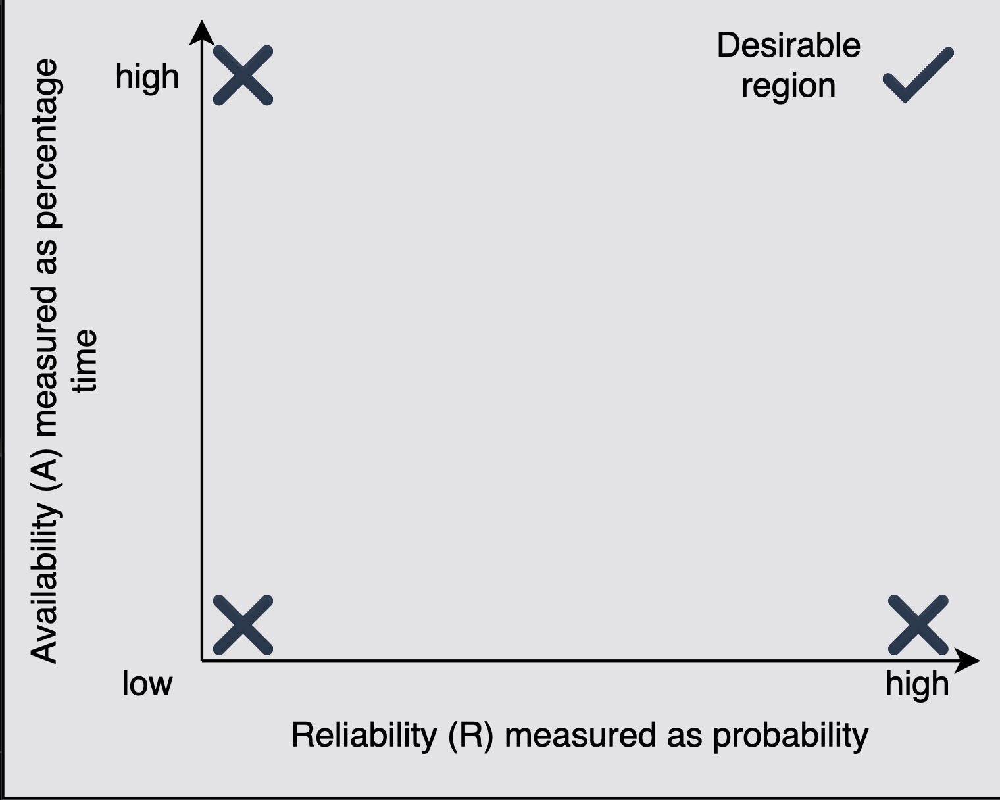

# Reliability

Learn about reliability, how to measure it, and its importance.

> We'll cover the following:
>
> What is reliability?
>
> > - Reliability and availability

## What is reliability?

Reliability, R, is the probablity that service will perform its functions for a specified time.  
 R mesures how the service performs under varying operating conditions.

We often use **mean time between failures (MTBF) and mean time to repair (MTTR)** as metrics to measure R.

MTBF = (Total Elapsed Time - Sum of Downtime) / Total Number of Failures

MTTR = (Total Maintenance Time) / (Total Number of Repairs)

(We strive for a higher MTBF value and a lower MTTR value.)

### Reliability and availability

Reliability and availability are two important metrics to measure compliance of service to agreed-upon **service level objectives (SLO).**

> The measurement of availability is driven by time loss, whereas the frequency and impact of failures drive the measure of reliability.
>
> Availability and reliability are essential because they enable the stakeholders to assess the health of the service.

> Reliability(R) and availability(A) are two distinct concepts, but they are related.
>
> Mathematically, A is a function of R. This means that the value of R can change independently, and the value of A depends on R. .
>
> Therefore, it's possible to have situations where we have:
>
> > - low A, low R
> > - Low A, high R
> > - high A, low R
> > - high A, high R (desirable)
>
> 

> **NOTE:** There are many variations of the MTBF metric, such as mean time to failure (MTTF).
>
> > Usually, we use MTTF instead of MTBF for those cases where a failed component is replaced due to irreparable problem. A bad disk or a failed bulb are examples of irreparable faults where a replacement is required.

---

### POINT TO PONDER

What is the difference between reliability and availabilty?

> Reliability measures **how well a system performs its intended operations** (functional requirements).
>
> We use averages for that (Mean Time to Failure, Mean Time to Repair, etc.)

> Availability measures **the percentage of time a system accepts requests and reponds to clients.**
>
> Example 1: A certain system may be 90% available but only reliable 80% of the time.
>
> Example 2: Suppose we consider our "system" the stuff inside a data center (hardware + software). Let's assume this data center suffers a network failure such that no outside traffic is coming in and no insider traffic is going out.  
>  In this case, instantenous availability might be zero (bacause clients cannot reach the service) even though inside the data center, all systems are perfectly functioning (instantaneous reliability 100%).

We use both of them (reliability and availability) in different contexts.  
 For example, storage vendors often quote MTTF for their disks.  
 Most online services use uptime (as a measure of availability) in their SLAs. For example, the uptime of EC2 virtual machines is 99.5%.

---
