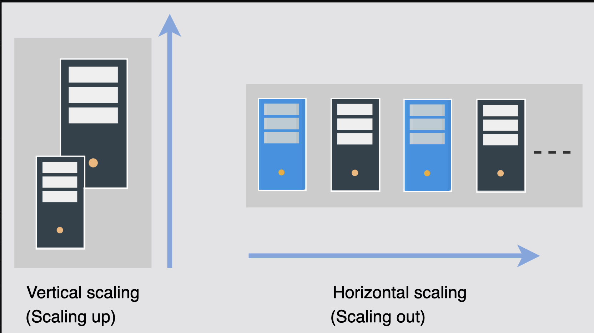

# Scalability

Learn about sacalabilty and its importance in system design.

> We'll cover the follwing:
>
> - What is scalability?
>   > - Dimensions
>   > - Different approaches of scalability
>   >   > - Vertical scalability - scaling up
>   >   > - Horizontal scalability - scalung out

## What is scalability?

Scalability is the ability of a system to handle an increasing amount of workload without compromising performance.
A search engine, for example, must accomodate increasing numbers of users, as well as the amount of data it indexes.

The workload can be different types, including the following:

- **Request workload:** This is the number of requests served by the system.
- **Data/storage workload:** This is the amount of data stored by the system.

### Dimensions

Here are the different dimensions of scalability:

- **Size scalability:** A system is scalable in size if we can simply add additional users and resources to it.
- **Administrative scalability:** This is the capacity for a growing number of organization or users to share distributed with ease.
- **Geographical scalabilty:** This relates to how easily the program can cater to other regions while maintaining acceptable performance constraints. In other words, the system can readily service a broad geographical region, as well as a smaller one.

### Different approaches of scalability

Here are different ways to implement scalability.

#### Vertical scalability -- scaling up

Vertical scaling, also known as **"scaling up"**, refers to scaling by providing additional capabilities (for example, additional CPUs or RAM) to an existing device.  
 Vertical scaling allows us to expand our present hardware or software capacity, but we can only grow it to the limitations of our server.

The dollar cost of vertical scaling is usually high because we might need exotic components to scale up.

#### Horizontal scalability -- scaling out

Horizontal scaling, also known as "scaling out", refers to increasing the number of machines in the network.  
 We use commodity nodes for this purpose because of their attractive dollar-cose benefits.

The catch here is that we need to build a system such that **many nodes could collectively work as if we had a single, high server.**

