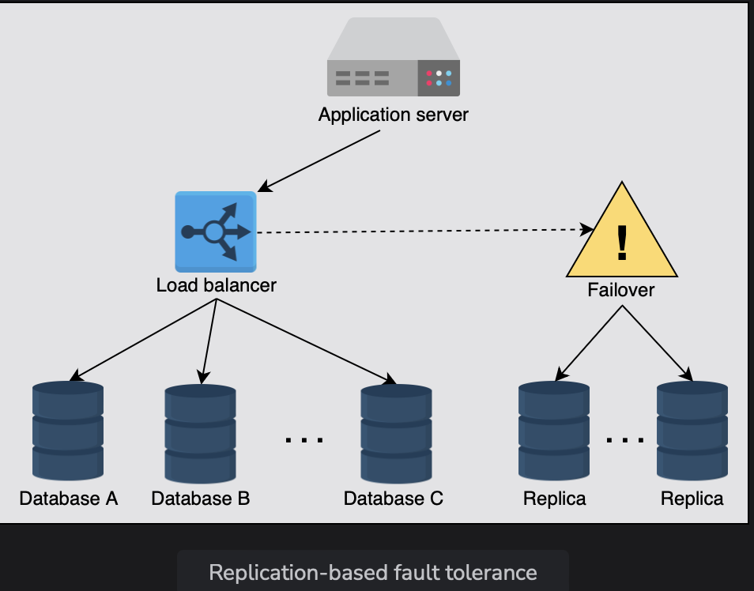
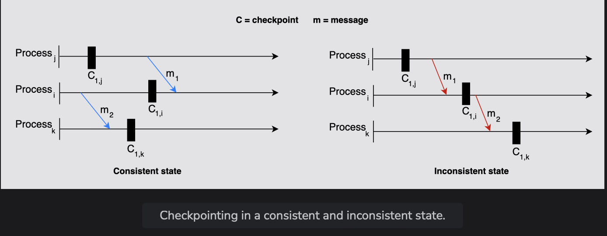

# Fault Tolerance

Learn about fault tolerance, how to measure it, and its importance.

> We'll cover the follwing:
>
> - What is fault tolerance?
>   > - Fault tolerance techniques
>   >   > - Replication
>   >   > - Checkpointing

## What is fault tolerance?

Real-world, large-scale applications run hundreds of servers and databases to accomodate billions of users' requests and store significant data.  
 These applications need a mechanism that helps with data safety and eschews the recalculation of computationally intensive tasks by avoiding a single point of failure.

Fault tolerance refers to a system's ability to execute persistently even if one or more of its components fail. Here, components can be software or hardware.  
 Conceiving a system that is hundred percent fault-tolerant is practically very difficult.

Let's discuss important features for which fault-tolerance becomes a necessity.

- Availability focuses on receiving every client's request by being accessible 24/7.
- Relaibility is concerned with responding by taking specified action on every client's request.

### Fault tolerance techniques

Failure occurs at the hardware or software level, which eventually affects the data.  
 Fault tolerance can be achieved by many approaches, considering the system structure.

Let's discuss the techniques that are significant and suitable for most designs.

#### Replication

One of the most widely-used techniques is **replication-based fault tolerance.**  
 With this technique, we can replicate both the services and data.  
 We can swap out failed nodes with healthy ones and a failed data store with its replica.  
 (a large system can transparently make the switch without impacting the end customers.)

> We create multiple copies of our data in seperate storage. All copies need to update regularly for consistency when any update occurs in the data.  
>  Updating data in a replica is a challenging job.
>
> When a system needs strong consistency, we can synchronously update data in replicas.  
>  However, this reduces the availability of the system.
>
> We can also asynchronously update data in replicas when we can tolerate eventual consistency, resulting in stale reads until all replicas converge.
> Thus, there is a trade-off between both consistency approached.
>
> We compromise either on availability or on consistency under failures - a reality that outlined in the CAP theorem.
>
> 

#### Checkpointing

Checkpointing is a **technique that saves the system's state in stable storage for later retrieval in case of failures** due to errors or service disruptions.

Checkpointing is a fault tolerance technique performed in many stages at different time intervals.  
 When a distributed system fails, we can get the last computed data from the previous checkpoint and start working from there.

Checkpointing is performed for different individual processes in a system in such a way that they represent a global state of the actual execution of the system.

Depending on the state, we can divide checkpointing into two types:

- **Consistent state:** A state is consistent in which all the individual processes of a system have a consistent view of the shared state or sequece of events that have occurred in a system.
  Snapshots taken in consistent states have data in coherent states, representing a possible situation of the system.
- **Inconsistent state:** This is a state where there are discrepancies in the saved state of different processes of a system. In other words, the checkpoints across different processes are not coherent and coordinated.

> Let's look at an example to understand consitent and inconsistent states in a better way. Consider three processes represented by i, j, and k. Two messages, m1 and m2, are exchanged between the processes. Other than that, we have one snapshot/checkpoint saved for each process represented by C1i, C1j, and C1k, where 1 represents the number of snapshots for a process and the lowercase letter represents the process itself.
>
> 
>
> In the illustration on the left, the first checkpoints at processes j and i are consistent because m1 is sent and received after the checkpoints.  
>  On the contrary, in the right-hand illustration, the first checkpoint at process j doesn't know about m1, while the first checkpoint at process i recorded the reception of message m1.
>
> Therefore, it's an inconsistent state.
>
> The left-hand illustration represents a consistent state also because no communication is being performed among the processes when the system performs checkpointing.
> On the right side, we can see that the process communicate through messages when the system performs checkpointing.
