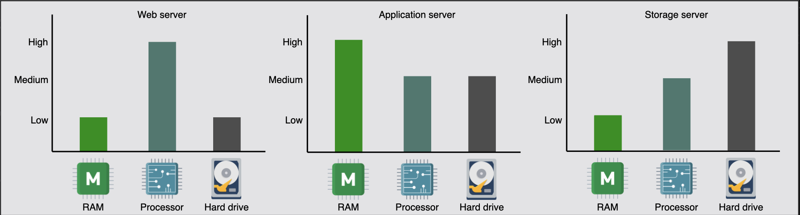
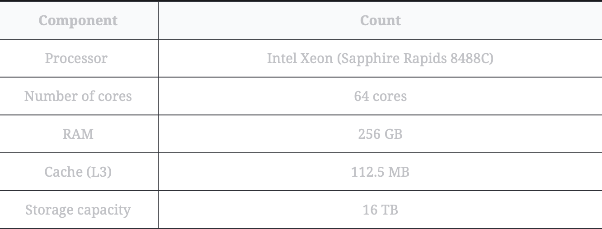
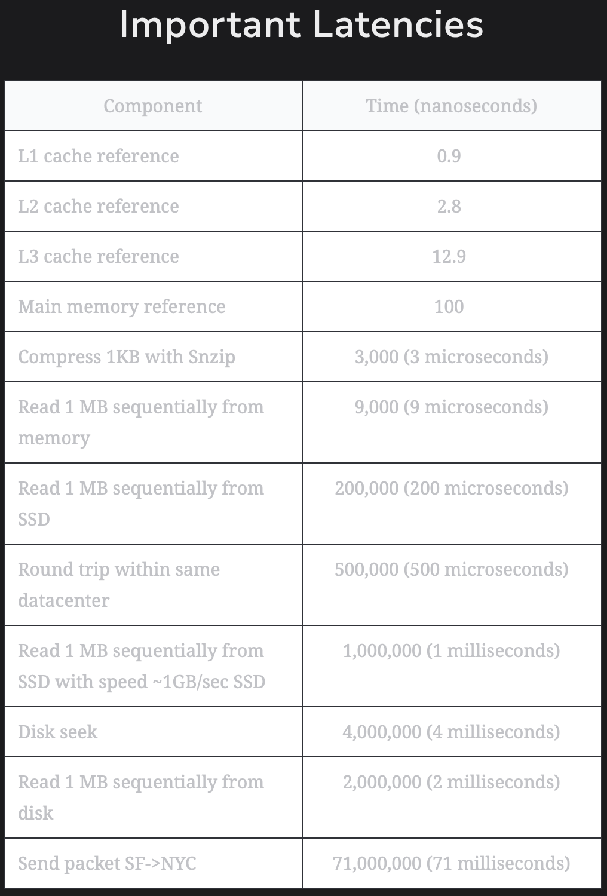

# Put Back-of-the-envelope Numbers in Perspective

Learn to use appropriate numbers in back-of-the-envelope calculations.

> We'll cover the following:
>
> - BOTECs in system design
>   > - Types of data center servers
>   >   > - Web servers
>   >   > - Application servers
>   >   > - Storage servers
>   > - Standard numbers to remember
>   > - Request types
> - Abstracting away the complexities of real system
>   > - Request estimation in system design

Back-of-the-envelope calculations (BOTECs) involve swift, approximate, and simplified estimations or computations typically done on paper or, figuratively, on the back of an envelope.  
 While these calculations are not intended to yield precise results, they function as a quick and preliminary evaluation of crucial parameters and the feasibility of a system.

> For example, let's say we're in a city and want to estimate the population of a particular neighborhood. We could count the number of houses in a sample area, estimate the average number of people per household, and then extrapolate to the whole neighborhood.  
>  Similar calculatios can be used to check the validity of census data for some neighborhoods.

## BOTECs in system design

A modern system is a complex web of computational resources connected via a network.  
 Different kinds of nodes, such as load balancers, web servers, application servers, caches, in-memory databases, and storage nodes, collectively serve the clients.

Such a system might be architected in different ways, including a **monolothic architecture, a modular monolith architecture, or a microservices architecture.**  
 Precisely considering such richness at the design level (especially in an interview) isn't advisable, and sometimes, it's impossible.

**BOTECs help us ignore the nitty-gritty details of the system (at least at the design level) and focus on more important aspects, such as finding the feasibility of the service in terms of computational resources.**

> Some examples where we often need BOTECs are the following estimations:
>
> - The number of concurrent TCP connections a server can support.
> - The number of requests per second (RPS) a web, database, or cache server can handle.
> - The storage requirements of a service.
>
> Using BOTECs, we abstract away the messy details specific to different kinds of servers used in the actual system, the different access latencies of system components, different throughput rates, and the different types of requests.
>
> As we move forward, we'll first look into these different server types, access latencies, throughput numbers, and request types to know the reality of the systems and see how complex they are.
>
> Then, abstracting away these details, we'll learn to estimate the number of RPS a server can handle. Finally, we'll practice bandwidth, servers, and storage estimation examples.

### Types of data center servers

Data centers don't have a single type of server. Enterprise solutions use commodity hardware to save costs and develop scalable solutions. Below, we discuss the types of servers that are commonly used within a data center to handle different workloads.

>   
> An approximation of the resources required on the web, application, and storage layer of the server, where the y-axis is a categorical axis with data points indicating levels of low, medium, and high resource requirements.

##### Web servers

For scalability, web servers are decoupled from application servers.

- Web servers are the first point of contact after load balancers.
- Data centers have racks full of web servers that usually handle API calls from clients.
- Depending on the service that's offered, the memory and storage resources in web servers can be small to medium.  
   However, such servers require good processing resources.

> For example, Facebook has used a web server with 32 GB of RAM and 500 GB of storage space in the past.

##### Application servers

Application servers **run the core application software and business logic.**  
(the difference between web servers and application servers is somewhat fuzzy)

> Application servers primarily provide dynamic content, whereas web servers mostly serve static content to the client.
>
> They can require extensive computational and storage resources.  
>  (Storage resources can be volatile and nonvolatile.)
>
> Facebook has used application servers with a RAM of up to 256 GB and two types of storage - traditional rotating disks and flash - with a capacity of up to 6.5 TB.

##### Storage servers

With the explosive growth of Internet users, the amount of data stored by giant services has multiplied. Additionaly, various types of data are now being stored in different storage units.

> For instance, YouTube uses the following data stores:
>
> 1. **Blob storage:** This is used for its encoded videos.
> 2. **Temporary processing queue storage:** This can hold a few hundred hours of video content uploaded daily to YouTube for processing.
> 3. **Bigtable:** This is a specialized storage used for storing a large number of thumbnails of videos.
> 4. **Relational database management system (RDBMS):** This is for users' and videos' metadata (comments, likes, user channels, and so on).
>
> Other data stores are still used for analytics, for example, Hadoop's HDFS.  
>  Storage servers mainly include structured (SQL) and nonstructured (NoSQL) data management system.
>
> Returning to the example of facebook: they've used servers with a storage capacity of up to 120 TB.  
>  With the number of servers in use, Facebook is able to house exabytes of storage.  
>  (One exabyte is 10\*\*18 bytes. By convention, we measure storage and network bandwidth in base 10, and not 2.)  
> However, the RAM of these servers is only 32 GB.

**NOTE:** The servers described above aren't the only types of servers in a data center.  
 Organizations also require servers for services like **configuration, monitoring, load balancing, analytics, accounting, caching, and so on.**

> We need a reference point to ground our calculations. In the table below, we depict the capabilities of a typical server that can be used in the data centers of today:  
>  

### Standard numbers to remember

A lot of effort goes into the planning and implementation of a service. But without any basic knowledge of the kinds of workloads machines can handle, this planning isn't possible.

Latencies play an important role in deciding the amount of workload a machine can handle.  
 The table below depicts some of the important numbers system designers should know in order to perform resource estimation.  
 

**Remember the _order of magnitude_ difference between different components and operations is more important than remembering the exact numbers.**  
 For example, we should know that doing IO-bound work (reading 1 MB data sequentially from SSD disk) is two orders of magnitude slower than CPU-bound work (compressing 1 KB data as snzip).  
 (you might be wondering why the data sizes are different in the comparison!)

> As long as the data compress is readily available to the processor from L1, L2, L3 caches, the time to compress will be relatively consistent.  
>  The data up to the size of the L3 cache of the server (which is normally a few MBs - 45 MBs for a typical server, as mentioned above) fits entirely within the cache, and therefore, compressing data up to this limit will take almost the same time.
>
> This is because the processor can quickly access the data from the cache without incurring the additional latency associated with fetching data from slower levels of memory or storge.
>
> Apart from the latencies listed above, throughput numbers are measured as queries per second (QPS) that a typical single-server datastore can handle.
>
> 
>
> The numbers above are approximations and vary greatly depending on a number of reasons, like the type of query (**point and range**), the specification of the machine, the design of the database, the indexing, the load on the server, and so on...

> **NOTE:** For real projects, initial design use BOTECs similar to the ones we use in a system design interview. As the design goes through iterations for real products, we might use reference numbers from some sysnthetic workload that match our requests (for example, spec int for CPU characteristics and TPC-C for measuring database transactions per unit time).  
>  Initial prototypes are used to validate design-level assumptions. Later on, built-in monitoring of resources and demand is carefully analyzed to find any bottlenecks and for future capacity planning.

---

> Question 1: With reference to the throughput numbers given above, what will be your reply if an interviewer says that they think that for a MySql database, the average count of queries per second handled is 2000?
>
> Answer: 2000 is in the same order of magnitude as 1000. If, for some use cases, we need more precision, we might use a range such as, say, 250 queries for complex queries, 1750 for simpler queries, and 1000 on average.

> Question 2: With reference to the table above, why does a key-value store serve as order of magnitude more queries per second as compared to a MySql database?
>
> Answer: A typical key-value store has a simpler API (put and get) compared to a relational query that needs to go through query planning before query execution. On the same lines, in-memory caches have read and write operations, which again simple than a database query. If such a cache is primarily used for reading, it can serve even more requests per second.
>
> Like the memory hierarchy inside a server, we need to keep the relative benefits of these systems (relational databse, key-value store, and in-memory caches) in perspective. Doing so allows us to use some reasonable number for databases and then use the order of magnitude difference to develop related numbers for key-value stores and caches.

---

### Request types

We'll see that while estimating the number of requests a server can handle, we don't get into details of what kind of requests we're going to calculate for. But in reality, all requests are not the same.  
 Workloads (clients' requests) can be broadly classified into three categories: **CPU-bound, memory-bound, and IO-bound.**

> **CPU-bound requests:**  
>  These primarily depend on the processor of a node.  
>  (example: compressing 1 KB of data as snzip - 3 microseconds from the table above)
>
> **Memory-bound requests:**  
>  These are primarily bottlenecked by the memory subsystem.
> (example: reading 1 MB of data sequentially from teh RAM of a node - 9 microseconds.)
>
> **IO-bound requests:**  
>  These are primarily bottlenecked by the IO subsystem (such as disks or the network).  
>  (example: reading 1 MB of data sequentially from a disk - 200 microseconds.)

Similar to BOTECs, we can say that **if a CPU-bound request takes X time units to complete some work on a node, then memory-bound workloads are an order of magnitude slower (10X), and IO-bound workloads are two orders of magnitude slower (100X) than the CPU-cound workload.**

## Abstracting away the complexities of real system

Above, we've seen the complexities involved in real systems.  
 All such complexities at the design level, especially in a limited time frame such as an interview, is impractical.

**BOTECs are a valuable tool for making quick, high-level estimates and decisions in the early stages of system design or when a rapid assessment is needed.**  
 So, moving forward, we'll learn to perform back-of-the-envelope calculations.

### Request estimation in system design

This section discusses the number of requests a typical server can handle in a second.  
 A real request will touch many nodes in a data center for different kinds of processing before a reply can be sent back to the client, and we'll accumulate all such work for our estimations.
