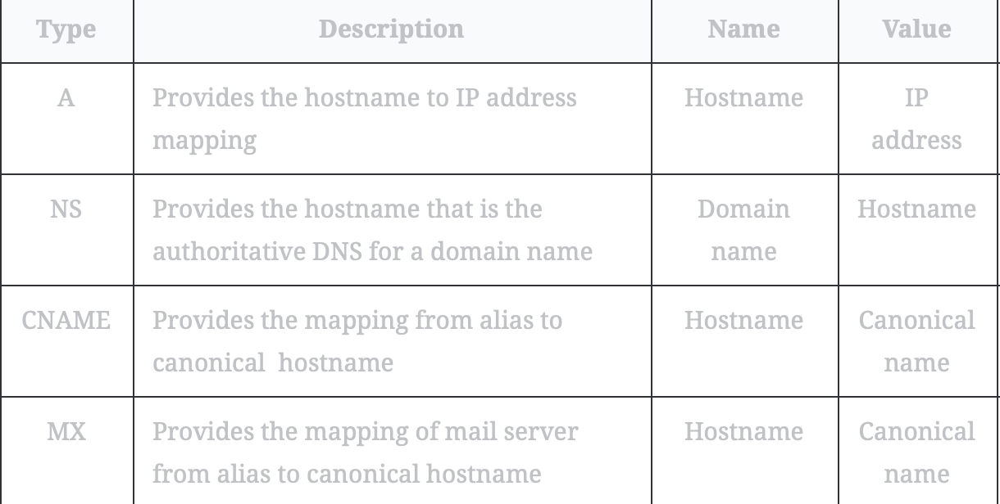

# Introduction to Domain Name System (DNS)

Learn how domain names get translated to IP addresses through DNS.

> We'll cover the following:
>
> - The origins of DNS
>   > - What is DNS?
>   > - Important details

## The origins of DNS

> Computers are uniquely identified by IP addresses - for example, 104.18.2.119 is an IP address.  
>  (we use IP addresses to visit a website hosted on a machine)
>
> Since humans cannot easily remember IP addresses to visit domain names, we need a phone book-like repository that can **maintain all mappings of domain names to IP addresses.**  
>  
>
> This chapter shows how DNS serves as the Internet's phone book...

### What is DNS?

The domain name system (DNS) is the **Internet's naming service that maps human-friendly domain names to machine-readable IP addresses.**  
 The service is transparent to users.

> When a user enters a domain name in the browser, the browser has to translate the domain name to IP address by asking the DNS infrastructure.  
>  Once the desired IP address is obtained, the user's request is forwarded to the destination web server.
>
> The entire operation is performed very quickly. Therefore, the end user experiences minimum delay.  
> (browsers have some of the frequently used mappings for later use in the next lesson.)

### Important details

Let's highlight some of the important details about DNS (covered in next lesson):

- **Name servers:**  
   It's important to understand that the DNS isn't a single server. It's a complete infrastructure with numerous servers.  
   **DNS servers that responds to users' queries are called name servers.**
- **Resource records:**  
   The DNS database **stores domain name to IP address mappings in the form of resource records (RR).**

  > The **RR is the smallest unit of information** that users request from the name servers.  
  > There are different types of RRs.  
  >  The three important information are type, name, and value. (name and value change depending on the type of the RR.)
  >
  > 

- **Caching:**  
   DNS uses caching at different layers to reduce request latency for the user.  
   Caching plays an **important role in reducing the burden on DNS infrastructure because it has to cater to the queries of the entire Internet.**
- **Hierarchy:**  
   DNS name servers are in a hierarchical form.  
   The hierarchical structure allows DNS to be highly scalable because of its increasing size and query load.
  > We will look at how a tree-like structure is used to manage the entire DNS database.

> Let's explore more detils of the above points in the next lesson to get more clarity....
