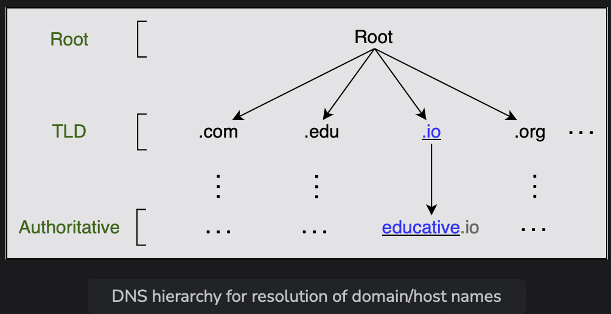
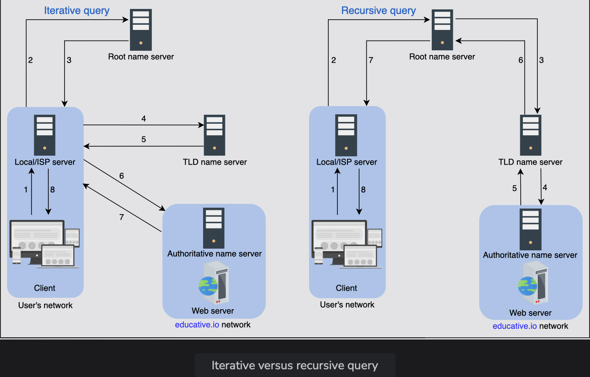

# How the Domain Name System Works

Understand the detailed working of the domain name system.

> We'll cover the following:
>
> - DNS hierarchy
>   > - Iterative versus recursive query resolution
> - Caching
> - DNS as a distributed system
>   > - Highly scalable
>   > - Reliable
>   > - Consistent

Through this lesson, we'll answer the follwing questions:

- How is the DNS hierarchy formed using various types of DNS name servers?
- How is caching performed at different levels of the Internet to reduce the querying burden over the DNS infrastructure?
- How does the distributed nature of the DNS infrastructure help its robustness?

> Let's get started....

## DNS heirarchy

As stated before, the DNS isn't a single server that accepts requests and responds to user queries.  
 It's a **complete infrastructure with _name servers_ at different hierarchies.**

There are four types of servers in the DNS hierarchy:

1. **DNS resolver:**  
   Resolvers initiate the querying sequence and forward requests to the other DNS name servers.  
    Typically, DNS resolvers can also cater to users' DNS queries through caching techniques.  
    The servers can also be called **local or default servers.**
2. **Root-level name servers:**  
   These servers receive requests from local servers.  
   Root name servers maintain name servers based on top-level domain names, such as .com, .edu, .us, and so on...
   > For instance, when a user requests the IP address of xyz.com, root-level name servers will return a list of top-level domain (TLD) servers that hold the IP addresses of the .io domain.
3. **Top-level domain (TLD) name servers:**  
   There servers hold the IP addresses of authorative name servers. The querying party will get a list of IP addresses that belong to the authorative servers of the organization.
4. **Authorative name servers:**  
   These are the organization's DNS name servers that provide the IP addresses of the web or application servers.

---

##### Point to Ponder

Q. How are DNS names processed? For example, will educative.io be processed from left to right or right to left?

> A. Unlike UNIX files, which are processed from left to right, DNS names are processed from right to left.  
>  In the case of educative.io, the resolvers will first resolve the .io part, then educative, and so on....
>
> Visually, however, the DNS hierarchy can be viewed as a tree.

---

### Iterative versus recursive query resolution

There are two ways to perform a DNS query:

1. **Iterative:**  
   The local server requests the root, TLD, and the authorative server for the IP address.
2. **Recursive:**  
   The end user requests the local server. The local server further requests the root DNS name servers.  
   The root name servers forwards the requests to other name servers.

> In the following illustration (left), DNS query resolution is iterative from the perspective of the local/ISP server:
>
> 
>
> **NOTE:** Typically, an iterative query is preferred to reduce query load on DNS infrastructure.
>
> **FUN FACT:** These days, we'll find many third-party public DNS resolvers offered by Google, Cloudflare, OpenDNS, and many more.  
>  The interesting fact is that these public DNS servers may provide quicker responses than the local ISP DNS facilities.

## Caching

Caching refers to the temporary storage of frequently requested resource records.  
 **A record is a data unit within the DNS database that shows a name-to-value binding.**

Caching reduces response time to the user and decreases network traffic. When we use caching at different hierarchies, it can **reduce a lot of querying burden on the DNS infrastructure.**  
 Caching can be implemeted in the browser, operating systems, local name server within the user's network, or the ISP's DNS resolvers.

> **NOTE:** Even if there is no cache available to resolve a user's query and it's imperative to visit the DNS infrastructure, caching can still be beneficial.  
>  The local server or ISP DNS resolver can cache the IP addresses of TLD servers or authorative servers and avoid requesting the root-level server.

## DNS as a distributed system

Although the DNS hierarchy facilitates the distributed Internet that we know today, it's a distributed system itself.

The distributed nature of DNS has the following advantages:

- It avoids becoming a single point of failure (SPOF).
- It acheives low query latency so users can get reponses from nearby servers.
- It gets a higher degree of flexibility during maintenance and updates or upgrades.  
   For example. if one DNS server is down or overburdened, another DNS server can respond to user queries.

> There are 13 logical root name servers (named letter A through M) with many instances spread throughout the globe. These servers are managed by 12 different organizations.
>
> Let's not go over how DNS is scalable, reliable and consistent.

#### Highly scalable

Due to its hierarchical nature, DNS is a highly scalable system.

- Roughly 1,000 replicated instances of 13 root-level servers are spread throughout the world stategically to handle user queries.
- The working labor is divided among TLD and root servers to handle a query and, finally, the authoratitive servers that are managed by the organizations themselves to make the entire system work.
- As shown in the DNS hierarchy tree above, different services handle different portions of the tree enabling scalability and manageability of the system.

#### Reliable

The main reasons make the DNS a reliable system:

1. **Caching:**  
   The caching is done in the browser, the operating system, and the local name server, and the ISP resolvers also maintain a rich cache of frequently visited services.  
    Even if some DNS servers are temporarily down, cached records can be served to make DNS a reliable system.
2. **Server replication:**  
   DNS has replicated copies of each logical server spread systematically across the globe to entertain user requests at low latency.  
    The redundant servers improve the reliability of the overall system.
3. **Protocol:**  
   Although many clients rely in the unreliable User Datagram Protocol (UDP) to request and receive DNS responses, it's important to acknowledge that UDP also offers distinct advantages.
   - It is much faster, and therefore, improves DNS performance.
   - Furthermore, internet service reliability has improved since its inception, so UDP is usually favored over TCP.
   - DNS queries are usually retransmitted at the transport layer if there's no response for the previous one. Therefore, request-response might need additional round trips, which provides a shorter delay as compared to TCP, which needs a three-way handshake every time before data exchange.

---

##### Point to Ponder

Question: What happens if a network is congested? Should DNS continue using UDP?

Answer: Typically, DNS uses UDP. However, DNS can use TCP when its message size exceeds the original packet size of 512 Bytes.  
 This is because large-size packets are more prone to be damanged in congested networks.**DNS always uses TCP for zone transfers.**

Some clients prefer UDP over TCP to employ transpory layer security for privacy reasons.

---

#### Consistent

DNS uses various protocols to update and transfer information among replicated servers in a hierarchy.

DNS compromises on strong consistency to achieve high performance because data is read frequently from DNS databases as compared to writing.  
 However, **DNS provides eventual consistency** and **updates records on replicated servers lazily**. Typically, it can take from a few seconds up to three days to update records on the DNS servers across the Internet.  
 (the time it takes to propagate information among different DNS clusters depends on the DNS infrastructure, the size of the update, and which part of the DNS tree is being updated.)

> Consitency can suffer because of caching too.  
>  Since authoritative servers are located within the organization, it may be possible that certain resource records are updated on the authoratitive servers in case of server failures at the organization.
>
> Therefore, cached records at the default/local and ISP servers may be outdated. To mitigate this issue, each cached record comes with an expiration time called **time-to-live(TTL).**

---

##### Point to Ponder

Question: To maintain high availability, should the TTL value be large or small?

Answer: To maintain high availability, the TTL value should be small. This is because if any server or cluster fails, the organizatio can update the resource records right away. Users will experience non-availability only for the time the TTL isn't expired.  
 However, if the TTL is large, the organization will update its resource records, whereas users will keep pinging the outdated server that would have crashed long ago.  
Companies that long for high availability maintain a TTL value as low as 120 seconds. Therefore, even in case of a failure, the maximum downtime is a few minutes.

---

## Important commands

> Type **_nslookup www.google.com_** and **\*dig www.google.com** in the terminal.....

#### The nslookup output

- The Non-authorative answer, as the name suggests, is the answer provided by a server that is not the authorative server of Google. It isn't in the list of authorative nameservers that Google maintains. So, where does the answer come from?  
   The answer is provided by second, third, and fourth-hand name servers configured to reply to our DNS query - our university or office DNS resolver, our ISP nameserver, our ISP's ISP nameserver, and so on...  
  In short, it can be considered as a cached version of Google's authorative nameservers response.
- If we run the same command multiple times, we'll receive the same IP address list but in a different order each time. The reason for that is DNS is indirectly performing load balancing.

#### The dig output

- The _Query time: 4 msec_ represents the time it takes to get a response from the DNS server. ( For various reasons, these numbers may be different in our case. )
- The _300_ value in the _ANSWER SECTION_ represents the number of seconds the cache is maintained in the DNS resolver. This means that Google's ADNS keeps a TTL value of five minutes.

---

##### Point to Ponder

Question: If we need DNS to tell us which IP to reach a website or service, how will we know the DNS resolver's IP address? (_It seems like a chicken-and-egg problem!_)

Answer: End user's operating systems have configuration files (/etc/resolve.conf in Linux) with the DNS resolver's IP addresses, which in turn obtain all information for them.  
 (Often, DHCP provides the default DNS resolver IP address along with other configurations.)  
The end-systems request DNS resolves for any DNS queries through the infrastructure.

DNS resolvers have special software installed to resolve queries through the DNS infrastructure. The root server's IP addresses are within the special software.  
 Typically, the Berkeley Internet Name Domain (BIND) software is used on DNS resolvers. The InterNIC maintains the updated list of 13 root servers.

So, we break the chicken-and-egg problem by seeding each resolver with prior knowledge of root DNS servers (whose IPs rerely change).

---
