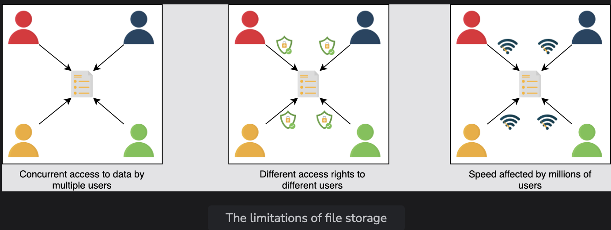
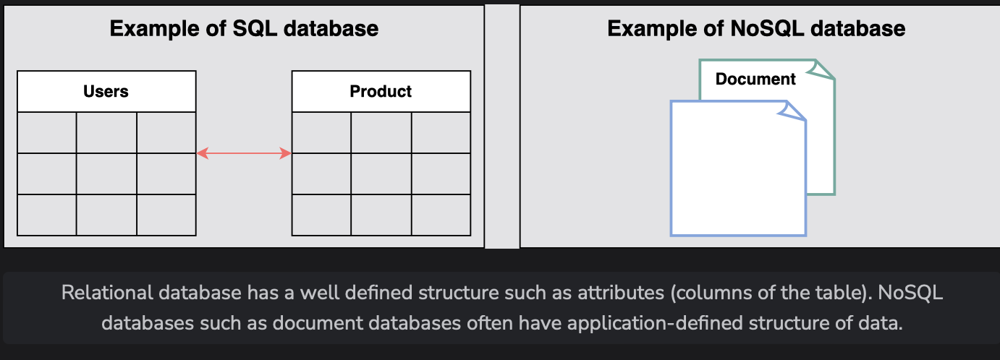

# Introduction to Databases

Understand what a database is and its use cases in the system design.

> We'll cover the following:
>
> - Problem statement
>   > - Limitations of file storage
>   > - Solution
> - Advantages
> - How will we explain databases?

## Problem statement

Let’s start with a simple question. Can we make a software application without using databases?

> Let’s suppose we have an application like WhatsApp. People use our application to communicate with their friends.
>
> Now, where and how can we store information (a list of people’s names and their respective messages) permanently and retrieve it?

We can use a simple file to store all the records on separate lines and retrieve them from the same file.  
 But using a file for storage has some limitations.

#### Limitations of file storage

- We can’t offer concurrent management to separate users accessing the storage files from different locations.
- We can’t grant different access rights to different users.
- How will the system scale and be available when adding thousands of entries?
- How will we search content for different users in a short time?

#### Solution

The above limitations can be addressed using databases.

A database is an **organized collection of data that can be managed and accessed easily.**  
 Databases are created to make it **easier to store, retrieve, modify, and delete data in connection with different data-processing procedures.**

> Some of the applications where we use database management are the banking systems, online shopping stores, and so on. Different organizations have different sizes of databases according to their needs.
>
> **Note:** According to a source, the _World Data Center for Climate (WDCC)_ is the largest database in the world. It contains around 220 terabytes of web data and 6 petabytes of additional data.

There are two basic types of databases:

- SQL (relational databases)
- NoSQL (non-relational databases)
  They differ in terms of their intended use case, the type of information they hold, and the storage method they employ.

> **Relational databases**, like phone books that record contact numbers and addresses, **_are organized and have predetermined schemas_**.
>
> **Non-relational databases**, like file directories that store anything from a person’s constant information to shopping preferences, **_are unstructured, scattered, and feature a dynamic schema_**.
>
> We’ll discuss their differences and their types in detail in the next lesson.

## Advantages

A proper database is essential for every business or organization.  
 This is **because the database stores all essential information about the organization**, such as personnel records, transactions, salary information, and so on.

> Following are some of the reasons why the database is important:
>
> - **Managing large data:**  
>    A large amount of data can be easily handled with a database, which wouldn’t be possible using other tools.
> - **Retrieving accurate data (data consistency):**  
>    Due to different constraints in databases, we can retrieve accurate data whenever we want.
>   **Easy updation:**  
>    It is quite easy to update data in databases using data manipulation language (DML).
>   **Security:**  
>    Databases ensure the security of the data. A database only allows authorized users to access data.
>   **Data integrity:**  
>    Databases ensure data integrity by using different constraints for data.
>   **Availability:**  
>    Databases can be replicated (using data replication) on different servers, which can be concurrently updated. These replicas ensure availability.
>   **Scalability:**  
>    Databases are divided (using data partitioning) to manage the load on a single node. This increases scalability.

## How will we explain databases?

> We have divided the database chapter into four lessons:
>
> 1. **[Types of Databases:](./02-types-of-databases.md)**  
>    We’ll discuss the different types of databases, their advantages, and their disadvantages.
> 2. **[Data Replication](./03-data-replication.md):**  
>    We’ll discuss what data replication is and its different models with their pros and cons.
> 3. **[Data Partitioning](./04-data-partitioning.md):**  
>    We’ll discuss what data partitioning is and its different models with their pros and cons.
> 4. **[Cost-benefit analysis](./05-trade-offs-in-databases.md):**
>    We’ll discuss which database sharding approach is best for different kinds of databases.

> Let’s get started by understanding different types of databases and their preferred use cases.
