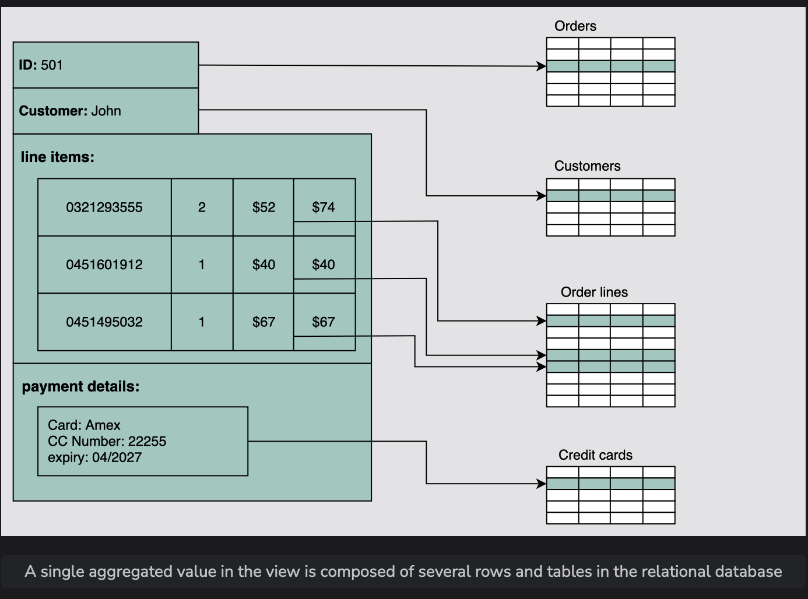

# Types of Databases

Understand various types of databases and their use cases in system design.

> We'll cover the following:
>
> - Relational databases
>   > - Why relational databases?
>   >   > - Flexibility
>   >   > - Reduced redundancy
>   >   > - Concurrency
>   >   > - Integration
>   >   > - Backup and disaster recovery
>   > - Drawback
>   >   > - Impedance mismatch
> - Why non-relational (NoSQL) databases?
>   > - Types of NoSQL databases
>   >   > - Key-value database
>   >   > - Document database
>   >   > - Graph database
>   >   > - Columnar database
>   > - Drawbacks of NoSQL databases
>   >   > - Lack of standardization
>   >   > - Consistency
> - Choose the right database

As we discussed earlier, databases are divided into two types: **relational and non-relational**.

## Relational databases

> Relational databases adhere to particular schemas before storing the data. The data stored in relational databases has prior structure.
>
> Mostly, this model organizes data into one or more relations (also called tables), with a unique key for each tuple (instance).
>
> Each entity of the data consists of instances and attributes, where instances are stored in rows, and the attributes of each instance are stored in columns.
>
> Since each tuple has a unique key, a tuple in one table can be linked to a tuple in other tables by storing the primary keys in other tables, generally known as **foreign keys**.

A **Structure Query Language (SQL) is used for manipulating the database.**  
 This includes **insertion, deletion, and retrieval** of data.

There are various reasons for the popularity and dominance of relational databases, which include **simplicity, robustness, flexibility, performance, scalability, and compatibility in managing generic data**.

Relational databases provide the **atomicity, consistency, isolation, and durability (ACID) properties to maintain the integrity of the database**.  
 ACID is a powerful abstraction that simplifies complex interactions with the data and hides many anomalies _(like dirty reads, dirty writes, read skew, lost updates, write skew, and phantom reads)_ behind a simple transaction abort.

> Let’s discuss ACID in detail:
>
> - **Atomicity:**  
>    A transaction is considered an atomic unit.  
>    Therefore, either all the statements within a transaction will successfully execute, or none of them will execute.  
>    If a statement fails within a transaction, it should be aborted and rolled back.
> - **Consistency:**
>   At any given time, the database should be in a consistent state, and it should remain in a consistent state after every transaction.  
>    For example, if multiple users want to view a record from the database, it should return a similar result each time.
> - **Isolation:**  
>    In the case of multiple transactions running concurrently, they shouldn’t be affected by each other.  
>    The final state of the database should be the same as the transactions were executed sequentially.
> - **Durability:**  
>    The system should guarantee that completed transactions will survive permanently in the database even in system failure events.

#### Why relational databases?

Relational databases are the default choices of software professionals for structured data storage.  
 One of the greatest powers of the relational database is its abstractions of ACID transactions and related programming semantics. This make it very convenient for the end-programmer to use a relational database.

Let’s revisit some important features of relational databases:

###### Flexibility

In the context of SQL, data definition language (DDL) provides us the flexibility to modify the database, including tables, columns, renaming the tables, and other changes. DDL even allows us to modify schema while other queries are happening and the database server is running.

###### Reduced redundancy

One of the biggest advantages of the relational database is that it eliminates data redundancy. The information related to a specific entity appears in one table while the relevant data to that specific entity appears in the other tables linked through foreign keys. This process is called **normalization** and has the additional benefit of removing an inconsistent dependency.

###### Concurrency

Concurrency is an important factor while designing an enterprise database. In such a case, the data is read and written by many users at the same time. We need to coordinate such interactions to avoid inconsistency in data—for example, the double booking of hotel rooms.  
 Concurrency in a relational database is handled through transactional access to the data. As explained earlier, a transaction is considered an atomic operation, so it also works in error handling to either roll back or commit a transaction on successful execution.

###### Integration

The process of aggregating data from multiple sources is a common practice in enterprise applications. A common way to perform this aggregation is to integrate a shared database where multiple applications store their data.  
 This way, all the applications can easily access each other’s data while the concurrency control measures handle the access of multiple applications.

###### Backup and disaster recovery

Relational databases guarantee the state of data is consistent at any time. The export and import operations make backup and restoration easier. Most cloud-based relational databases perform continuous mirroring to avoid loss of data and make the restoration process easier and quicker.

#### Drawback

###### Impedance mismatch

Impedance mismatch is the **difference between the relational model and the in-memory data structures.**  
 The relational model organizes data into a tabular structure with relations and tuples. SQL operation on this structured data yields relations aligned with relational algebra.

> However, it has some limitations. In particular, the values in a table take simple values that can’t be a structure or a list.
>
> The case is different for in-memory, where a complex data structure can be stored.
>
> To make the complex structures compatible with the relations, we would need a translation of the data in light of relational algebra.
>
> So, the impedance mismatch requires translation between two representations, as denoted in the following figure:
>
> 

## Why non-relational (NoSQL) databases?

#### Types of NoSQL databases

###### Key-value database

###### Document database

###### Graph database

###### Columnar database

#### Drawbacks of NoSQL databases

###### Lack of standardization

###### Consistency

## Choose the right database
