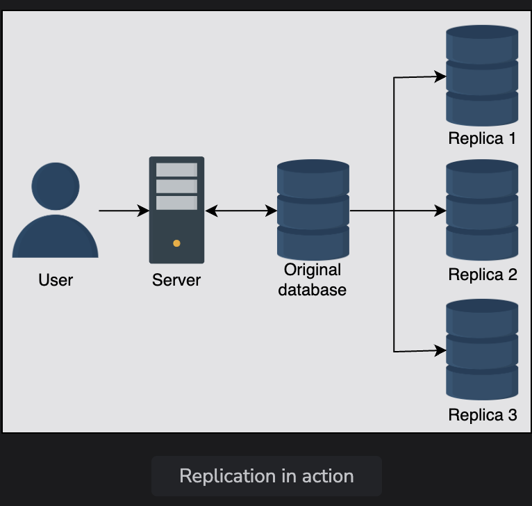
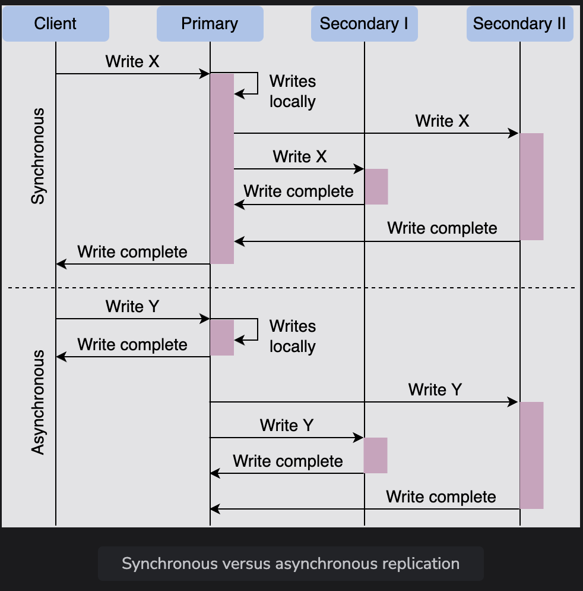
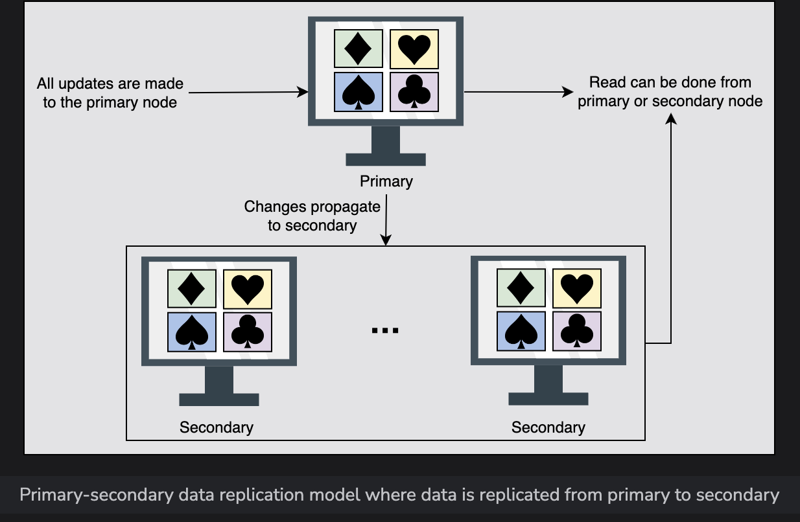
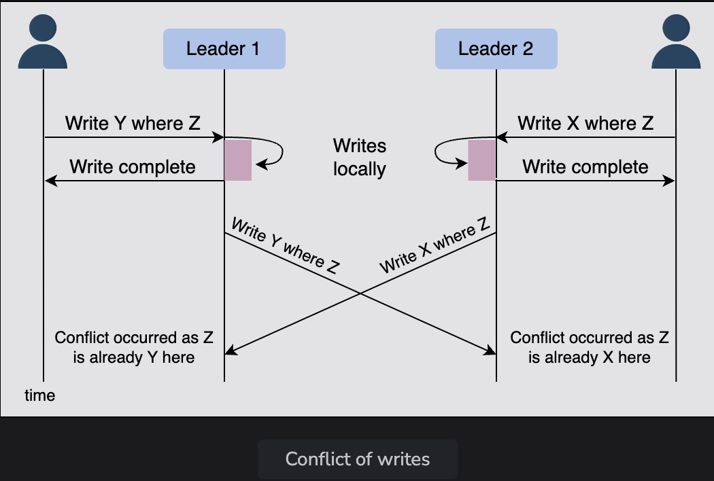
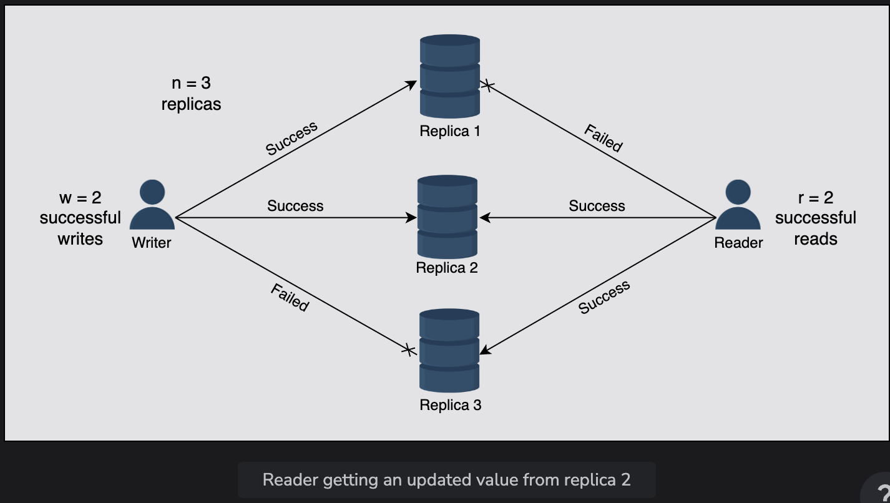
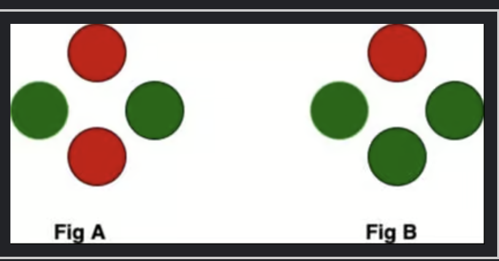
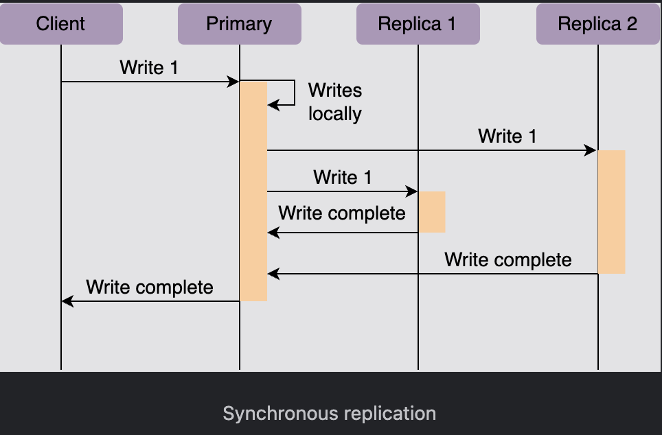
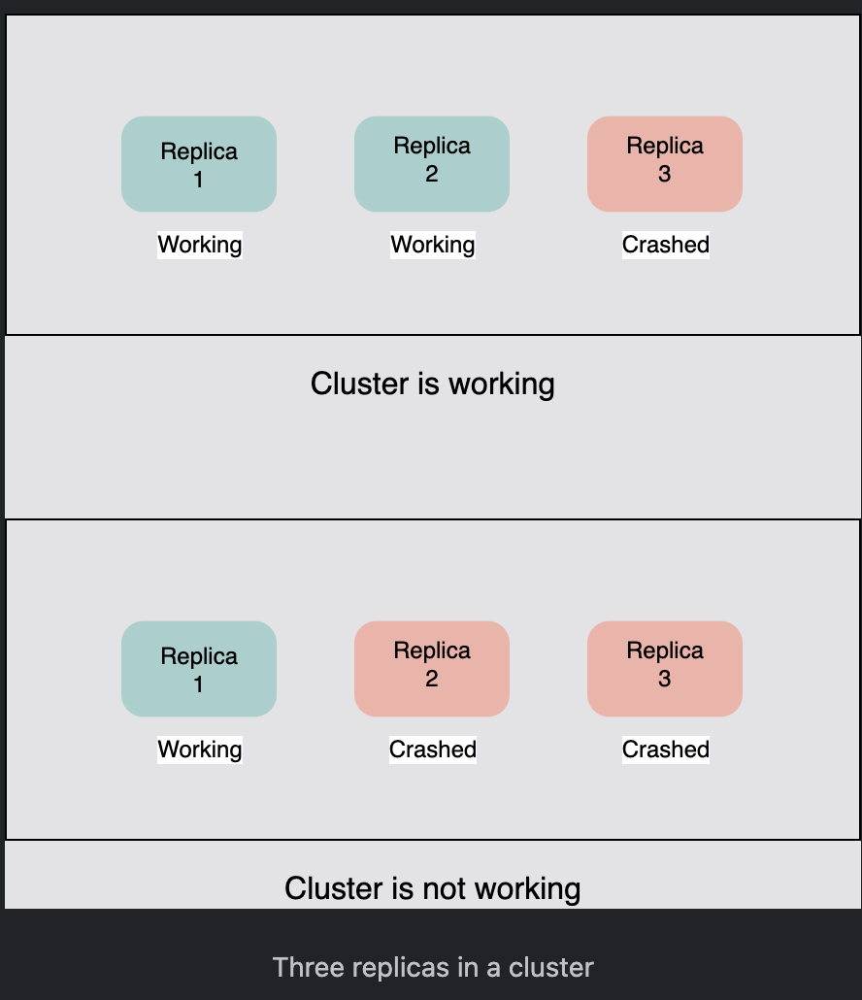
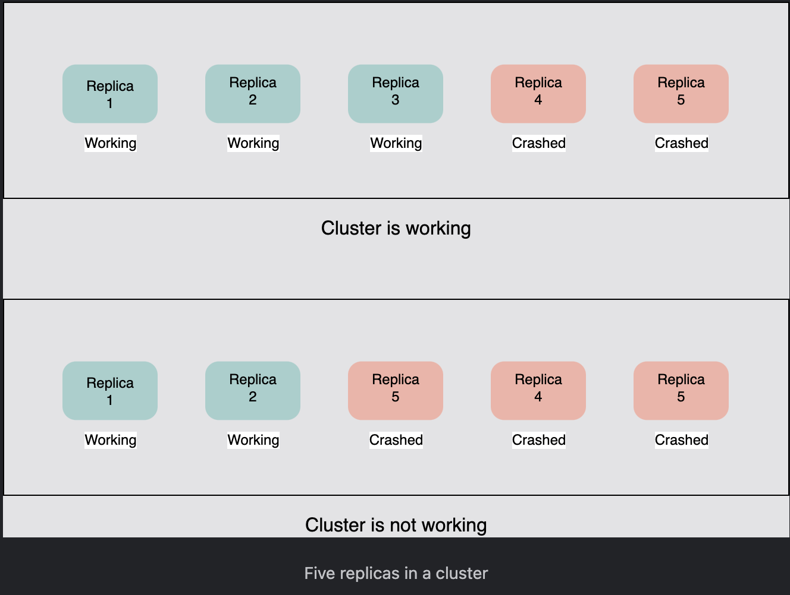

# Data Replication

Understand the models through which data is replicated across several nodes.

> We'll cover the following:
>
> - Replication
> - Synchronous versus asynchronous replication
> - Data replication models
>   > - Single leader/primary-secondary replication
>   >   > - Primary-secondary replication methods
>   >   >   > - Statement-based replication
>   >   >   > - Write-ahead log (WAL) shipping
>   >   >   > - Logical (row-based) replication
>   > - Multi-leader replication
>   >   > - Conflict
>   >   > - Handle conflicts
>   >   >   > - Conflict avoidance
>   >   >   > - Last-write-wins
>   >   >   > - Custom logic
>   >   > - Multi-leader replication topologies
>   > - Peer-to-peer/leaderless replication
>   >   > - Quorums

> Data is an asset for an organization because it drives the whole business.  
> Data provides critical business insights into what’s important and what needs to be changed.  
>  Organizations also need to securely save and serve their clients’ data on demand.  
>  Timely access to the required data under varying conditions (increasing reads and writes, disks and node failures, network and power outages, and so on) is required to successfully run an online business.

We need the following characteristics from our data store:

- **Availability under faults** (failure of some disk, nodes, and network and power outages).
- **Scalability** (with increasing reads, writes, and other operations).
- **Performance** (low latency and high throughput for the clients).

It’s challenging, or even impossible, to achieve the above characteristics on a single node.

## Replication

Replication refers to **keeping multiple copies of the data at various nodes** (preferably geographically distributed) to achieve availability, scalability, and performance.

> In this lesson, we assume that a single node is enough to hold our entire data.  
>  We won’t use this assumption while discussing the partitioning of data in multiple nodes.

Often, **the concepts of replication and partitioning go together.**

> However, with many benefits, like availability, replication comes with its complexities.
>
> Replication is relatively simple if the replicated data doesn’t require frequent changes.  
>  The **main problem in replication arises when we have to maintain changes in the replicated data over time.**
>
> Additional complexities that could arise due to replication are as follows:
>
> - How do we keep multiple copies of data consistent with each other?
> - How do we deal with failed replica nodes?
> - Should we replicate synchronously or asynchronously?
>   - How do we deal with replication lag in case of asynchronous replication?
> - How do we handle concurrent writes?
> - What consistency model needs to be exposed to the end programmers?

We'll explore the answer to these questions in this lesson.  
 

## Synchronous versus asynchronous replication

There are two ways to disseminate changes to the replica nodes:

- Synchronous replication
- Asynchronous replication

> In synchronous replication, **the primary node waits for acknowledgments from secondary nodes about updating the data.**  
>  After receiving acknowledgment from all secondary nodes, the primary node reports success to the client.
>
> Whereas in asynchronous replication, **the primary node doesn’t wait for the acknowledgment from the secondary nodes** and reports success to the client after updating itself.
>
> The **advantage of synchronous replication** is that all the secondary nodes are completely up to date with the primary node.  
> However, there’s a disadvantage to this approach.  
>  If one of the secondary nodes doesn’t acknowledge due to failure or fault in the network, the primary node would be unable to acknowledge the client until it receives the successful acknowledgment from the crashed node.
>
> This **causes high latency in the response from the primary node to the client.**
>
> On the other hand, **the advantage of asynchronous replication** is that the primary node can continue its work even if all the secondary nodes are down.  
>  However, if the primary node fails, the writes that weren’t copied to the secondary nodes will be lost.

The above paragraph explains a **trade-off between data consistency and availability** when components of the system can fail.

---

In the context of a real-time financial trading platform where low latency is critical and some degree of eventual consistency is acceptable, asynchronous updates are recommended. This approach allows the primary node to continue operations and report success after updating itself, reducing latency.  
 **Asynchronous replication is favored over synchronous replication because it mitigates potential latency issues, especially beneficial in environments requiring swift data updates.**

---

## Data replication models

Now, let's discuss various mechanisms of data replication.  
In this section, we'll discuss the following models along with their strengths and weakness:

- Single leader or primary-secondary replication
- Multi-leader replication
- Peer-to-peer or leaderless replication

### 1. Single leader/primary-secondary replication

In primary-secondary replication, data is replicated across multiple nodes.  
 One node is designated as the primary. It's responsible for processing any writes to data stored on the cluster.  
 It also sends all the writes to the secondary nodes and keeps them in sync.

Primary-secondary replication is **appropriate when our workload is read-heavy**.  
 To better scale with increasing readers, we can add more followers and distribute the read load across the available followers.  
 However, replicating data to many followers can make a primary bottleneck.  
 Additionaly, primary-secondary replication is inappropriate if our workload is write-heavy.

Another advantage of primary-secondary replication is that it's read resilient.  
 Secondary nodes can still handle read requests in case of primary node failure.  
 Therefore, it's helpful approach for read-intensive applications.

Replication via this approach comes with inconsistency if we use asynchronous replication.  
 Clients reading from different replicas may see inconsistent data in the case of failure of the primary node that couldn't propagate updated data to the secondary nodes.  
 So, if the primary node fails, any missed updates not passed on to the secondary nodes can be lost.

> WHAT HAPPENS WHEN THE PRIMARY NODE FAILS?
>
> In case of failure of the primary node, a secondary node can be appointed as a primary node, **which speeds up the process of recovering the initial primary node**.
>
> There are two approaches to select the new primary node:  
>  **manual and automatic**.
>
> In a **manual approach**, an operator decides which node should be the primary node and notifies all secondary node.
>
> In an **automatic approach**, when secondary nodes find out that the primary node has failed, they appoint the new primary node by conducting an election known as **leader election.**

#### Primary-secondary replication methods

There are many different replication methods in primary-secondary replication:

- Statement-based replication
- Write-ahead log (WAL) shipping
- Logical (row-based) replication  
   Let's discuss each of them in detail.

##### Statement-based replication

Statement-based replication (SBR) is an approach used in MySQL databases.  
 In this approach, **the primary node executes the SQL statements such as INSERT, UPDATE, DELETE, etc., and then the statements are written into a log file.**  
 In the next step, the log file is sent to the secondary nodes for execution. This type of replication was used in MySQL before version 5.1.

While this type of replication seems good, it also has some **disadvantages**.  
 For example, any nondeterministic functions such as NOW() might result in distinct writes on the primary and secondary nodes.

**NOTE: The NOW() function returns the current date and time according to the system clock.**

##### Write-ahead log (WAL) shipping

Write-ahead log (WAL) shipping is a data replication technique used in both PostgreSQL and Oracle.  
 In this technique, **when a transaction occurs, it’s initially recorded in a transactional log file, and the log file is written to disk.**  
 Subsequently, the recorded operations are executed on the primary database before being transmitted to secondary nodes for execution.

Unlike SBR, **WAL maintains transactional logs instead of SQL statements into a log file, ensuring consistency when dealing with nondeterministic functions.**  
 Writing to disk also aids in recovery in case of crash failures.

> For example, when an operation like an UPDATE is executed in PostgreSQL, it’s first written to the transactional log file and disk before being applied to the database.
>
> This entry in the transactional log can include details such as the transaction ID, operation type, affected table, and new values, after which the changes are replicated to the secondary nodes. However, the drawback of WAL is its tight coupling with the inner structure of the database engine, making software upgrades on the leader and followers complicated.

##### Logical (row-based) replication

Logical (row-based) replication is utilized in various relational databases, including PostgreSQL and MySQL.  
 In this approach, **changes made to the database are captured at the level of individual rows and then replicated to the secondary nodes.**  
 Instead of replicating the actual physical changes made to the database, this approach captures the operations in a logical format and then executes them on secondary nodes.

> For example, when operations like INSERT or UPDATE are performed, the entire affected row is captured on the primary node, containing all the column values of the specified row.
>
> This captured change is then executed on secondary nodes, where they ensure that the data remains consistent with the data on the primary node. It offers advantages in terms of flexibility and compatibility with different types of schemas.

### 2. Multi-leader replication

> As discussed above, single leader replication using asynchronous replication has a drawback.
>
> - There's only primary node, and all the writes have to go through it, which limits the performance.
> - In case of failure of the primary node, the secondary nodes may not have the updated database.

Multi-leader replication is an alternative to single leader replication.  
 There are **multiple nodes that process the writes and send them to all other primary and secondary nodes to replicate.**  
 This type of replication is used in databases along with external tools like Tungsten Replication for MySQL.

This kind of replication is quite useful in applications in which we can continue work even if we're offline -  
 for example, a calender application in which we can set our meetings even if we don't have access to the internet.  
 Once we're online, it replicates its changes from our local database (our mobile phone or laptop acts as a primary node) to other nodes.

.png>)

#### Conflict

Multi-leader replication gives better performance and scalability than single leader replication, but it also has a significant disadvantage.  
 Since all the primary nodes concurrently deal with the write requests, they may modify the same data, which can create a conflict between them.

> For example, suppose the same data is edited by two clients simultaneously. In that case, their writes will be successful in their associated primary nodes, but when they reach the other primary nodes asynchronously, it creates a conflict.

#### Handle Conflict

Conflicts can result in different data at different nodes.  
 These should be handled efficiently without losing any data.

Let's discuss some of the approaches to handle conflicts:  
 

###### Conflict avoidance

A simple strategy to deal with conflicts is to prevent them from happening in the first place.  
 Conflicts can be avoided if the application can verify that all writes for a given record go via the same leader.

However, the conflict may still occur if a user moves to a different location and is now near a different data center.  
 If that happens, we need to reroute the traffic.

In such scenerios, the conflict avoidance approach fails and results in concurrent writes.

###### Last-write-wins

Using the local clock, all nodes assign a timestamp to each update. When a conflict occurs, the update with the latest timestamp is selected.  
 This approach can also create difficulty because the clock sysnchronization across nodes is challenging in distributed systems.  
There's clock skew that can result in data loss.

###### Custom logic

In this approach, we can write our own logic to handle conflicts according to the needs of our application.  
 This custom logic can be executed on both reads and writes.  
When the system detects a conflict, it calls our custom conflict handler.

#### Multi-leader replication topologies

There are many topologies through which multi-leader replication is implemented, such as circular topology, star topology, and all-to-all topology.  
 The most common is the all-to-all topology.

> In star and circular topology, there's again a similar drawback that if one of the nodes fails, it can affect the whole system.  
>  That's why all-to-all is the most used topology.

### 3. Peer-to-peer or leaderless replication

> In primary-secondary replication, the primary node is a bottleneck and a single point of failure.  
>  Moreover, it helps to achieve read scalability but fails to provide write scalability.

The peer-to-peer replication model resolves these problems by not having a single primary node.  
 All the nodes have equal weightage and can accept read and write requests.  
 (this replication scheme can be found in the Cassandra database.)

> Like primary-secondary replication, this replication can also yield inconsistency.  
>  This is because when several nodes accept write requests, it may lead to concurrent writes.
>
> A helpful approach used **for solving write-write inconsistency is called quorums.**

#### Quorums

Let's suppose we have three nodes. If at least two out of three nodes are guaranteed to return successful updates, it means only one node has failed.  
 This means that if we read from two nodes, at least one of them will have the updated version, and our system can continue working.

> If we have n nodes, then every write must be updated in at least w nodes to be considered a success, and we must read from r nodes.  
> We'll get an updated value from reading as long as w+r > n, because **at least one of the nodes must have an updated write from which we can read.**

Quorums reads and writes adhere to these r and w values.  
 These n, w, and r are configured in Dynamo-style databases.

---

For more details on the topic of Quorum, refer below:

### What is a quorum?

##### Definition

A quorum is the **minimum number of members that must be present at any meeting to consider the proceedings of the meeting valid.**

##### Quorum in distributed systems

Quorum is a widely used concept in distributed systems.  
 For many of the standard algorithms, the idea of quorum is used to reach a decision.

> Let's understand the concept of quorum with the help of a diagram.
>
> 
>
> In figure A, we have two nodes, each with green and red colors. In this case, there can be no consensus, as a quorum of nodes has not agreed.  
>  On the other hand, in figure B, we have three green nodes, and hence we have a quorum.
>
> Whatever these three nodes agree upon is what the algorithm will do.

In a distributed systems, we mostly have an odd number of nodes, so the chances of us running into a situation like the one depicted in figure A are slim.  
 There will always be more than half the number of given nodes deciding on something, provided that there are two options to choose from.

#### Problem of split brain in distributed systems

Network partition is an inherent part of any distributed system, and a system that claims to be distributed also needs to be partition tolerant.  
 That is, in the event of a network partition, the system should continue to work.

> Quorums usually helps with this continuity in the event of a network paritition.  
>  In the absence of a quorum, the different partitions would each assume that the view of the system is as they see it, which is limited by the communication.  
>  Each of the partitions would then continue to work and move forward in different directions.
>
> **This problem is known as split brain.**

With the concept of quorum, the system would only work if more than half the nodes can communicate with each other through some network path.

#### Conclusion

Quorum is used in almost all consensus-based algorithms in distributed systems.  
 Raft is one of the famous consensus algorithms that uses quorum as the core of their algorithm logic.

---

---

### What is quorum in distributed systems?

#### Introduction

Data is copied throughout many servers to acquire high availability and fault tolerance in distributed systems, called replication.  
 In copying data to all the replicas, an issue comes up: _how to ensure that all the replicas have the same data and all the users can access the same data from all the replicas?_

#### Synchronous replication

We can use synchronous replication, in which the original node reports success to the user only when it has received acknowledgment from all the replicas.  
 The original database waits until it has received acknowledgments from all replicas, as shown in the illustration below:  
 

#### Problems in synchronous replication

If any one of the replica nodes fails to acknowledge due to a network failure or fault, the original node cannot respond to the client until the failed node acknowledges.  
 This causes a decrease in the availability of the write operations.

### Quorum as a solution

**A quorum in a distributed system is the minimal number of replicas on which a distributed operation (commit/abort) must be completed before proclaiming the operation’s success.**

> Let’s suppose we have three replicas of the database. The quorum in such an instance is the least number of machines that take the same action, commit or abort, for a particular transaction to determine the final operation for that transaction.
>
> So, in a cluster of three replicas, if two replicas acknowledge, the operation can be committed as two replicas make the majority.  
>  A quorum guarantees the required consistency for distributed operations.

##### Selecting quorum number

We should select more than half of the replicas in the cluster. If there are R replicas in the cluster, we should choose R/2 + 1 as a quorum number

- In a three-node cluster, at least two nodes must be working.
- In a five-node cluster, at least three nodes must be working.

> 
>
> Similarly, if there are five replicas in a cluster and three of them acknowledge, the operation can be committed as the majority is working.
>
> Anything less than three replicas will result in the failure of the cluster.
>
> 

A quorum can be achieved only when the nodes adhere to the methodology w+r > n where w is the minimum nodes for write operations, r is the minimum nodes for read operations, and n is the total number of nodes in a cluster.

---
