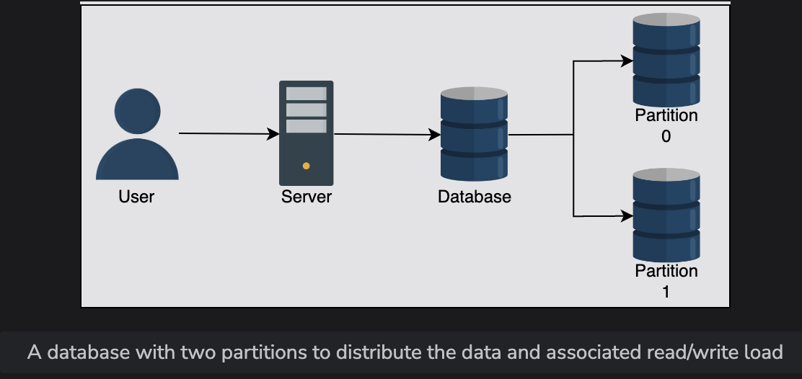
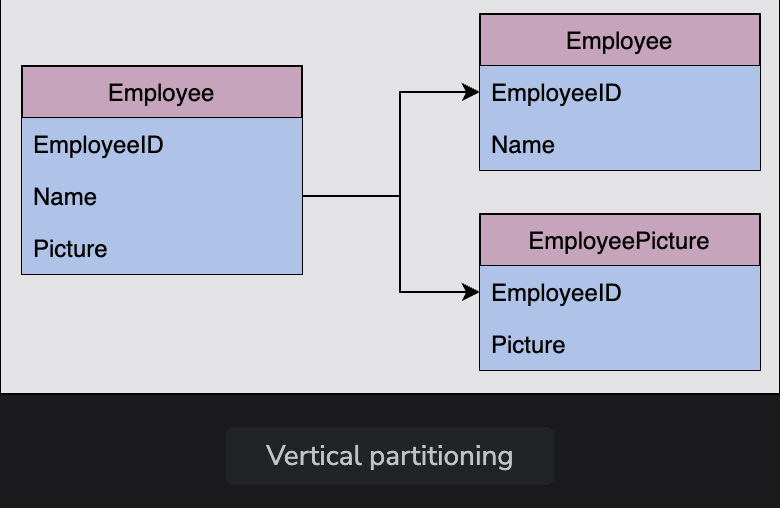
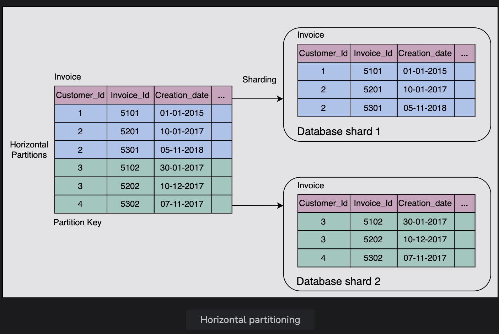
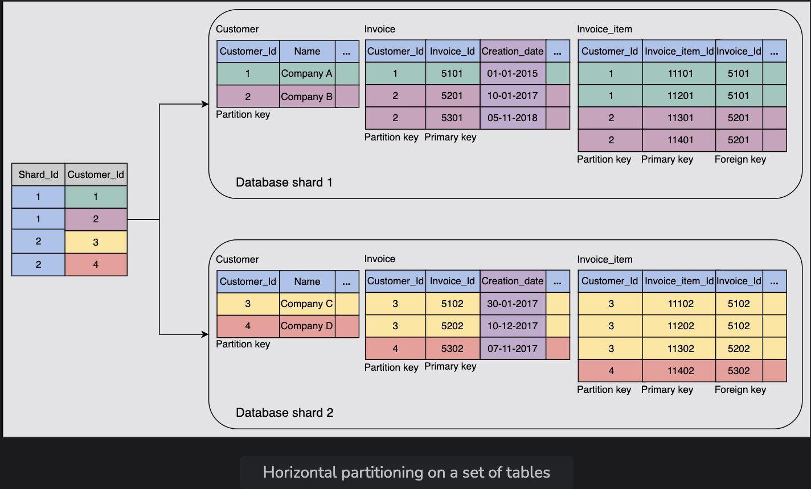
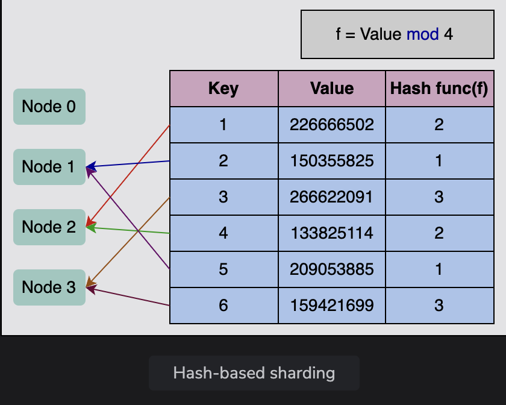
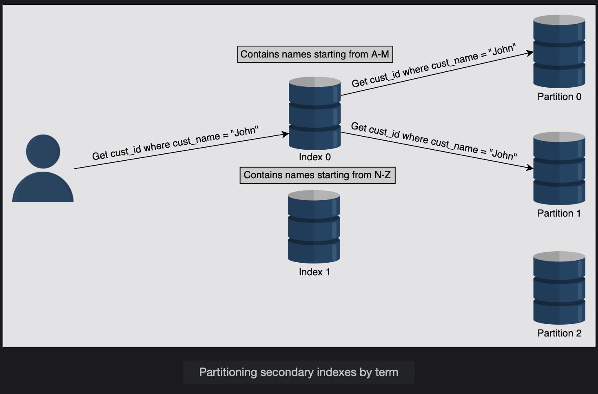
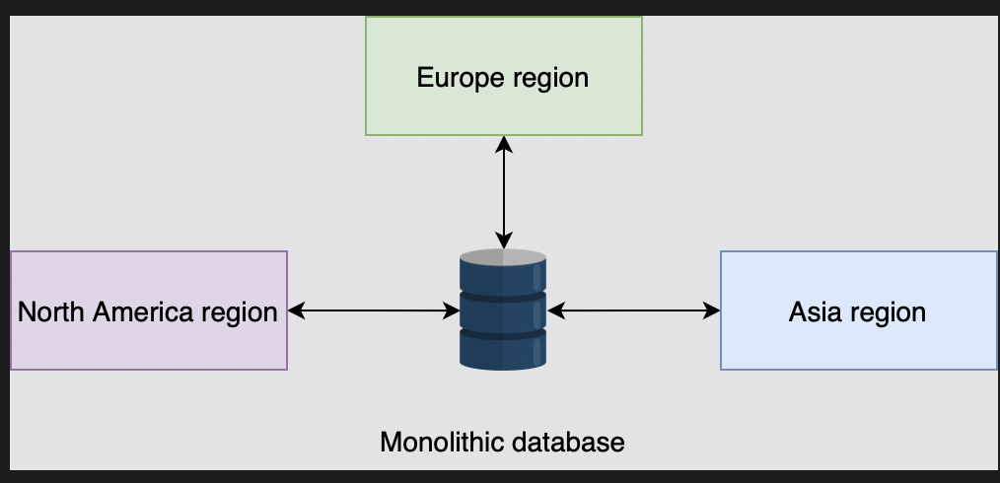

# Data Partitioning

Learn about data partitioning models along with their pros and cons.

> We'll cover the following:
>
> - Why do we partition data?
> - Sharding
>   - Vertical sharding
>   - Horizontal sharding
>     - Key-range based sharding
>     - Hash-based sharding
>     - Consistent hashing
>   - Rebalance the partitions
>     - Avoid hash mod n
>     - Fixed number of partitions
>     - Dynamic partitioning
>     - Partition proportionally to nodes
>   - Partitioning and secondary indexes
>     - Partition secondary indexes by document
>     - Partition secondary indexes by the term
> - Request routing
>   - ZooKeeper
> - Conclusion

## Why do we partition data?

> Data is an asset for any organization. Increasing data and concurrent read/write traffic to the data puts scalability pressure on traditional databases.  
>  As a result, the latency and throughput are affected.  
>  Traditional databases are attractive due to their properties such as range queries, secondary indices, and transactions with the ACID properties.
>
> At some point, a single node-based database isn’t enough to tackle the load.  
>  We might need to distribute the data over many nodes but still export all the nice properties of relational databases.  
>  In practice, it has proved challenging to provide single-node database-like properties over a distributed database.
>
> One solution is to move data to a NoSQL-like system.  
>  However, the historical codebase and its close cohesion with traditional databases make it an expensive problem to tackle.
>
> Organizations might scale traditional databases by using a third-party solution.  
>  But often, integrating a third-party solution has its complexities.  
>  More importantly, there are abundant opportunities to optimize for the specific problem at hand and get much better performance than a general-purpose solution.

Data partitioning (or sharding) enables us to **use multiple nodes where each node manages some part of the whole data.**  
 To handle increasing query rates and data amounts, we strive for balanced partitions and balanced read/write load.

We'll discuss different ways to partition data, related challenges, and their solutions in this lesson.  
 

## Sharding

> To divide load among multiple nodes, we need to **partition the data by a phenomenon known as partitioning or sharding**.  
>  In this approach, we **split a large dataset into smaller chunks of data** stored at different nodes on our network.

The partitioning must be balanced so that each partition receives about the same amount of data.  
 **If partitioning is unbalanced**, _the majority of queries will fall into a few partitions._

Partitions that are heavily loaded will create a system bottleneck.  
The efficacy of partitioning will be harmed because a significant portion of data retrieval queries will be sent to the nodes that carry the **highly congested partitions**.  
 **Such partitions are known as hotspots.**

Generally, we use the following two ways to shard the data:

- Vertical sharding
- Horizontal sharding

### Vertical sharding

We can put different tables in various database instances, which might be running on a different physical server.  
 We might break a table into multiple tables so that **some columns are in one table while the rest are in the other.**

We should be careful if there are joins between multiple tables.  
We may like to keep such tables together on one shard.

Often, vertical sharding is used to increase the speed of data retreival from a **table consisting of columns with very wide text or a binary large object** **_(blob)._**  
 In this case, the column with large text or a blob is split into a different table.

> As shown in the figure a couple paragraphs below, the Employee table is divided into two tables: a reduced Employee table and an EmployeePicture table.
>
> The EmployeePicture table has just two columns, EmployeeID and Picture, separated from the original table.
>
> Moreover, the primary key EmployeeID of the Employee table is added in both partitioned tables.
>
> This makes the data read and write easier, and the reconstruction of the table is performed efficiently.

Vertical sharding has its intracacies and is **more amenable to manual partitioning**, where stakeholders carefully decide how to partition data.  
 In comparison, horizontal sharding is suitable to automate even under dynamic conditions.

> **NOTE:** **Creating shards by moving specific tables of a database around** is also a form of vertical sharding.  
>  Usually, **those tables are put in the same shard because they often appear together in queries**, for example, _for joins._  
>  We will see an example of such a use-case ahead in the course.

### Horizontal sharding

At times, some tables in the databases become too big and affect read/write latency.  
 Horizontal sharding or partitioning is used to **divide a table into multiple tables by splitting data row-wise**, as shown in the figure in the next section.

**Each partition of the original table distributed over databases servers** is called a shard.  
Usually, there are two strategies available:

- Key-range based sharding
- Hash based sharding

##### Key-range based sharding

In the key-range based sharding, each partition is assigned a continuous range of keys.

> In the following figure, horizontal partitioning on the Invoice table is performed using the key-range based sharding with Customer_Id as the partition key.  
>  The two different colored tables represent the partitions.
>
> 

Sometimes, a database consists of multiple tables bound by foreign key relationships.  
 In such a case, the horizontal partition is performed using the same partition key on all tables in a relation.  
 Tables (or subtables) that belong to the same partition key are distributed to one database shard.

The following figure shows that several tables with the same partition key are placed in a single database shard:

> The basic design techniques used in multi-table sharding are as follows:
>
> - There’s a partition key in the Customer mapping table. This table resides on each shard and stores the partition keys used in the shard.  
>    Applications create a mapping logic between the partition keys and database shards by reading this table from all shards to make the mapping efficient.  
>    Sometimes, applications use advanced algorithms to determine the location of a partition key belonging to a specific shard.
>
> - The partition key column, Customer_Id, is replicated in all other tables as a data isolation point.  
>    It has a trade-off between an impact on increased storage and locating the desired shards efficiently. Apart from this, it’s helpful for data and workload distribution to different database shards. The data routing logic uses the partition key at the application tier to map queries specified for a database shard.
>
> - Primary keys are unique across all database shards to avoid key collision during data migration among shards and the merging of data in the online analytical processing (OLAP) environment.
>
> - The column Creation_date serves as the data consistency point, with an assumption that the clocks of all nodes are synchronized. This column is used as a criterion for merging data from all database shards into the global view when essential.

###### Advantages

- Using key-range-based sharding method, the **range-query-based schema is easy to implement**. We precisely know where (which node, which shard) to look for a specific range of keys.
- Range queries **can be performed using the partitioning keys**, and those can be kept in partitions in sorted order. How exactly such a sorting happens over time as new data comes in is implementation specific.

###### Disadvantages

- Range queries **can’t be performed using keys other than the partitioning key**.
- If keys aren’t selected properly, some nodes may have to store more data due to an uneven distribution of the traffic.

##### Hash-based sharding

Hash-based sharding **uses a hash function on an attribute.**  
 This hash function produces a hash value that is used to perform partitioning.

The main concept is to **use a hash function on the key to get a hash value and then mod by the number of partitions.**  
 Once we’ve found an appropriate hash function for keys, we may give each partition a range of hashes (rather than a range of keys).  
 Any key whose hash occurs inside that range will be kept in that partition.

> In the illustration below, we use a hash function of Value mod = n.  
>  The n is the number of nodes, which is four. We allocate keys to nodes by checking the mod for each key. Keys with a mod value of 2 are allocated to node 2.  
>  Keys with a mod value of 1 are allocated to node 1.
>
> Keys with a mod value of 3 are allocated to node 3.  
>  Because there's no key with a mod value of 0, node 0 is left vacant.
>
> 

###### Advantages

- Keys are uniformly distributed across the nodes.

###### Disadvantages

- We can't perform range queries with this technique.  
   Keys will be spread over all partitions.

---

> ##### Why do you need databases? Why can't you just use files?
>
> Databases indeed **offer optimized resource usage**, **support complex joins**, **provide faster throughput**, and **ensure low latency**, among other benefits.  
>  Additionally, databases are crucial for managing **large volumes of data efficiently,** **ensuring data consistency and security**, **facilitating easy updates**, and **supporting scalability and data recovery**.

> **NOTE:** How many shards per databases?
>
> Emperically, we can determine how much each node can serve with acceptable performance.  
>  It can help us find out maximum amount of data that we would like to keep on any one node.
>
>       For example, if we find out that we can put a maximum of 50 GB of data on one node, we have the following:
>
> Database size = 10 TB  
> Size of a single shard = 50 GB
>
> Number of shards the database should be distributed in = 10 TB / 50 GB = 200 shards.

---

##### Consistent hashing

Consistent hashing **assigns each server or item in a distributed hash table a place on an abstract circle,** _called a ring,_ irrespective of the number of servers in the table.  
 This permits servers and objects to scale without compromising the system's overall performance.

###### Advantages of consistent hashing

- It's easy to scale horizontally.
- It increases the throughput and improves the latency of the application.s

###### Disadvantages of consistent hashing

- Randomly assigning nodes in the ring may cause non-uniform distributions.

### Rebalance the partitions

Query load can be imbalanced across the nodes due to many reasons, including the following:

- The distribution of the data isn't equal.
- There's too much load on a single partition.
- There's an increase in the query traffic, and we need to add more nodes to keep up.

We can apply the following strategies to rebalance partitions.

##### Avoid hash mod n

Usually, we avoid the hash of a key for partitioning (we used such a scheme to explain the concept of hashing in simple terms earlier). The problem with the addition or removal of nodes in the case of
hashmod n is that every node’s partition number changes and a lot of data moves. For example, assume we have hash(key) = 1235. If we have five nodes at the start, the key will start on node 1 (1235 mod 5 = 0). Now, if a new node is added, the key would have to be moved to node 6 (1235 mod 6 = 5), and so on. This moving of keys from one node to another makes rebalancing costly.

##### Fixed number of partitions

In this approach, the number of partitions to be created is fixed at the time when we set our database up. We create a higher number of partitions than the nodes and assign these partitions to nodes. So, when a new node is added to the system, it can take a few partitions from the existing nodes until the partitions are equally divided.

There’s a downside to this approach. The size of each partition grows with the total amount of data in the cluster since all the partitions contain a small part of the total data. If a partition is very small, it will result in too much overhead because we may have to make a large number of small-sized partitions, each costing us some overhead. If the partition is very large, rebalancing the nodes and recovering from node failures will be expensive. It’s very important to choose the right number of partitions. A fixed number of partitions is used in Elasticsearch, Riak, and many more.

##### Dynamic partitioning

In this approach, when the size of a partition reaches the threshold, it’s split equally into two partitions. One of the two split partitions is assigned to one node and the other one to another node. In this way, the load is divided equally. The number of partitions adapts to the overall data amount, which is an advantage of dynamic partitioning.

However, there’s a downside to this approach. It’s difficult to apply dynamic rebalancing while serving the reads and writes. Dynamic rebalancing during reads and writes is challenging because it involves moving data between nodes, causing latency and potential conflicts. Ensuring data consistency (as data is simultaneously moved and accessed) and availability (potentially requiring pauses in reads/writes during rebalancing) introduces complexities that can impact system performance and reliability. This approach is used in HBase and MongoDB.

##### Partition proportionally to nodes

In this approach, the number of partitions is proportionate to the number of nodes, which means every node has fixed partitions. In earlier approaches, the number of partitions was dependent on the size of the dataset. That isn’t the case here. While the number of nodes remains constant, the size of each partition rises according to the dataset size. However, as the number of nodes increases, the partitions shrink. When a new node enters the network, it splits a certain number of current partitions at random, then takes one half of the split and leaves the other half alone. This can result in an unfair split. This approach is used by Cassandra and Ketama.

---

**Point to Ponder**
Who performs the rebalancing? Is it automatic or manual?

There are two ways to perform rebalancing: automatic and manual. In automatic rebalancing, there’s no administrator. The system determines when to perform the partitions and when to move data from one node to another.

In manual rebalancing, the administrator determines when and how to perform the partitioning. Organizations perform rebalancing according to their needs. Some use automatic rebalancing, and some use manual.

---

### Partitioning and secondary indexes

We’ve discussed key-value data model partitioning schemes in which the records are retrieved with primary keys. But what if we have to access the records through secondary indexes? Secondary indexes are the records that aren’t identified by primary keys but are just a way of searching for some value. For example, the above illustration of horizontal partitioning contains the customer table, searching for all customers with the same creation year.

We can partition with secondary indexes in the following ways.

##### Partition secondary indexes by document

Each partition is fully independent in this indexing approach. Each partition has its secondary indexes covering just the documents in that partition. It’s unconcerned with the data held in other partitions. If we want to write anything to our database, we need to handle that partition only containing the document ID we’re writing. It’s also known as the local index. In the illustration below, there are three partitions, each having its own identity and data. If we want to get all the customer IDs with the name John, we have to request from all partitions.

However, this type of querying on secondary indexes can be expensive. As a result of being restricted by the latency of a poor-performing partition, read query latencies may increase.

##### Partition secondary indexes by the term

Instead of creating a secondary index for each partition (a local index), we can make a global index for secondary terms that encompasses data from all partitions.

In the illustration below, we create indexes on names (the term on which we’re partitioning) and store all the indexes for names on separated nodes. To get the cust_id of all the customers named John, we must determine where our term index is located. The index 0 contains all the customers with names starting with “A” to “M.” The index 1 includes all the customers with names beginning with “N” to “Z.” Because John lies in index 0, we fetch a list of cust_id with the name John from index 0.

Partitioning secondary indexes by the term is more read-efficient than partitioning secondary indexes by the document. This is because it only accesses the partition that contains the term. However, a single write in this approach affects multiple partitions, making the method write-intensive and complex.

## Request routing

We’ve learned how to partition our data. However, one question arises here: How does a client know which node to connect to while making a request? The allocation of partitions to nodes varies after rebalancing. If we want to read a specific key, how do we know which IP address we need to connect to read?

This problem is also known as service discovery. Following are a few approaches to this problem:

- Allow the clients to request any node in the network. If that node doesn’t contain the requested data, it forwards that request to the node that does contain the related data.
- The second approach contains a routing tier. All the requests are first forwarded to the routing tier, and it determines which node to connect to fulfill the request.
- The clients already have the information related to partitioning and which partition is connected to which node. So, they can directly contact the node that contains the data they need.

In all of these approaches, the main challenge is to determine how these components know about updates in the partitioning of the nodes.

### Zookeeper

To track changes in the cluster, many distributed data systems need a separate management server like ZooKeeper. Zookeeper keeps track of all the mappings in the network, and each node connects to ZooKeeper for the information. Whenever there’s a change in the partitioning, or a node is added or removed, ZooKeeper gets updated and notifies the routing tier about the change. HBase, Kafka and SolrCloud use ZooKeeper.

## Conclusion

For all current distributed systems, partitioning has become the standard protocol.  
Because systems contain increasing amounts of data, partitioning the data makes sense since it speeds up both writes and reads.  
 It increases the system's availability, scalability, and performance.

---

Let’s assess our understanding of what’s described in this lesson with the following question:

Imagine you’re a database architect for a rapidly expanding e-commerce platform with a global user base. The platform experiences varying user activity levels across different regions, as illustrated below. The existing monolithic database struggles to handle the increasing load. Users in different regions have distinct sets of preferences and tend to interact more within their regions. Now, we’re looking for an efficient and scalable solution to optimize performance, enhance scalability, and cater to regional variations in user behavior. Regarding this, which one of the following strategies would you adopt, and why?

- Database sharding
- Database replication

Note: Provide your answer in the following interactive widget:

In this scenario, the most suitable strategy would be to implement database sharding. This is because sharding involves dividing the database into smaller, manageable parts, known as shards, each responsible for a specific subset of data. This approach is particularly effective in handling the scalability challenges and optimizing performance for a rapidly expanding e-commerce platform. It also aligns well with the regional variations in user behavior and levels of activity, as each shard can be tailored to cater to the specific needs of its respective region.

---
