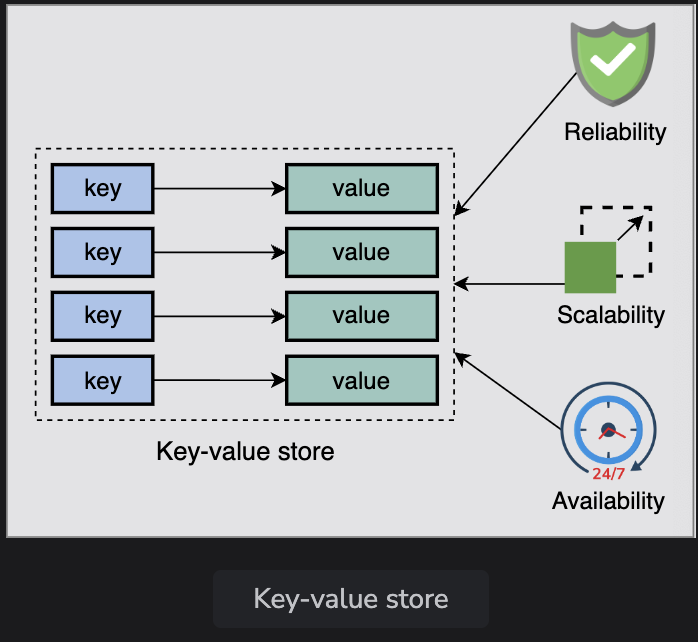

# System Design: The Key-value Store

Let's understand the basics of designing a key-value store.

> We'll cover the following:
>
> - Introduction to key-value stores
> - How will we design a key-value store?

## Introduction to key-value stores

Key-value stores are **distributed hash tables (DHTs).**  
 A key is generated by the hash function and should be unique.

> In a key-value store, a key binds to a specific value and doesn't assume anything about the structure of the value.  
>  A value can be a **blob, image, server name, or anything the user wants to store against a unique key.**
>
> Usually, it's preferred to keep the size of value relatively smaller (KB to MB). We can put large data in the blob store and put links to that data in the value field.
>
> Key-value stores are useful in many situations, such as storing user sessions in a web application and building NoSQL databases.

It's challenging to scale traditional databases with strong consistency and high availability in a distributed environment.  
 Many real-world services like Amazon, Facebook, Instagram, Netflix, and many more **use primary-key access to a data store instead of traditional online transaction processing (OLTP) databases.**

> Examples of key-value store usage include bestseller lists, shopping carts, customer preferences, session management, sales rank, and product catalogs.
>
> 

**NOTE:** Many applications might not require a rich programming model provided by a traditional relational database management system (RDBMS).  
 Using RDBMS for such applications is often expensive in terms of cost and performance.

## How will we design a key-value store?

We've divided the key-value system design into the following four lessons:

1. **Design a Key-value Store:**  
   We'll define the requirements of a key-value store and design the API.
2. **Ensure Scalability and Replication:**
   We'll learn to achieve scalability using consistent hashing and replicate the partitioned data.
3. **Versioning Data and Achieving Configurability:**
   We'll learn to resolve conflicts that occur due to changes made by more than one entity, and we'll make our system more configurable for different use cases.
4. **Enable Fault Tolerance and Failure Detection:**
   We'll learn to make a key-value store fault tolerant and how to detect failures in the system.
