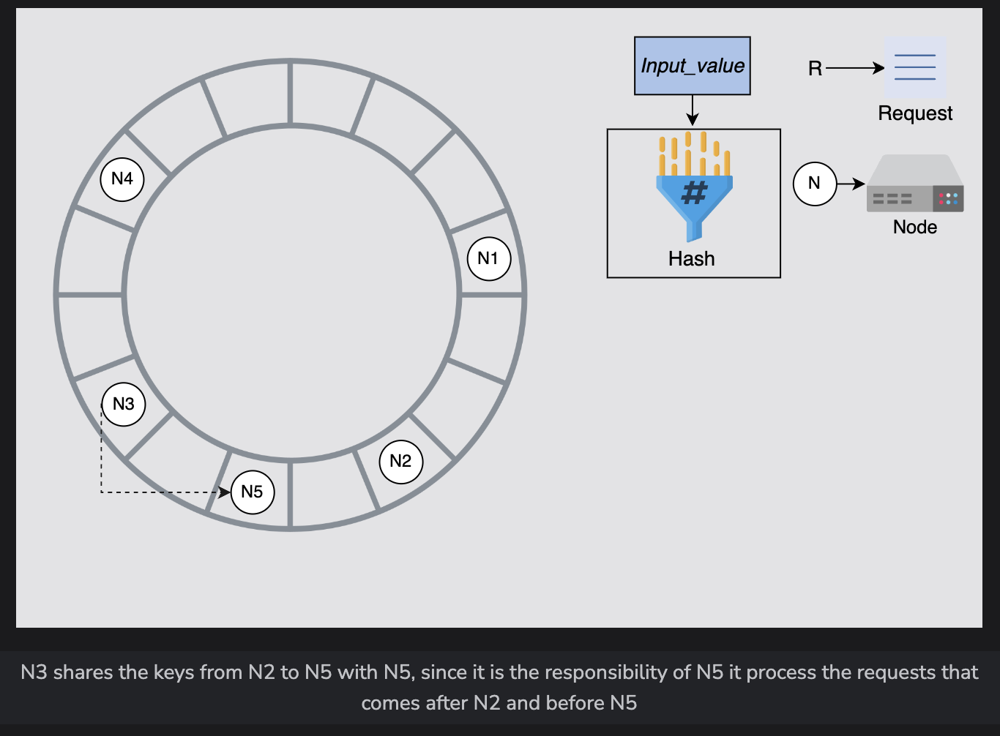
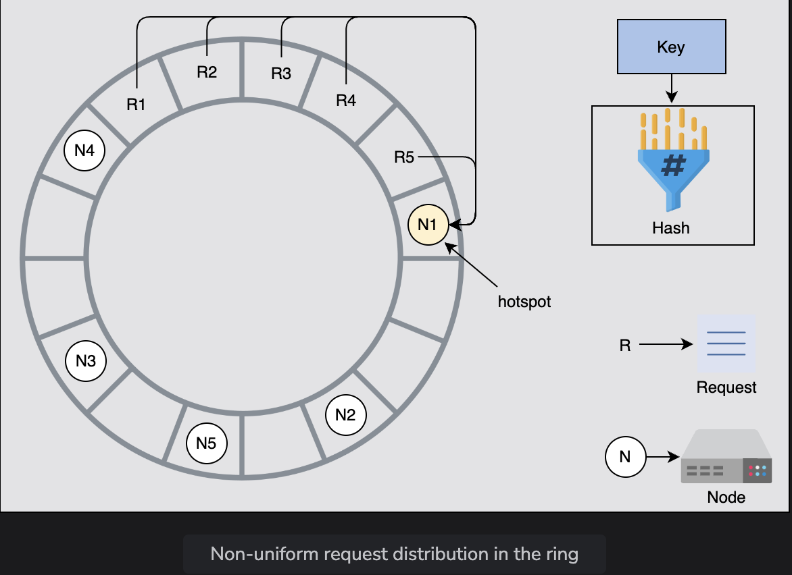
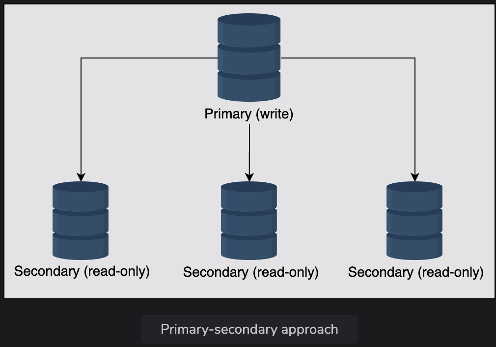
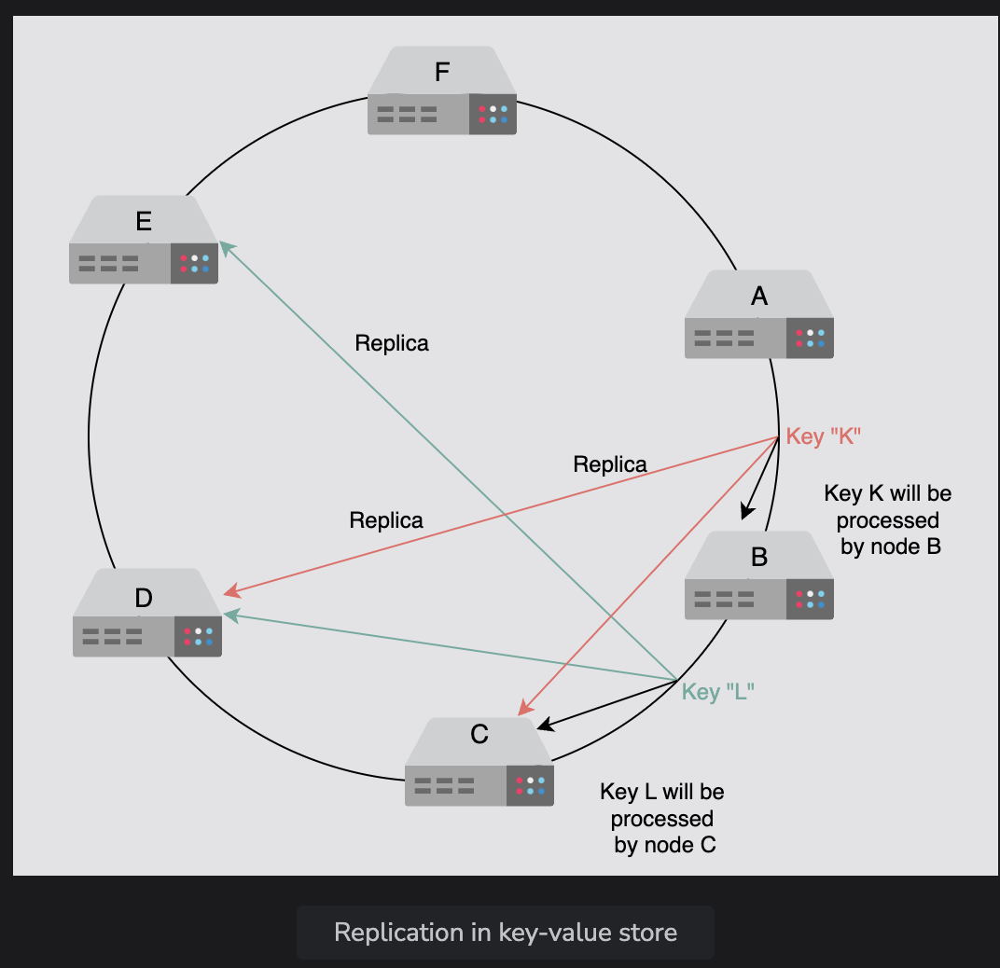

# Ensure Scalability and Replication

Learn how consistent hashing enables scalability and how we replicate such partitioned data.

> We'll cover the following:
>
> - Add scalability
>   - Consitent hashing
>     - Use virtual nodes
>       - Advantages of virtual nodes
> - Data replication
>   - Primary-secondary approach
>   - Peer-to-peer approach

## Add scalability

Let's start with one of the core design requirements: scalability.  
 We store a key-value data in storage node. With a change in demand, we might need to add or remove storage nodes.  
 It means we need to partition data over the nodes in the system to distribute the load across all nodes.

> For example, let's consider that we have four nodes, and we want 25% of the requests to go to each node to balance the load equally.
>
> The traditional way to solve this is through the modulus operator.  
>  Each request that arrives has a key associated with it.
>
> When a request comes in, we calculate the hash of the key.  
>  Then, we find the remainder by taking the modulus of the hashed value with the number of nodes m.
>
> The remainder value x is the node number, and we send the request to that node to process it.

We want to add and remove nodes with minimal change in our infrastructure. But in this method, when we add or remove a node, we need to move a lot of keys.  
 This is inefficient.

> For example, node 2 is removed, and suppose for the same key, the new server to process a request will be node 1 because 10%3 = 1.
>
> Nodes hold information in their local caches, like keys and their values. So, we need to move that request's data to the next node that has to process the request.  
>  But this replication can be costly and can cause high latency.
>
> Next, we'll learn how to copy data efficiently.

---

**POINT TO PONDER**

**QUESTION:** Why didn't we use load balancers to distribute the requests to all nodes?

**ANSWER:** Load balancers distribute client requests according to an algorithm. That algorithm can be simple as explained above, or it can be something detailed, as described in the next section.  
 The next method we'll discuss can be **one of the ways the load balancers balance the requests across the nodes.**

---

### Consistent hashing

Consitent hashing is an effective way to **manage the load over the set of nodes.**  
 In consistent hashing, we consider that we have a conceptual ring of hashes from 0 to n-1, where n is the number of available hash values.  
 We use each node's ID, calculate its hash, and map it to the ring.  
 We apply the same process to requests.  
 Each request is completed by the next node that it finds by moving in the clockwise direction in the ring.

Whenever a new node is added to the ring, the immediate next node is affected. It has to share its data with the newly added node while other nodes are unaffected.  
 It's easy to scale since we're able to keep changes to our nodes minimal. This is because only a small portion of overall keys need to move.  
 The hashes are randomly distributed, so we expect the load of requests to be random and distributed evenly on average on the ring.

The primary benefit of consistent hashing is that **as node join or leave, it ensures that a minimal number of keys need to move**.  
 However, the request load isn't equally divided in practice.  
 Any server that handles a large chunk of data can become a bottleneck in a distributed system.  
 That node will receive a disproportionately large share of data storage and retrieval requests, reducing the overall system performance.
As a result, these are **referred to as hotspots.**

> As shown in the figure below, most of the requests are between the N4 and N1 nodes. Now, N1 has to handle most of the requests compared to other nodes, and it has become a hotspot.  
>  That means non-uniform load distribution has increased load on a single server.
>
> **NOTE:** It's a good exercise to think of possible solutions to the non-uniform load distribution before reading on.
>
> 

#### Use virtual nodes

We'll use **virtual nodes to ensure a more evenly distributed load across the nodes.** Instead of applying a single hash function, we'll **apply multiple hash functions onto the same key**.  
 Whenever the request lands onto the ring, it's processed by the next node found while moving in the clockwise direction.  
 Each server has three positions, so the load of requests is more uniform.  
Moreover, if a node has more hardware capacity than other, we can add more virtual nodes by using additional hash functions.  
 This way, it'll have more positions in the ring and serve more requests.

###### Advantages of virtual nodes

Following are some advantages of using virtual nodes:

- If a node fails or does routine maintenance, the workload is uniformly distributed over other nodes.  
   For each newly accessible node, the other nodes receive nearly equal load when it comes back online or is added to the system.
- It's upto each node decide how many virtual nodes it's responsible for, considering the heterogeneity of the physical infrastructure.
  > For example, if a node has roughly double the computational capacity as compared to the others, it can take more load.

> We've made the proposed design of key-value storage scalable.  
>  The next task is to make our system highly available.

## Data replication

We have various methods to replicate the storage. It can be either a primary-secondary relationship or peer-to-peer relationship.

#### Primary-secondary approach

In a primary-secondary approach, one of the storage areas is primary, and other storage areas are secondary.The secondary replicates its data from the primary.  
 The primary serves the write requests while the secondary serves read requests.  
 After writing, there's a lag for replication. Moreover, if the primary goes down, we can't write into the storage, and it becomes a single point of failure.

---

**QUESTION:** Does the primary-secondary approach fulfill the requirement of the key-value store that we defined in the System Design: The Key-value Store lesson?

**ANSWER:** One of our requirements is that we need the ability to always write. This approach is good for the always read option.  
 However, this approach doesn't include the ability to always write because it will overload the primary storage.  
Moreover, if a primary server fails, we need to upgrade a secondary to a primary.  
 The availability of write will suffer as we won't allow writes during the switch-over time.

---

#### Peer-to-peer approach

In the peer-to-peer approch, all involved storage areas are primary, and they replicate the data to stay updated.  
 Both read and write are allowed on all nodes.  
 Usually, it's inefficient and costly to replicate in all n nodes.  
 Instead, three or five is a common choice for the number of storage nodes to be replicated.  
 

We'll use peer-to-peer relationship for replication.  
 We'll replicate the data on multiple hosts to achieve durability and high availability.  
 Each data item will be replicated at n hosts, where n is a parameter configured per instance of the key-value store.

> For example, if we choose n to be 5, it means we want our data to be replicated to five nodes.

Each node will replicate its data to the other nodes. We'll call node coordinator that handles read or write operations.  
 It's directly responsible for the keys. A coordinator node is assigned the key "K".  
 It's also responsible for replacing the keys to n-1 successors on the ring (clockwise).  
 These lists of successors virtual nodes are called preference lists.  
 To avoid putting replicas on the same physical nodes, the preference list can skip those virtual nodes whose physical node is already in the list.

Let's consider the illustration given below. We have a replication factor, n, set to 3. For the key "K", the replication is done on the next three nodes: B, C, and D.  
 Similarly, for the key "L", the replication is done on nodes C, D, and E.

---

**POINT TO PONDER:**

**QUESTION:** What is the impact of synchronous or asynchronous replication?

**ANSWER:** In the context of the CAP theorem, key-value stores can either be consistent or be available when there are network partitions.  
 For key-value stores, we prefer availability over consistency. It means if the two storage nodes lost connection for replication, they would keep on handling the requests sent to them, and when the connection is restored, they'll sync up.  
 In the disconnected phase, it's highly possible for the nodes to be inconsistent.  
So, we need to resolve such conflicts.

---

> In the next lesson, we'll learn a concept to handle inconsistencies using the versioning of our data.
