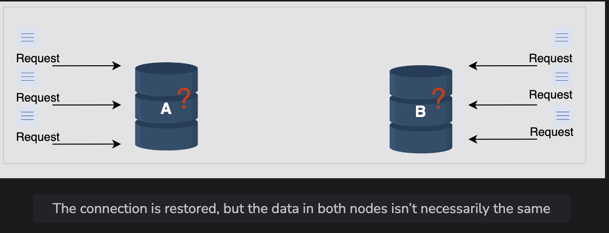

# Versioning Data and Achieving Configurability

Learn how to resolve conflicts via versioning and how to make the key-value storage into a configurable service.

> We'll cover the following:
>
> - Data versioning
>   - Modify the API design
>   - Vector clock usage example
>   - Compromises with vector clocks limitations
>   - The get and put operations
> - Usage of r and w

## Data versioning

> When network partitions and node failures occur during an update, an object’s version history might become fragmented.
>
> As a result, it requires a reconciliation effort on the part of the system. It’s necessary to build a way that explicitly accepts the potential of several copies of the same data so that we can avoid the loss of any updates.
>
> It’s critical to realize that some failure scenarios can lead to multiple copies of the same data in the system. So, these copies might be the same or divergent. Resolving the conflicts among these divergent histories is essential and critical for consistency purposes.
>
> 

- To handle inconsistency, we **need to maintain causality between the events.**  
  We can do this using the timestamps and update all conflicting values with the value of the latest request.  
  But time isn't reliable in a distributed system, so we can't use it as a deciding factor.
- Another approach to maiantaing causality effectively is by using vector clocks.  
   A vector clock is a list of (node, counter) pairs. Ther's a single vector clock for every version of an object.  
   If two objects have different vector clocks, we're able to tell they're causally related or not (more on this in a bit).  
   Unless one of the two changes is reconciled, the two are deemed at odds.

#### Modify the API design

We talked about how we can decide if two events are causally related or not using a vector clock value.  
 For this, we need information about which node performed the operation before and what its vector clock value was. This is the context of an operation.

> So, we'll notify our API design as follows.  
> The API call to get a value should look like this:
>
>           get(key)
>
> We return an object or a collection of conflicting objects along with a context. The context holds encoded metadata about the object, including details such as the object's version.
>
> The API call to put the value into the system should look like this:
>
>           put(key, context, value)
>
> The function finds the node where the value should be placed on the basis of the key and stores the value associated with it.  
>  The context is returned by the system after the get operation. If we have a list of objects in context that raises a conflict, we'll ask the client to resolve it.

#### Vector clock usage example

#### Compromises with vector clocks limitations

#### The get and put operations

## Usage of r and w
