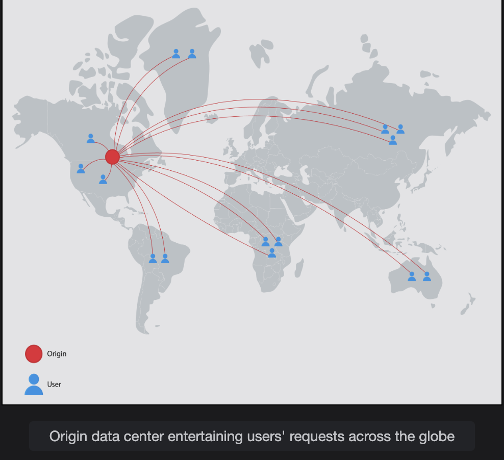

# System Design: The Content Delivery Network (CDN)

Understand what problems a CDN solves.

> We'll cover the following:
>
> - Problem statement
> - How will we design a CDN?

## Problem statement

> Let's start with a question:  
>  If million of users worldwide use our data-intensive applications, and our service is deployed in a single data center to serve the users' requests, what possible problems can arise?
>
> The following problems can arise:
>
> - **High latency:**
> - **Data-intensive applications:**
> - **Scarcity of data center resources:**

#### High latency

Th user-perceived latency will be high due to the physical distance from the serving data center.  
User-perceived latency has many components, such as _**transmission delays** (a function of available bandwidth), **propagation delays** (a function of distance), **queuing delays** (a function of network congesion), and **nodal processing delays**._

Therefore, data transmission over a large distance results in higher latency.

> Real-time applications require a latency below 200 milliseconds (ms) in general.  
> For the Voice over Internet Protocol (VoIP), latency should not be more than 150 ms, whhereas  
> video streaming applications cannot tolerate a latency above a few seconds.

#### Data-intensice applications

Data-intensive applications require transferring large traffic. Over a longer distance, this could be a problem due to the network path streching through different kinds of ISPs.  
 Because of some smaller **Path message transmission unit (MTU)** _(A Path MTU refers to the largest data unit that can traverse from source to destination without the need for splitting.)_ links, the throughput of applications of the network might be reduced.

Similarly, different portions of the network path might have different congestion characteristics. The problem multiplies as the number of users grows because the origin servers will have to provide the data individually to each user.  
 That is, the primary data center will need to send out a lot of redundant data when multiple clients ask for it. However, applications that use streaming services are both data-intensive and dynamic in nature.

#### Scarcity of data center resources

Important data center resources like computational capacity and bandwidth become a limitation when the number of users of a service increases significantly.  
 Services engaging millions of users simultaneously need scaling. Even if scaling is achieved in a single data center, it can still suffer from becoming a single point of failure when the data center goes offline due to natural calamity or connectivity issues with the internet.

## How will we design a CDN?

We've divided the design of CDN into six lessons:

1. **Introduction to a CDN:**  
   Provide a thorough introduction to CDNs and identify the functional and non-functinal requirements.
2. **Design of a CDN:**  
   Explain how to design the CDN. Also briefly describe the API design.
3. **In-depth Investigation of CDN: Part 1:**  
   Explains caching strategies and CDN architecture. Also, discuss various approaches to finding the nearest proxy server.
4. **In-depth Investigation of CDN: Part 2:**  
   Discuss how to make content consistent in a CDN and the deployment of proxy servers. Also cover and specialized CDN in detail.
5. **Evaluation of CDN:**  
   Provide an evaluation of our proposed design.

Let's think about the solution to the discussed issues in the next lesson.
