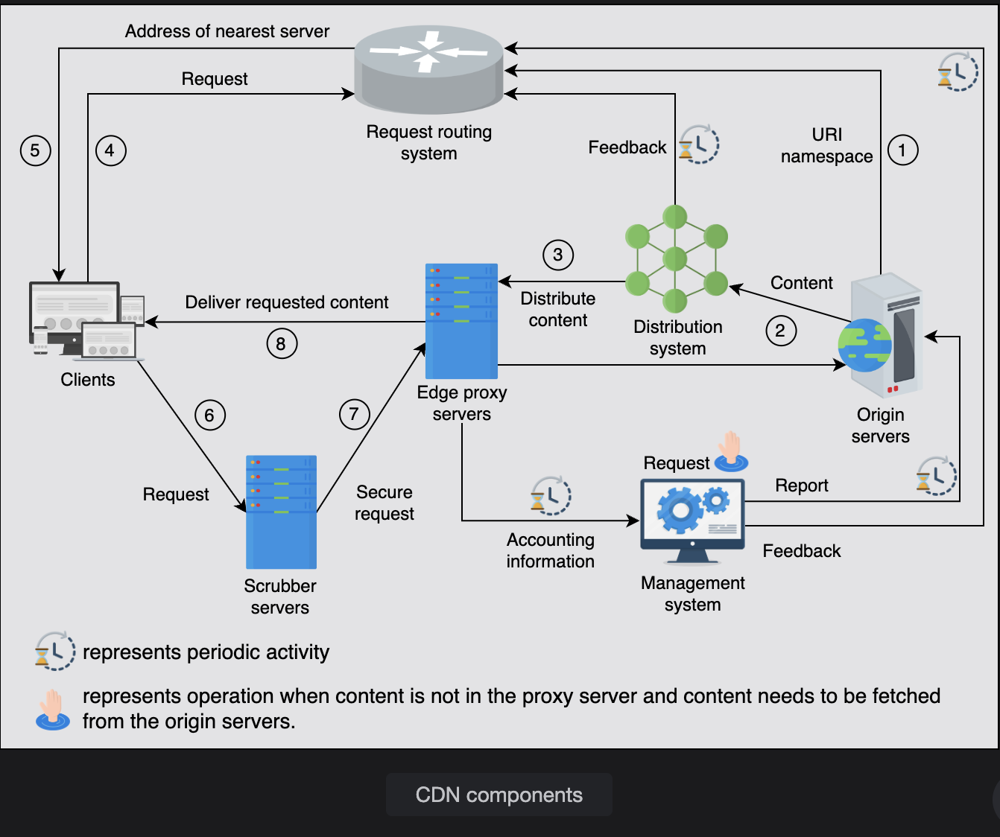
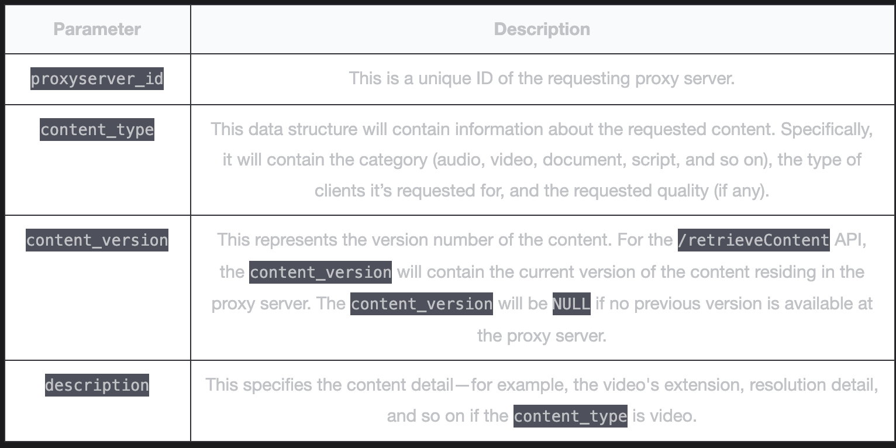

# Design of a CDN

Let's understand the basic design of a CDN system.

> We'll cover the following:
>
> - CDN design
>   - CDN components
>   - Workflow
> - API design
>   - Retrieve (proxy server to origin server)
>   - Deliver (origin server to proxy servers)
>   - Request (clients to proxy servers)
>   - Search (proxy server to peer proxy servers)
>   - Update (proxy server to peer proxy servers)

## CDN design

Explain CDN design in two phases.  
 First phase covers the components that compromise a CDN. By the end of the phase, we'll understand why we need a specific components.  
 Second phase explores the workflow by explaining how each component interacts with others to develop a fully functional CDN.

Let's dive in....

#### CDN components

The following components comprise a CDN:

- **Clients:** End users use various clients, like browsers, smartphones, and other devices, to request content from the CDN.
- **Routing system:** The routing system directs clients to the nearest CDN facility. To do that effectively, this component receives input from various systems to understand where content is placed, how many requests are made for particular content, the load a particular set of servers is handling, and the URI (Uniform Resource Identifier) namespace of various content.  
   In the next lesson, we'll discuss different routing mechanism to forward users to the nearest CDN facility.
- **Scrubber servers:** Scrubber servers are used to separate the good traffic from malicious traffic and protect against well-known attacks, like DDoS. Scrubber servers are generally used only when an attack is detected.  
   In that case, the traffic is scrubberd or cleaned and then routed to the target destination.
- **Proxy servers:** The proxy or edge proxy servers serve the content from RAM to the users. Proxy servers store hot data in RAM, though they can store cold data in SSD or hard drive as well.  
   These servers also provide accounting information and receive content from the distribution system.
- **Distribution system:** The distribution system is responsible for distributing content to all the edge proxy servers to different CDN facilities.  
   This system uses the Internet and intelligent broadcast-like approaches to distribute content across the active edge proxy servers.
- **Origin servers:** The CDN infrastructure facilitates users with data received from the origin servers. The origin servers serve any unavailable data at the CDN to clients.  
   Origin servers will use appropriate stores to keep content and other mapping metadata.
- **Management system:** The management systems are important in CDNs from a business and managerial aspect where resource usage and statistics are constantly observed.  
   The component measures important metrics, like latency, downtime, packet loss, server load, and so on.  
   For third-party CDNs, accounting information can also be used for billing purposes.

#### Workflow

The workflow for the abstract design is given below:

1. The origin servers provide the **URI namespace delegation** (_URI namespace delegation is the process of assigning control of different parts of a URI namespace, such as domain name, to a particular organization._) of all objects cached in the CDN to the request roting system.
2. The original server publishes the content to the distribution system responsible for data distribution across the active edge proxy servers.
3. The distribution system distributes the content among the proxy servers and provides feedback to the request routing system. This feedback is helpful in optimizing the selection of the nearest proxy server for a requesting client. This feedback contains information about which content is cached on which proxy server to route traffic to relevant proxy servers.
4. The client requests the routing system for a suitable proxy server from the request routing system.
5. The request routing system returns the IP address of an appropriate proxy server.
6. The client request routes through the scrubber servers for security reasons.
7. The scrubber server forwards good traffic to the edge proxy server.
8. The edge proxy server serves the client request and periodically forwards accounting informataion to the management system.  
   The management system updates the origin servers and sends feedback to the routing system about the statistics and detail of the content.  
   However, the request is routed to the origin servers if the content isn't available in the proxy servers.  
   It's also possible to have a hierarchy of proxy servers if the content isn't found in the edge proxy servers.  
   For such cases, the request gets forwarded to the parent proxy servers.

## API design

This section discusses the API design of the functionalities offered by CDN. This will help us understand how the CDN will receive requests from the clients, receive content from teh origin servers, and communicate to other components in the network.

Let's develop APIs for each of the following functionalities:

- Retrieve content
- Deliver content
- Request content
- Search content
- Update content
- Delete content

Content can be anything, like a file, video, audio, or other web objects. Here, we'll use the word "content" to refer to all the above.  
 For clarity, we won't discuss the privacy-related parameters - like if the content is public or private, who should be able to access this content, if it should be encrypted, and so on - in the following APIs.

#### Retrieve (proxy server to origin server)

If the prxy servers request content, the GET method retrieves the content through the /retieveContent API below:

        retrieveContent(proxyserver_id, content_type, content_version, description)

> Let's see the details of the parameters:  
>  
>
> The above API gives a response in a JSON file, which contains the text, content types, links to the images or videos in the content, and so on.
>
> Links in the JSON file from where various objects will be downloaded at the proxy servers.

        "Object_links": [
                            {
                            "name": "videos"
                            "link": https://app_server.com/api/assets/videos/
                            },
                            {
                            "name": "illustrations"
                            "link": https://app_server.com/api/assets/illustrations/
                            },
                        ]

#### Deliver (origin server to proxy servers)

The origin servers use this API to deliver the specified content, the updated version, to the proxy servers through the distribution system. We call this /deliverContent API:

        deliverContent(origin_id, server_list, content_type, content_version, description)

> 
>
> The rest of the parameters have been explained above already.

#### Request (clients to proxy servers)

The users use this API to request the content from the proxy servers. We call this /requestContent API:

        requestContent(user_id, content_type, description)

> 
>
> The specified proxy server returns the particular content to the requested users in response to the above API.
>
> Links in the JSON file format where various objects will be downloaded at the user end.

            "Object_links": [
                 {
                 "name": "components"
                 "link": https://cdn.app_server.com/api/components/
                 },
                 {
                 "name": "css"
                 "link": https://cdn.app_server.com/api/css/
                 },
                 {
                 "name": "illustrations"
                 "link": https://cdn.app_server.com/api/assets/illustrations/
                 },
                 {
                 "name": "videos"
                 "link": https://cdn.app_server.com/api/assets/videos/
                 },
                 {
                 "name": "icons"
                 "link": https://cdn.app_server.com/api/icons/
                 },
                 {
                 "name": "fonts"
                 "link": https://cdn.app_server.com/api/fonts/
                 },
                ]

#### Search (proxy server to peer proxy servers)

Although the content is first searched locally at the proxy server, the proxy servers can also probe requested content in the peer proxy servers in the same PoP through the /searchContent API.

This could flood the query to all proxy servers in PoP.  
Alternatively, we can use a data store in the PoP to query the content, though proxy servers will need to maintain what content is available on which proxy server.

The /searchContent API is shown below:

        searchContent(proxyserver_id, content_type, description)

#### Update (proxy server to peer proxy servers)

The proxy servers use the /updateContent API to update the specified content in the peer proxy servers in the PoP.  
It does so when specified isolated scripts run on the CDN to provide image resizing, video resolution conversion, securoty, and many more services.

This type of scripting is known as **serverless scripting.**

        updateContent(proxyserver_id, content_type, description)

> 
>
> The rest of the parameters have been explained above already.

**NOTE:** The Delete API isn't discussed here. In our caching chapter, we discussed different eviction mechanisms in detail. Those mechanisms are also applicable for a CDN content eviction.  
 Nevertheless, situations can arise where the Delete APIs may be required. We'll discuss a few consistency mechanisms, like how much time content stays in the cache.

> In the upcoming lesson, we'll dive deep into the characteristics of CDNs.
