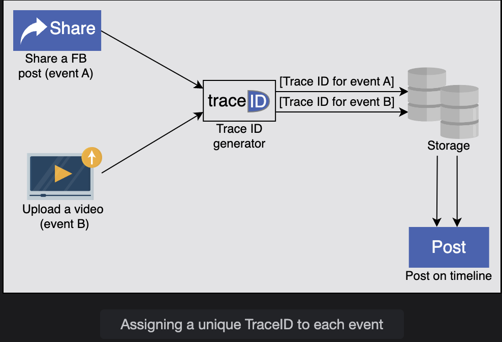

# System Design: Sequencer

Understand the basics of designing a sequencer.

> We'll cover the following:
>
> - Motivation
> - How do we design a sequencer?

## Motivation

> There can be millions of events happening per second in a large distributed system.  
>  Commenting on a post on Facebook, sharing a Tweet, and posting a picture on Instagram are just a few examples of such events.  
>  We need a mechanism to distinguish these events from each other. One such mechanism is the assignment of globally unique IDs to each of these events.
>
> Assigning a primary key to an entry in a databse is another use case of unique ID.  
>  Usually, auto-increment feature in databases fulfills this requirement.  
>  However, that feature won't work for distributed database, where different nodes independently generate the identifiers.
> For this case, we need a unique ID generator that acts as a primary key in a distributed setting - for example, a horizontally-sharded table.

A unique ID helps us identify the flow of an event in the logs and is useful for debugging.

> A real-world example of unique ID usage is Facebook's end-to-end performance tracing and analysis system, Canopy(_an end-to-end performance tracing and analysis system_).
>
> Canopy uses TraceID to identify an event uniquely across the execution path that may potentially perform hundreds of microservices to fulfill one user request.
>
> 

## How do we design a sequencer?

We've divided the sequencer's comprehensive design into the following two lessons:

1. **Design of a Unique ID Generator:** After enlisting the requirements of the design, we discuss three ways to generate unique IDs: using UUID, using a database, and using a range handler.
2. **Unique IDs with Casuality:** In this lesson, we incorporate an additional factor of time in the generation of IDs and explain the process by taking causality into consideration.

Unique IDs are important for identifying events and objects within a distributed system is challenging.  
 In the next lesson, let's lool at the requirements for a distributed unique ID generation system.
