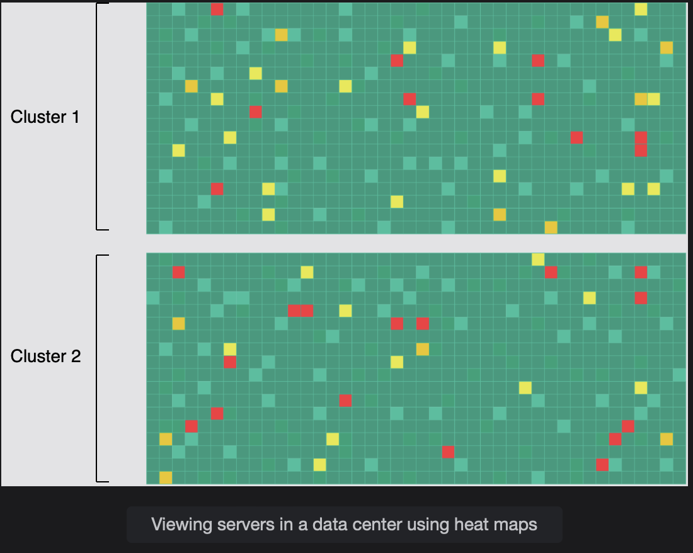

# Visualize Data in a Monitoring System

Learn a novel way to visualize an enormous amount of monitoring data.

> We'll cover the following
>
> - Using heat maps to troubleshoot
> - Summary

Large data centers have millions of servers, and visualizing the health data for all of them is challenging. An important aspect of monitoring a fleet of servers is to know which ones are alive and which ones are offline. A modern data center can house many thousands of servers in a building. We can use a heat map to display information about thousands of servers compactly in a data center.

A heat map is a data visualization technique that shows the magnitude of a phenomenon in two dimensions by using colors.

## Using heat maps to troubleshoot

We’ll identify if a server is down by using heat maps. Each rack of servers is named and is sorted by data center, then cluster, then row, so problems common at any of these levels are readily apparent.

A heat map depicting the operational state of a large number of components is an effective method. The health of each component is indicated by the color of each cell in a big matrix. Nodes with green cells operate within permitted parameters, while nodes with red cells are nonresponsive on multiple tries.

Below, we have a heat map displaying the server’s state.

We can use heat maps for the globally distributed systems and continuously share the health information of a server. We can use one bit (one for live, zero for dead). For 1,000,000 servers, we have 125 KB of data. We can quickly find out which server is down by the red color and focus on the problematic parts.

We can create similar heat maps to get a bird’s-eye view of any resource, like filesystems, networking switches, links, and so on.

---

Certainly! Here’s a concise explanation for your revision:

Part 1 of Revision: Define the Models

- Pull-based monitoring: The central monitoring system periodically “pulls” metrics by sending requests to the monitored servers and retrieving the data.
- Push-based monitoring: Monitored servers actively “push” metrics to the central monitoring system at predetermined intervals.

Part 2 of Revision: Scenario Analysis

- Scenario A (Pull-based approach): Adding 500 new servers could lead to potential network congestion and scalability issues on the monitoring server itself, as it has to pull data from a significantly larger number of servers.
- Scenario B (Push-based approach): With a push-based system, there’s a potential for overwhelming the central collection point and data loss if local agents on the servers are unreliable, due to the increased volume of data being pushed to the monitoring system.

This breakdown should help clarify how each type of monitoring system works and the potential implications of scaling them.

---

## Summary

- Monitoring systems are critical in distributed systems because they help in analyzing the system and alerting the stakeholders if a problem occurs.
- We can make a monitoring system scalable using a hybrid of the push and pull methods.
- Heat maps are a powerful tool for visualization and help us learn about the health of thousands of servers in a compact space.
