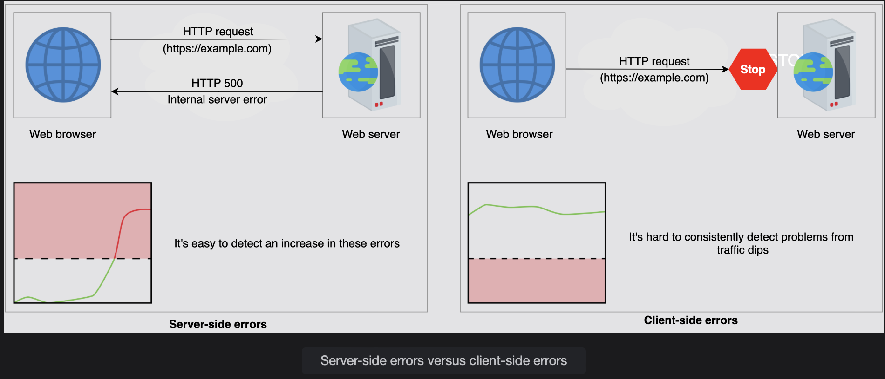
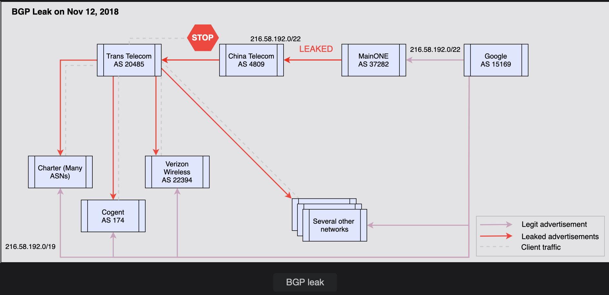

# Focus on Client-side Errors in a Monitoring System

Learn what client-side errors are and their impact on the service.

> We'll cover the following
>
> - Client-side errors
> - Failures due to a routing bug

## Client-side errors

In a distributed system, clients often access the service via an HTTP request. We can monitor our web and application servers’ logs if a request fails to process. If multiple requests fail, we can observe a spike in internal errors (error 500).

Those errors whose root cause is on the client side are hard to respond to because the service has little to no insight into the client’s system. We might try to look for a dip in the load compared to averages, but such a graph is usually hard. It can have false positives and false negatives due to factors such as unexpectedly variable load or if a small portion of the client population is affected.

There are many factors that can cause failures that can result in clients being unable to reach the server. These include the following:

- Failure in DNS name resolution.
- Any failure in routing along the path from the client to the service provider.
- Any failures with third-party infrastructure, such as middleboxes and content delivery networks (CDNs).

## Failures due to a routing bug

Let’s look at a real-world example of an error that impacted a large number of service customers, but the service wasn’t readily aware of it.

One of Google’s peer ISPs accidentally announced Internet routes that it wasn’t supposed to. As a result, the traffic of many of Google’s customers started routing through unintended ISPs and wasn’t reaching Google because of the BGP leak; one of the examples of the BGP leak is shown in the illustration below. Clients were frustrated because they weren’t able to reach Google, while Google might have been unaware of such problems right away because these issues didn’t happen on its infrastructure.

---

Border Gateway Protocol (BGP) is a routing protocol that connects the entire Internet. The routing is easy in a local area network because every device is connected to the same computer network. However, it gets complicated as the network grows, and the Internet is comprised of millions of networks all around the globe. Big organizations and ISPs manage Internet connectivity for multiple network sites and locations themselves. It’s called an autonomous system (AS).

An AS handles the network traffic inside it, and the BGP router manages the inbound and outbound traffic. Each BGP router contains routing tables. It allows BGP to find the best path over the Internet to send the packet to its destination. But a leaked route can occur. A leaked route occurs when an autonomous system propagates some routing announcements beyond their intended scope.

On November 12, 2018, a BGP leak occurred, and it impacted clients worldwide, including Google, Meta, and Amazon. A service announced a 216.58.192.0/19 route to some autonomous systems and a more specific route (216.58.192.0/22) to one autonomous system, which wasn’t supposed to announce it further. IP forwarding picks the longest prefix as a match. In the example, a /22 will be longer than a /19 prefix. Due to configuration errors, the more specific route leaked to the Internet, and because since it’s so specific, all traffic went through the wrong autonomous system, resulting in dropping the traffic.

---

The above leak isn’t unique. Similar issues keep arising. Another such leakage happened on April 16, 2021, when an AS mistakenly announced over 30,000 BGP prefixes. This resulted in a 13 times spike in the inbound traffic to their network. However, an increase in influx was observed, and the problem was solved.

The impacted services’ monitoring systems might not catch the above events readily. Monitoring such situations is crucial so that the application remains available for all of its customers. Therefore, in the next lessons, we’ll go through methods that help us to monitor the situations mentioned above.
