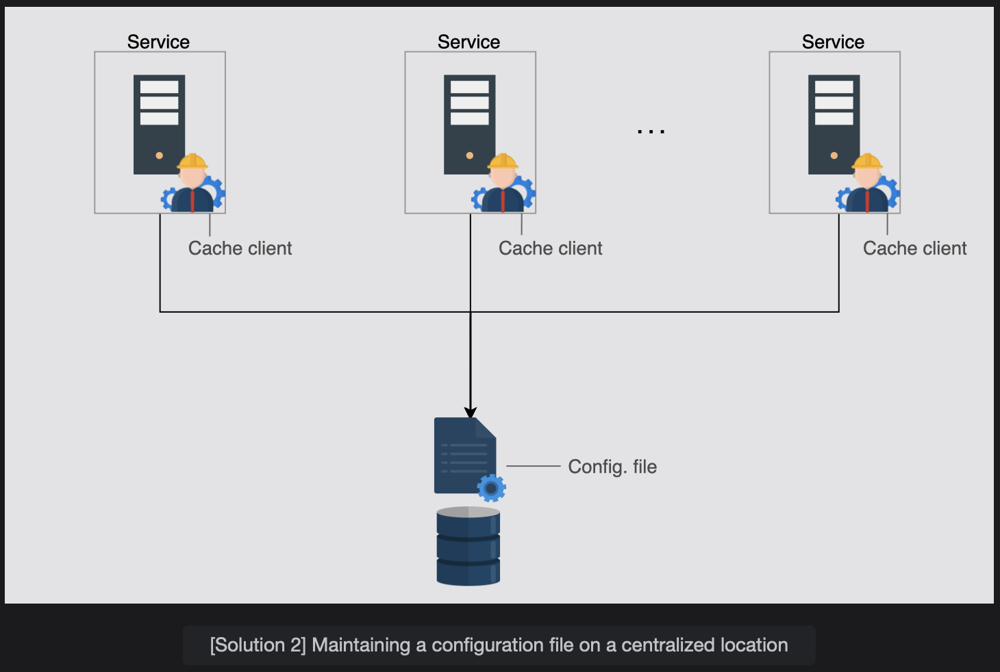
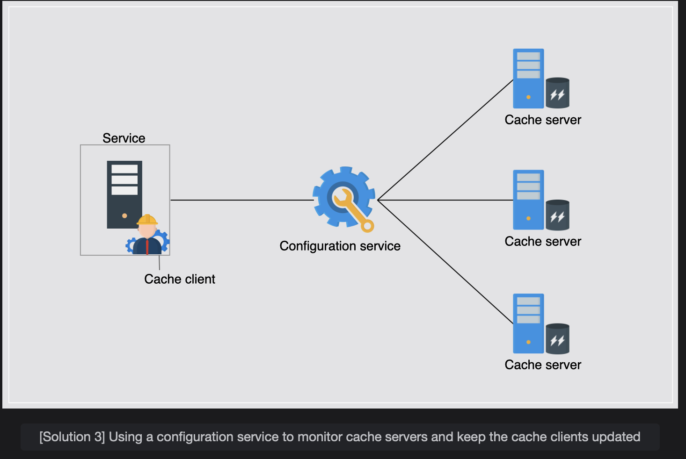
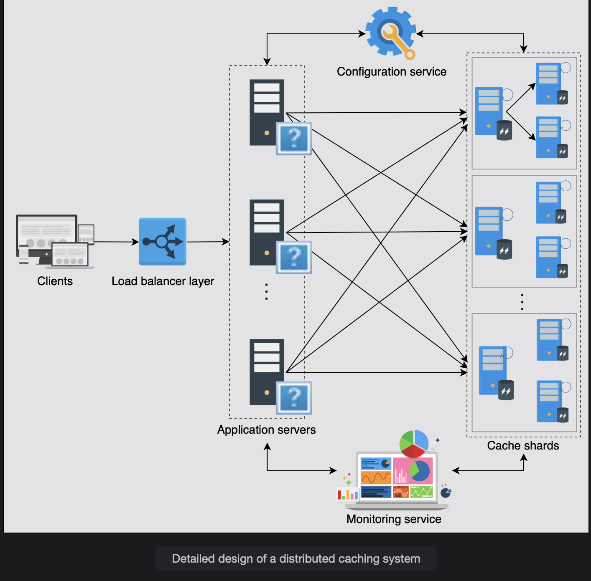

# Detailed Design of a Distributed Cache

Let's understand the detailed design of a distributed cache.

> We'll cover the following
>
> - Find and remove limitations
>   - Maintain cache servers list
>   - Improve availability
>   - Internals of cache server
> - Detailed design

This lesson will identify some shortcomings of the high-level design of a distributed cache and improve the design to cover the gaps. Let’s get started.

## Find and remove limitations

Before we get to the detailed design, we need to understand and overcome some challenges:

- There’s no way for the cache client to realize the addition or failure of a cache server.
- The solution will suffer from the problem of single point of failure (SPOF) because we have a single cache server for each set of cache data. Not only that, if some of the data on any of the cache servers is frequently accessed (generally referred to as a hotkey problem), then our performance will also be slow.
- Our solution also didn’t highlight the internals of cache servers. That is, what kind of data structures will it use to store and what eviction policy will it use?

#### Maintain cache servers list#

Let’s start by resolving the first problem. We’ll take incremental steps toward the best possible solution. Let’s look at the following slides to get an idea of each of the solutions described below:

> - Solution 1: It’s possible to have a configuration file in each of the service hosts where the cache clients reside. The configuration file will contain the updated health and metadata required for the cache clients to utilize the cache servers efficiently. Each copy of the configuration file can be updated through a push service by any DevOps tool. The main problem with this strategy is that the configuration file will have to be manually updated and deployed through some DevOps tools.
> - Solution 2: We can store the configuration file in a centralized location that the cache clients can use to get updated information about cache servers. This solves the deployment issue, but we still need to manually update the configuration file and monitor the health of each server.
> - Solution 3: An automatic way of handling the issue is to use a configuration service that continuously monitors the health of the cache servers. In addition to that, the cache clients will get notified when a new cache server is added to the cluster. When we use this strategy, no human intervention or monitoring will be required in case of failures or the addition of new nodes. Finally, the cache clients obtain the list of cache servers from the configuration service.
>
> The configuration service has the highest operational cost. At the same time, it’s a complex solution. However, it’s the most robust among all the solutions we presented.

#### Improve availability

The second problem relates to cache unavailability if the cache servers fail. A simple solution is the addition of replica nodes. We can start by adding one primary and two backup nodes in a cache shard. With replicas, there’s always a possibility of inconsistency. If our replicas are in close proximity, writing over replicas is performed synchronously to avoid inconsistencies between shard replicas. It’s crucial to divide cache data among shards so that neither the problem of unavailability arises nor any hardware is wasted.

This solution has two main advantages:

- There’s improved availability in case of failures.
- Hot shards can have multiple nodes (primary-secondary) for reads.

Not only will such a solution improve availability, but it will also add to the performance.

#### Internals of cache server

Each cache client should use three mechanisms to store and evict entries from the cache servers:

- **Hash map:** The cache server uses a hash map to store or locate different entries inside the RAM of cache servers. The illustration below shows that the map contains pointers to each cache value.
- **Doubly linked list:** If we have to evict data from the cache, we require a linked list so that we can order entries according to their frequency of access. The illustration below depicts how entries are connected using a doubly linked list.
- **Eviction policy:** The eviction policy depends on the application requirements. Here, we assume the least recently used (LRU) eviction policy.

A depiction of a sharded cluster along with a node’s data structure is provided below:

> It’s evident from the explanation above that we don’t provide a delete API. This is because the eviction (through eviction algorithm) and deletion (of expired entries through TTL) is done locally at cache servers. Nevertheless, situations can arise where the delete API may be required. For example, when we delete a recently added entry from the database, it should result in the removal of items from the cache for the sake of consistency.

## Detailed design

We’re now ready to formalize the detailed design after resolving each of the three previously highlighted problems. Look at the detailed design below:

Let’s summarize the proposed detailed design in a few points:

- The client’s requests reach the service hosts through the load balancers where the cache clients reside.
- Each cache client uses consistent hashing to identify the cache server. Next, the cache client forwards the request to the cache server maintaining a specific shard.
- Each cache server has primary and replica servers. Internally, every server uses the same mechanisms to store and evict cache entries.
- Configuration service ensures that all the clients see an updated and consistent view of the cache servers.
- Monitoring services can be additionally used to log and report different metrics of the caching service.

> Note: An important aspect of the design is that cache entries are stored and retrieved from RAM. We discussed the suitability of RAM for designing a caching system in the previous lesson.

---

**While consistent hashing is a good choice, it may result in unequal distribution of data, and certain servers may get overloaded. How do we resolve this problem?**

A number of consistent hashing algorithms’ flavors have been suggested over time. We can use one such flavor (used here) that distributes load uniformly and even makes multiple copies of the same data on different cache servers. Each cache server can have virtual servers inside it, and the number of virtual servers in a machine depends on the machine’s capability. This results in a finer control on the amount of load on a cache server. At the same time, it improves availability.

---
