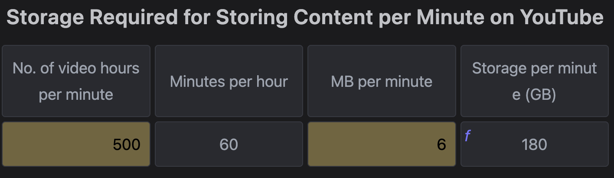

# Requirements of YouTube's Design

Understand the requirements and estimation for YouTube's design.

> We'll cover the following:
>
> - Requirements
>   - Functional requirements
>   - Non-functional requirements
> - Resource estimation
>   - Storage estimation
>   - Bandwidth estimation
>   - Number of servers estimation
> - Building blocks we will use

## Requirements

Let's start with the requirements for designing a system like YouTube.

### Functional requirements

We require that our system is able to perform the following functions:

1. Stream videos
2. Upload videos
3. Search videos according to titles
4. Like and dislike videos
5. Add comments to videos
6. View thumbnails

### Non-functional requirements

It's important that our system also meets the following requirements:

- **High availability:**  
   The system should be highly available. High availability requires a good performance of uptime.  
   Generally, an uptime of 99% and above is considered good.
- **Scalability:**  
   As the number of user grows, these issues should not become bottlenecks: storage for uploading content, the bandwidth required for simultaneous viewing, and the number of concurrent user requests should not overwhelm our application/web server.
- **Good performance:**  
   A smooth streaming experience leads to better performance overall.
- **Reliability:**  
   Content uploaded to the system should not be lost or damaged.››

We don't require strong consistency for YouTube's design.  
 Consider an example where a creator uploads a video. Not all users subscribed to the creator's channel should immediately get the notification for uploaded content.

To summarize, **the functional requirements are the features and functionalities that the user will get**, whereas **the non-functional requirements are the expectations in terms of performance from the system**.

Based on the requirements, we'll estimate the required resources and design of our system.

## Resource estimation

Estimation requires the identification of important resources that we'll need in the system.

Hundreds of minutes of video content get uploaded to YouTube every minute. Also, a large number of users will be streaming content at the same time, which means that the following resources will be required:

- **Storage resources** will be needed to store uploaded and processed content.
- A large number of requests can be handled by doing **concurrent processing**.  
   This means web/application servers should be in place to serve three users.
- Both **upload and download bandwidth will be required** to serve millions of users.

To convert the above resources into actual numbers, we assume the following:

- Total number of YouTube users: 1.5 billion.
- Active daily users (who watch or upload videos): 500 million
- Average length of a video: 5 minutes
- Size of an average (5 minute-long) video before processing/encoding  
   (compression, format changes, and so on): 600 MB
- Size of an average video after encoding (using differnet algorithms for different resolutions like MPEG-4 and VP9): 30 MB

### Storage estimation

To find the storage needs of YouTube, we have to estimate the total number of videos and the length of each video uploaded to YouTube per minute.

> Let's consider that 500 hours worth of content is uploaded to YouTube in one minute.
>
> Since each video of 30MB is 5 minutes long, we require 30/5 = 6 MB to store 1 minute of video.

Let's put this in a formula by assuming the following:

Total (Storage) : Total storage requirement

Total (upload/min) : Total content uploaded (in minutes) per minute

- Example : 500 hours worth of video is uploaded in one minute

Storage (min) : Storage required for each minute of content

Then, the following formula is used to compute the storage:

        Total(storage) = Total (upload/min) * Storage (min)

Below is a calculator to help us estimate our required resources.  
We'll look first at the storage required to persist 500 hours of content uploaded per minute, where each minute of video costs 6 MBs to store:

The numbers mentioned above correspond to the compressed version of videos.  
 However, we need to transcode videos into various formats for reasons that we will see in the coming lessons.  
 Therefore, we'll require more storage space than the one estimated above.

> **NOTE:** In a real-world scenerio, YouTube's design requires storage for thumbnails, user's data, video metadata, user's channel information, and so on.
>
> Since the storage requirements for these data sets will not be significant compared to video files, we ignore it for simplicity's sake.

> **Question:**  
> Assuming YouTube stores videos in five different qualities and the average size of a one-minute video is 6 MB, what would the estimated storage requirements per minute be?
>
> Since we need 6 MBs per minute and we need to store files in five different formats, the overall requirement is 5 \* 6 MB = 30 MBs.
>
> Next, we'll calculate the below value:
>
> 

### Bandwidth estimation

A lot of data transfer will be performed for streaming and uploading videos to YouTube.  
 This is why we need to calculate our bandwidth estimation too.

Assume the **upload:view ratio is 1:300** - that is, for each uploaded video, we have 300 video views per second.  
We'll also have to keep in mind that when a video is uploaded, it is not in compressed format, while viewed videos can be of different qualities.

Let's estimate the bandwidth required for uploading the videos.

> We assume:
>
> Total (bandwidth) : Total bandwidth required.
>
> Total (content) : Total content (in minutes) uploaded per minute.
>
> Size (minute) : Transmission required (in MBs) for each minute of content.
>
> Then, the following formula is used to do the computation below:
>
> Total (bandwidth) = Total (content_transferred) \* Size (minute)
>
> 
>
> **Hide Calculations**
>
> We calculate bandwidth in bits per second (bps), as shown above. Therefore, the detailed calculation of the above number (480 Gbps) is given below.
>
> Let' convert the numbers to appropriate units first:
>
> - No. of video hours per minute = 500 hours
> - No. of video minutes per minute = 500 \* 60 = 30,000 minutes
> - MB per minute = 120 MB/minute
> - MB per second = 120/60 = 2 MB/second
>
> Bandwidth = 30,000 minutes/minute \* 2 MB/secong \* 8 bits/Byte = 480,000 Mbps = 480 Gbps
>
> The 8 bits are used to convert bytes to bits.  
>  By convention metric of bandwidth is in bits per second.
>
> **Question**
> If 480 Gbps of bandwidth is required to satisfy uploading needs, how much bandwidth would be required to strem videos?  
>  Assume each minute of video requires 10 MB of bandwidth on average.
>
> **HINT:** The upload:view ratio is provided.
>
> For every video uploaded, 300 videos are watched. Therefore, the equation becomes this:
>
> 
>
> 

### Number of servers estimation

Let's assume that we have 500 million daily active users of YouTube.  
 Considering our assumption of using daily active users as a proxy for the number of requests per second to find the number of servers for peak load times, we get 500 million requests per second.

Then, we can use the following formula to calculate the number of servers:

    Servers needed at the peak load = (Number of requests/second) / (RPS of server)

    Servers needed at peak load = 500 million / 64,000 = 7812.5 ~ 8K servers

> **NOTE:** Concurrent requests significantly impact the number of required servers compared to requests spread over time.

## Building blocks we will use

Now that we have completed the resource estimations, let's identify the building blocks that will be an integral part of our design for the YouTube system.

The key building blocks are given below:  
 

- **Databases:** are required to store the metadata of videos, thumbnails, comments, and user-related information.
- **Blob storage:** is importatn for storing all videos on the platform.
- A **CDN** is used to effectively deliver content to end users, reducing delay and burden on end-servers.
- **Load balancers:** are a necessity to distribute millions of incoming clients requests among the pool of available servers.

Other than our building blocks, we anticipate the use of the following components in our high-level design:

- **Servers** are a basic requirements to run application logic and entertain user requests.
- **Encoders and transcoders** compress videos and transform them into different formats and qualifies to support varying numbers of devices according to their screen resolution and bandwidth.

