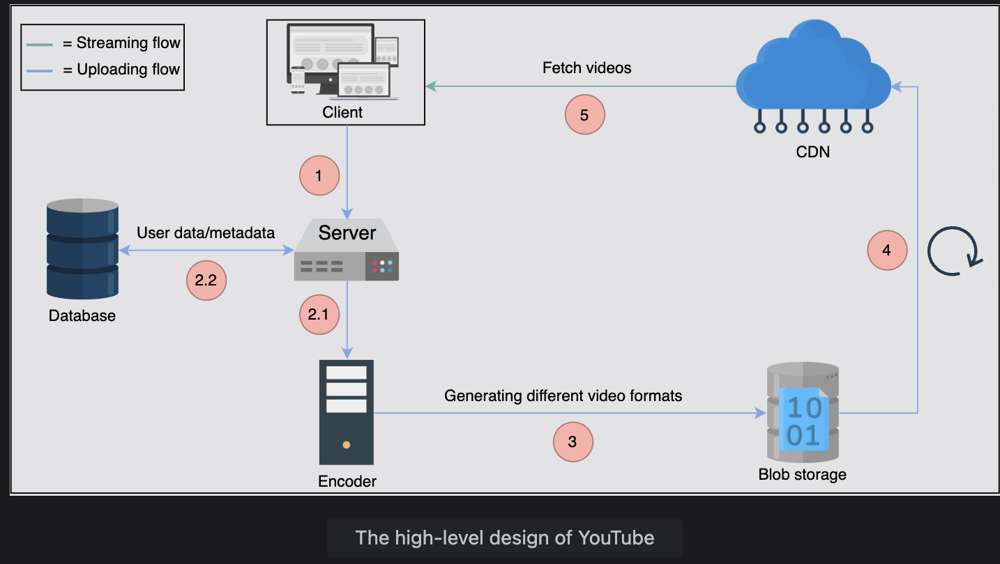
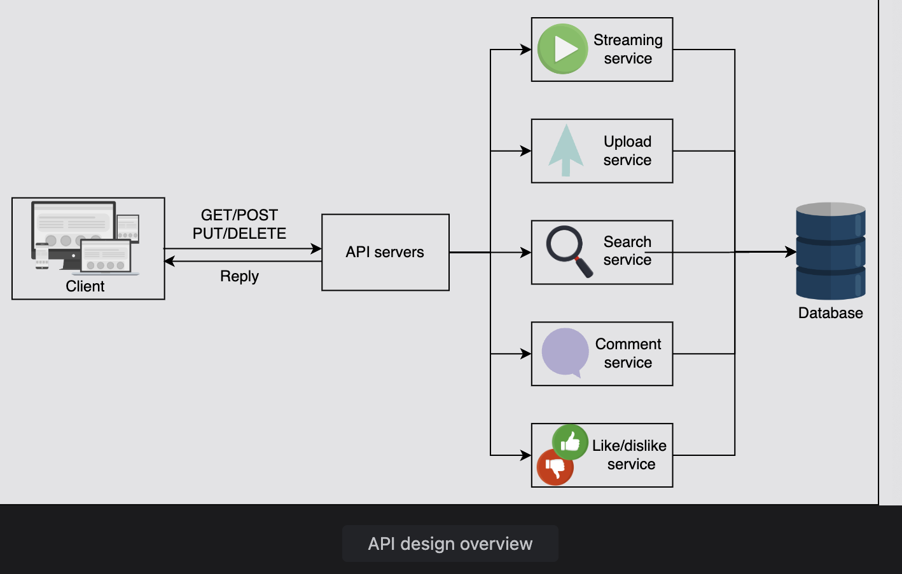
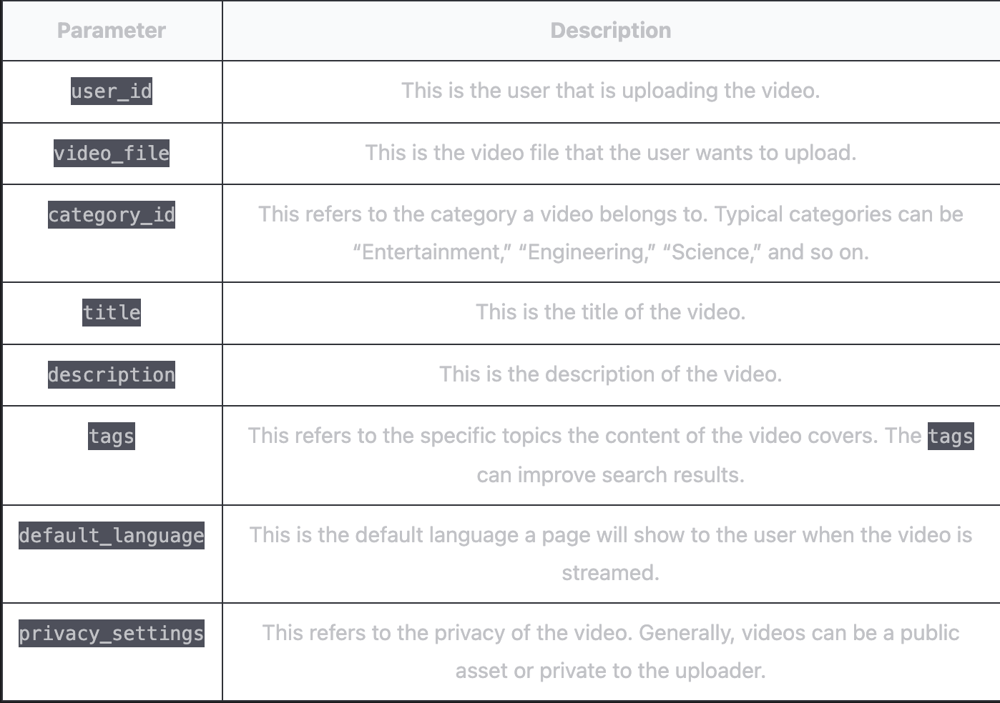
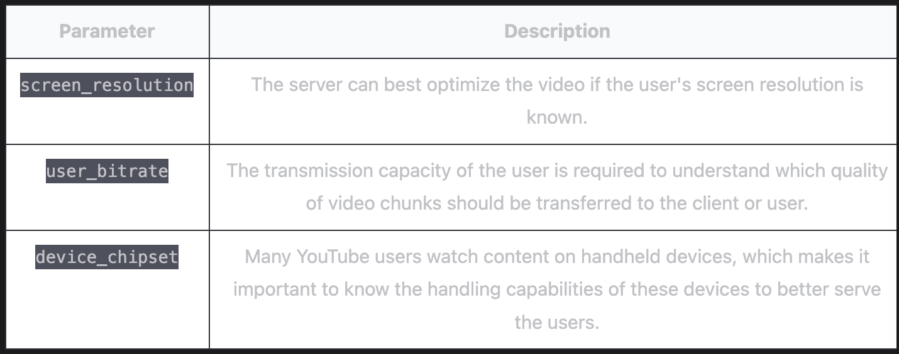
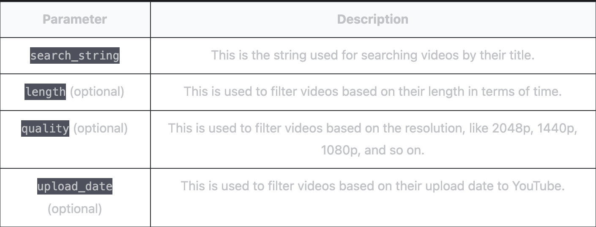
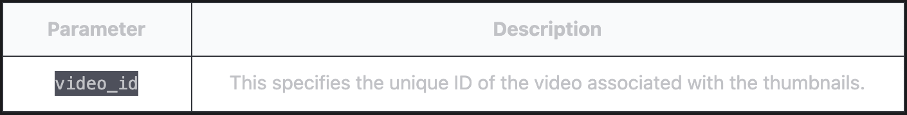
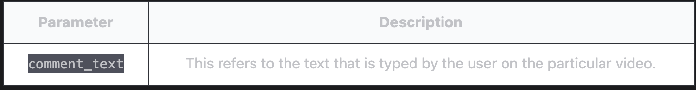
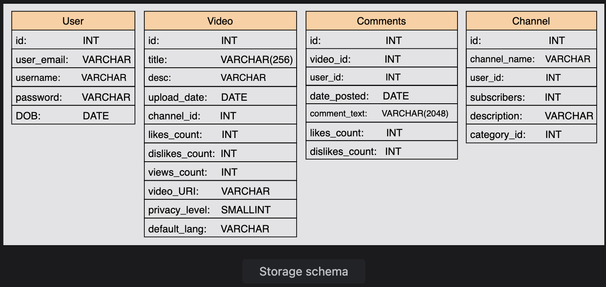
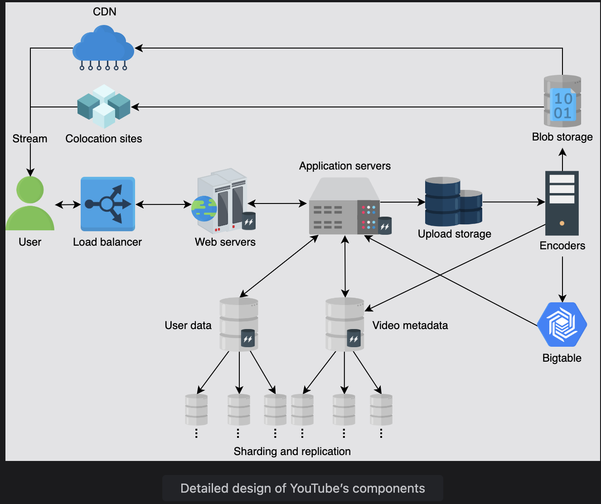

# Design of YouTube

Take a deep dive into YouTube's design.

> We'll cover the following:
>
> - High-level design
> - API design
>   - Upload video
>   - Stream video
>   - Search videos
>   - View thumbnails
> - Like and dislike a video
> - Comment video
> - Storage video
> - Detailed design
>   - Detailed design components
>   - Design flow and technology usage
> - YouTube search

## High-level design

The high-level design shows how we'll interconnect the various components we identified in the previous lesson.

> We have started developing a solution to support the functional and non-functional requirements with this design.
>
> 
>
> The workflow for the abstract design is provided below:
>
> 1.  The user uploads a video to the server.
> 2.  The server stores the metadata and the accompanying user data to the database and, at the same time, hands over the video to the encoder for encoding.
> 3.  The encoder, along with the transcoder, compresses the video and transforms it into multiple resolutions (like 2160p, 1440p, 1080p, and so on).  
>      The videos are stored on blob storage (similar to GFS or S3).
> 4.  The CDN, because of its vicinity to the user, lets the user stream the video with low latency.  
>      However, **CDN is not the only infrastructure for serving videos to the end user**, which we will see in the detailed design.
>
> **Question**  
> Why don't we upload the video directly to the encoder instead of to the server? Doesn't the current strategy introduce an additional delay?
>
> There are several reasons why it's a good idea to introduce a server in between the encoder and the client:
>
> - The client could be malicious and could abuse the encoder.
> - If the uploaded video is a duplicate, the server could filter it out.
> - Encoders will be available on a private IP address within YouTube's network and not available for public access.

## API design

Let's understand the design of APIs in terms of the functionalities we're providing.

We'll design APIs to translate our feature set into technical specifications.  
In this case, REST APIs can be used for simplicity and speed purposes.
Our API design section will help us understand how the client will request services from the back-end application of YouTube.

Let's develop APIs for each of the following features:

- Upload videos
- Stream videos
- Search videos
- View thumbnails
- Like or dislike videos
- Comment on videos

### Upload video

The POST method can upload a video to the /uploadVideo API:

        uploadVideo(user_id, video_file, category_id, title, description, tags, default_language, privacy_settings)

Let's take a look at the description of the following parameters here.

> The video file is broken down into smaller packets and uploaded to the server in order.  
>  In case of failure, YouTube can store data for a limited time and resume the upload if the user retries.
>
> To understand the concept in detail, read more about **_asynchronous APIs_**.  
>  APIs where the server cannot fulfill the request immediately, either because the data is too large or isn't readily available.
>
> In that case, the client gets an immediate response that the server has accepted the request while the server responds with the data later on.
>
> Such a mechanism saves the CPU and network bandwidth, and does not keep the client waiting.

### Stream video

The GET method is best suited for the /streamVideo API:

        streamVideo(user_id, video_id, screen_resolution, user_bitrate, device_chipset)

Some new things introduced in this case are the following parameters:

> The server will store different qualities of the same video in its storage and serve users based on their transmission rate.

### Search videos

The /searchVideo API uses the GET method:

        searchVideo(user_id, search_string, length, quality, upload_date)

### Video thumbnails

We can use the GET method to access the /viewThumbnails API:

        viewThumbnails(user_id, video_id)

This API will return the thumbnails of a video in a sequence.

## Like and dislike video

This like and dislike API uses the POST method to register a like/dislike.  
As shown it's fairly simple.

        likeDislike(user_id, video_id, like)

We can use the same API for the like and dislike functionality.  
 Depending on what is passed as a parameter to the like field, we can update the database accordingly - that is, 0 for like and 1 for dislike.

> The like field may also accept another input, such as none, to remove the like/dislike earlier registered by a user.

## Comment video

Much like the like and dislike API, we only have to provide the comment string to the API.  
 This API will also use the POST method.

        commentVideo(user_id, video_id, comment_text)

## Storage schema

Each of the above features in the API design requires support from the database - we'll need to store the details above in our storage schema to provide services to the API gateway.

> **NOTE:** Much of the underlying details regarding database tables that can be mapped to services provided by YouTube have been omitted for simplicity.  
>  For example, one video can have different qualities and that is not mentioned in the "Video" table.

## Detailed design

Now, let’s get back to our high-level design and see if we can further explore parts of the design. In particular, the following areas require more discussion:

- **Component integration:** We’ll cover some **interconnections between the servers and storage components** to better understand how the system will work.
- **Thumbnails:** It’s **important for users to see some parts of the video through thumbnails**.  
   Therefore, we’ll add thumbnail generation and storage to the detailed design.
- **Database structure:** Our estimation showed that we **require massive storage space**.  
   We also require storing varying types of data, such as videos, video metadata, and thumbnails, each of which demands specialized data storage for performance reasons. Understanding the database details will enable us to design a system with the least possible lag.

Let’s take a look at the diagram below. We’ll explain our design in two steps, where the **first looks at what the newly added components are**, and **the second considers how they coordinate to build the YouTube system**.

### Detailed design components

Since we highlighted the **requirements of smooth streaming, server-level details, and thumbnail features,** the following design will meet our expectations.

Let’s explain the purpose of each added component here:

- **Load balancers:** To divide a large number of user requests among the web servers, we require load balancers.
- **Web servers:** Web servers take in user requests and respond to them. These can be considered the interface to our API servers that entertain user requests.
- **Application server:** The application and business logic resides in application servers. They prepare the data needed by the web servers to handle the end users’ queries.
- **User and metadata storage:** Since we have a large number of users and videos, the storage required to hold the metadata of videos and the content related to users must be stored in different storage clusters. This is because a large amount of not-so-related data should be decoupled for scalability purposes.
- **Bigtable:** For each video, we’ll require multiple thumbnails. Bigtable is a good choice for storing thumbnails because of its high throughput and scalability for storing key-value data. Bigtable is optimal for storing a large number of data items each below 10 MB. Therefore, it is the ideal choice for YouTube’s thumbnails.
- **Upload storage:** The upload storage is temporary storage that can store user-uploaded videos.
- **Encoders:** Each uploaded video requires compression and transcoding into various formats. Thumbnail generation service is also obtained from the encoders.
- **CDN and colocation sites:** CDNs and colocation sites store popular and moderately popular content that is closer to the user for easy access. Colocation centers are used where it’s not possible to invest in a data center facility due to business reasons.

### Design flow and technology usage

Now that we understand the purpose of every component, let’s discuss the **flow and technology used in different components** in the following steps:

1. The user can **upload a video by connecting to the web servers**. The web server can run Apache or Lighttpd.  
   Lighttpd is preferable because it can serve static pages and videos due to its fast speed.
2. **Requests from the web servers are passed onto application servers** that can contact various data stores to read or write user, videos, or videos’ metadata.  
   There are separate web and application servers because we want to decouple clients’ services from the application and business logic. Different programming languages can be used on this layer to perform different tasks efficiently. For example, the C programming language can be used for encryption. Moreover, this gives us an additional layer of caching, where the most requested objects are stored on the application server while the most frequently requested pages will be stored on the web servers.
3. Multiple storage units are used. Let’s go through each of these:
   - Upload storage is used to store user-uploaded videos temporarily before they are encoded.
   - User account data is stored in a separate database, whereas videos metadata is stored separately.  
     The idea is to separate the more frequently and less frequently accessed storage clusters from each other for optimal access time. We can use MySQL if there are a limited number of concurrent reads and writes. However, as the number of users—and therefore the number of concurrent reads and writes—grows, we can move towards NoSQL types of data management systems.
   - Since Bigtable is based on Google File System (GFS), it is designed to store a large number of small files with low retrieval latency. It is a reasonable choice for storing thumbnails.
4. The encoders generate thumbnails and also store additional metadata related to videos in the metadata database. It will also provide popular and moderately popular content to CDNs and colocation servers, respectively.
5. The user can finally stream videos from any available site.

> **Note:** Because YouTube is storage intensive, **sharding different storage services will effectively come into play** as we scale and do frequent writes on the database.  
>  At the same time, Bigtable has multiple cache hierarchies. If we combine that with GFS, web- and application-level caching will further reduce the request processing latency.

## YouTube search

Since YouTube is one of the most visited websites, a large number of users will be using the search feature. Even though we have covered a building block on distributed search, we’ll provide a basic overview of how search inside the YouTube system will work.

Each new video uploaded to YouTube will be processed for data extraction. We can use a JSON file to store extracted data, which includes the following:

- Title of the video.
- Channel name.
- Description of the video.
- The content of the video, possibly extracted from the transcripts.
- Video length.
- Categories.

Each of the JSON files can be referred to as a document.  
 Next, keywords will be extracted from the documents and stored in a key-value store. The key in the key-value store will hold all the keywords searched by the users, while the value in the key-value store will contain the occurrence of each key, its frequency, and the location of the occurrence in the different documents. When a user searches for a keyword, the videos with the most relevant keywords will be returned.

The approach above is simplistic, and the relevance of keywords is not the only factor affecting search in YouTube.  
 In reality, a number of other factors will matter. The processing engine will improve the search results by filtering and ranking videos

It will make use of other factors like view count, the watch time of videos, and the context, along with the history of the user, to improve search results.
