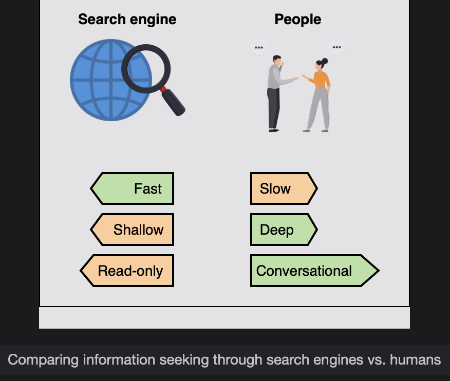
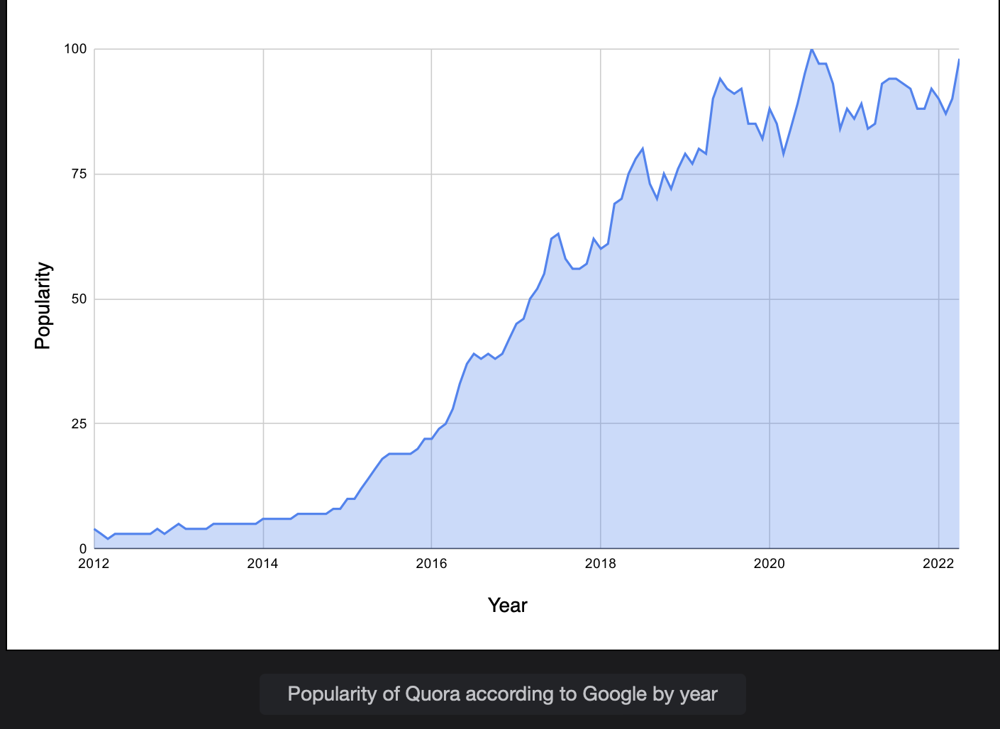

# System Design: Quora

Learn about the basics of designing Quora.

> We'll cover the folowing:
>
> - Introduction
> - What is Quora?
> - How will we design Quora?

## Introduction

> With so much information available online, finding answers to questions can be daunting. That’s why information sharing online has become so widespread..  
> Search engines help us dig for information across the web.  
>  For example, Google’s search engine is intelligent enough to answer questions by extracting information from web pages.  
>  While search engines have their advantages, sometimes finding the information we want isn’t a straightforward process.  
>  Let’s look at the illustration below to understand how seeking information through search engines is different in comparison to people.
>
> 
>
> The illustration above depicts that information-seeking through other people can be more instructive, even if it comes at the cost of additional time. Seeking information through search engines can lead to dead ends because of content unavailability on a topic.  
>  Instead, we can ask questions of others.

## What is Quora?

Quora is a social question-and-answer service that allows users to ask questions to other users.  
Quora was created because of the issue that asking questions from search engines results in fast answers but shallow information.  
Instead, we can ask the general public, which feels more conversational and can result in deeper understanding, even if it’s slower.  
Quora enables anyone to ask questions, and anyone can reply. Furthermore, there are domain experts that have in-depth knowledge of a specific topic who occasionally share their expertise by answering questions.

More than 300 million monthly active users post thousands of questions daily to more than 400,000 topics on Quora.

> In this chapter, we'll design Quora and evalute how it fulfills the functional and non-fucntional requirements.

## How will we design Quora?

We'll design Quora by dividing the design problem into the following four lessons.

1. **Requirements:** Focus on the fucntional and non-functional requirements for designing Quora. Also estimate the resources required to design the system.
2. **Initial design:** Create an initial design that fulfills all the functional requirements for Quora and also formulate the API design in this lesson.  
   Primarily, discuss the system's building blocks, other components involved in completing the design, their integration, and workflow.
3. **Final design:** Start by identifying the limitations of the intial design. Then, we'll update our final design to fulfill all the functional and non-functional requirements while addressing these limitations.
   Also focus on some interesting aspects of our design, like vertical sharding of the database.
4. **Evaluation:** Assess our design specifically for non-functional requirements and discuss some of its trade-offs.  
   Also discuss ideas on how we can improve the availability of our design in this lesson.

> **NOTE:** The information provided in this chapter is inspired by the enginering blog of Quora.
