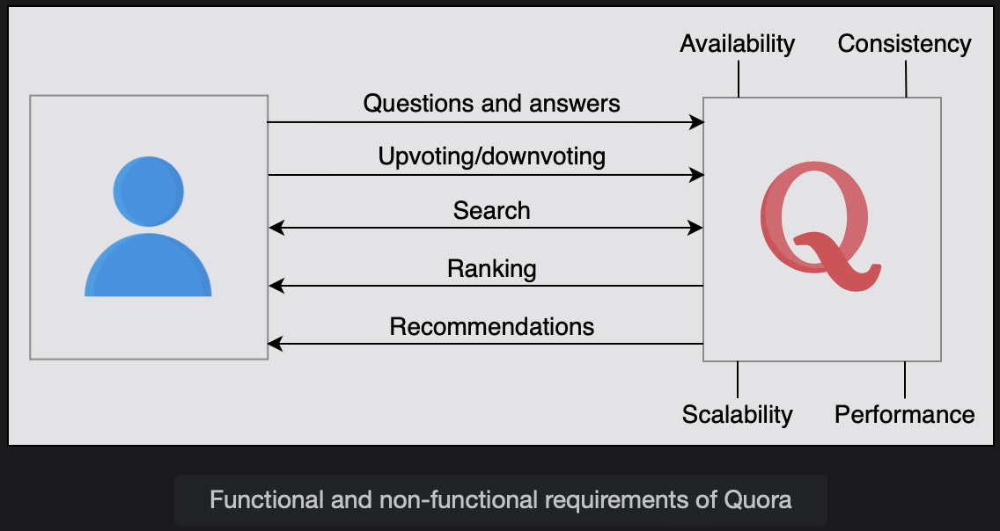
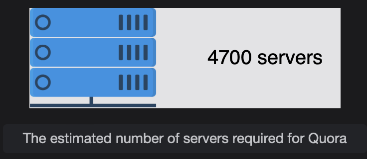
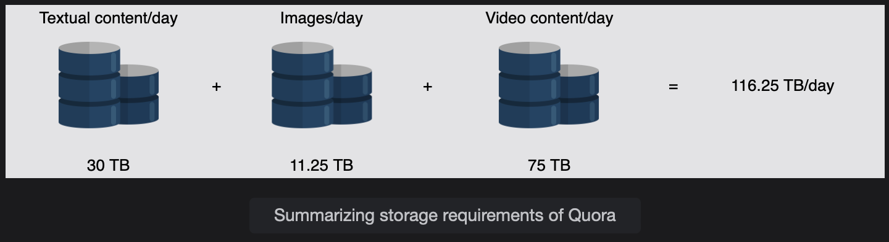
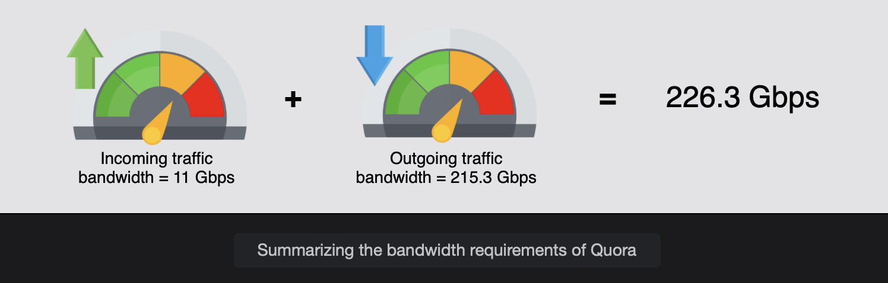
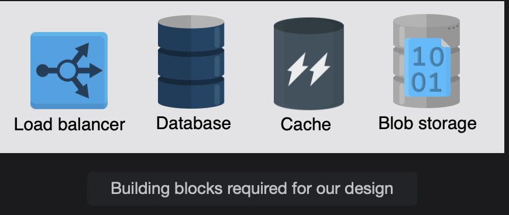

# Requirements of Quora's Design

Learn about the requirements for designing Quora.

> We'll cover the following:
>
> - Requirements
>   - Functional requirements
>   - Non-functional requirements
> - Resource estimation
>   - Number of servers estimation
>   - Storage estimation
>   - Bandwidth estimation
> - Building blocks we will use

## Requirements

Let's understand the functional and non-functional requirements below:

#### Functional requirements

A user should be able to perform the following functionalities:

- **Question and answers:**  
   Users can ask questions and give answers. Questions and answers can include images and videos.
- **Upvote/downvote and comment:**  
   It is possible for users to upvote, downvote, and comment on answers.
- **Search:**  
   Users should have a search feature to find questions already asked on the platform by other users.
- **Recommendation system:**  
   A user can view their feed, which includes topics they're interested in.  
   The feed can also include questions that need answers or answers that interest the reader.  
   The system should facilitate user discovery with a recommender system.
- **Ranking answers:**
  We enhance user experience by ranking answers accordingly to their usefulness.  
   The most helpful answer will be ranked highest and listed at the top.

#### Non-functional requirements

- **Scalability:**  
   The system should scale well as the number of features and users grow with time.  
   It means that the performance and usability should not be impacted by an increasing number of users.
- **Consistency:**  
   The design should ensure that different user's views of the same content should be consistent.  
   In particular, critical content questions and answers should be same for any collection of viewers.  
   However, it is not necessary that all users of Quora see a newly posted question, answer, or comment right away.
- **Availability:**  
   The system should hava high availability. This applies to cases where servers receive a large number of concurrent requests.
- **Performance:** .
  The system should provide a smooth experience to the user without a noticeable delay.

## Resource estimation

Make an estimate about the resources requirements for Quora service. We'll make assumptions to get a practical and tractable estimate. We'll estimate the number of servers, the storage, and the bandwidth required to facilitate a large number of users.

**Assumptions:** Underlying assumptions to base our estimate.

- There are a **total of 1 billion users**(100 crore users), out of which **300 million(30 crore) are daily active users**.
- Assume **15% of questions have an image**, and **5% of questions have a video embedded** in them. A question cannot have both at the same time.
- We'll assume an **image is estimated to be 250 KBs**, and a **video is considered 5 MBs**.

#### Number of servers estimation

Since we have 300 million daily active users for Quora.  
Considering our assumption of using daily active users as a proxy for the number of requests per second to find the number of servers for peak load times, we get 300 million requests per second.  
Then, we use the following formula to calculate the number of servers:

        servers needed at peak time = (Number of requests/second) / (RPS of server)

Using 64,000 as an estimated RPS a server can handle, the required servers are estimated as follows:

        servers needed at peak load = (300 million) / 64000 = 4687.5 ~ 4.7K servers

#### Storage estimation

Let's keep in mind our assumptions that 15% of questions have images and 5% have videos.  
 So, we'll make the following assumptions to estimate the storage requirements for our design:

- Each of the 300 million active users posts 1 question in a day, and each question has 2 responses on average, 10 upvotes, and 5 comments in total.
- The collective storage required for the textual content (including the question, answer(s), and comment(s) text) of one question equals 100 KB.

> The following are the default calculations:
>
> - Total questions: 300 M \* 1 = 300 \* 10^6 questions per day
> - Storage required for textual content of all questions in one day: 300 \* M \* 1 \* 10^3 B = 30 TB
> - Storage required for images for one day: ((300 \* 10^6 \* 15) / 100) \* 250 \* 10^3 B = 11.25 TB
> - Strage required for video content for one day: ((300 \* 10^6 \* 5) / 100) \* 5 \* 10^6 B = 75
>
> Total Storage = 30 TB + 11.25 TB + 75 TB = 116.25 TB/day
>
> 

The daily storage requirements of Quora seem very high. But for service with 300 million DAU, a yearly requirement of 116.25 TB \* 365 = 42.43 PB is feasible.  
 The practical requirement will be much higher because we have disregarded the storage required for a number of things.  
 For example, non-active (out of 1 B users' data will require storage.)

#### Bandwidth estimation

The bandwidth estimate requires the calculation of incoming and outgoing data through the network.

- **Incoming traffic:**  
   The incoming traffic bandwidth required per day will be equal to (116.25 TB / 86400) \* 8 = 10.9 Gbps ~ 11 Gbps
- **Outgoing traffic:**  
   We have assumed that 300 million active users views 20 questions per day, so the total bandwidth requirements can be found below.
  > 300 M \* 20 questions = 6 billion questions are viewed per day.  
  > Questions viewed per second: (6 _ 10^9) / 86400 = 69.4 _ 10^3 questions are viewed per second.  
  > Bandwidth for the textual content of all questions and their answers: 69.4 \* 10^3 \* 100 \* 10^3 \* 8 bits = 55.56 Gbps  
  > Bandwidth for the 5% of content that contains video per second: 69.4 \* 10^3 \* 5/100 \* 5 \* 10^6 \* 8 bits = 138.8 Gbps  
  > Total outgoing traffic bandwidth: 55.56 Gbps + 20.82 Gbps + 138/9 Gbps = 215.3 Gbps

We will use rounding at each step in the explanation.  
 The answer in the calculator above are slightly different due to rounding.

> Incoming + outgoing traffic bandwidth = 11 Gbps + 215.3 Gbps = 226.3 Gbps

## Building blocks we will use

- **Load balancers** will be used to divide the traffic load among the service hosts.
- **Databases** are essential for storing all sorts of data, such as user questions and answers, comments, and likes and dislikes.
  Also, user data will be stored in the databases. We may use different types of databases to store different data.
- **A distributed caching system** will be used to store frequently accessed data. We can also use caching to store our view counters for different questions.
- **The blob store** will keep images and video files.
