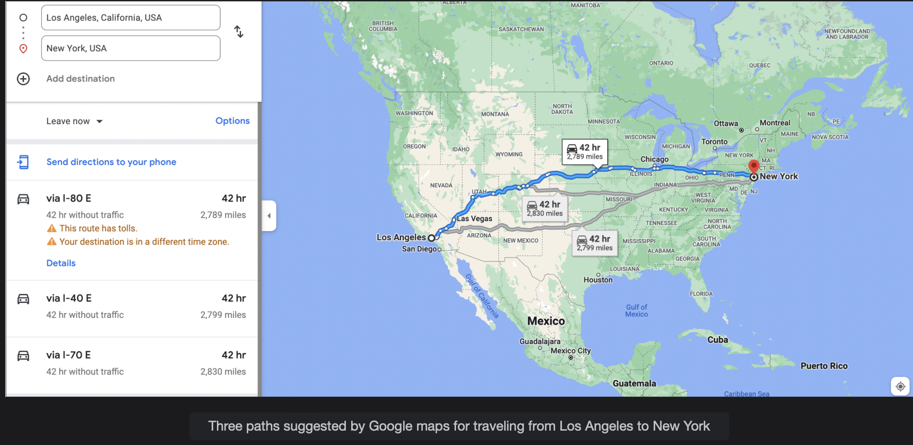

# System Design: Google Maps

Understand the basics of a Google Maps system.

> We'll cover the following
>
> - What is Google Maps?
> - When do we use a maps service?
> - How will we design Google Maps?

## What is Google Maps?

Let’s introduce the problem by assuming that we want to travel from one place to another. Here are the possible things that we might want to know:

What are the best possible paths that take us to our destination, depending on the vehicle type we’re using?
How long in miles is each path?
How much time does each path take to get us to our destination?
A maps application (like Google Maps or Apple Maps) enables users to answer all of the above questions easily. The following illustration shows the paths calculated by Google maps from “Los Angeles, USA” to “New York City, USA.”

## When do we use a maps service?

Individuals and organizations rely on location data to navigate around the world. Maps help in these cases:

Individuals can find the locations of and directions to new places quickly, instead of wasting their time and the costs of travel, such as gas.
Individuals use maps to see their estimated time of arrival (ETA) and the shortest path based on current traffic data.
Many modern applications rely heavily on maps, such as ride-hailing services, autonomous vehicles, and hiking maps. For example:
Waymo’s self-driving car system uses Google Maps to navigate efficiently, quickly, and safely.
Uber uses Google Maps as part of its application to assist drivers and provide customers with a visual representation of their journey.
Routing and logistics-based companies reduce the time it takes to make deliveries. By using a map’s unique real-time and historical traffic data, it minimizes the overall cost of deliveries by reducing gas usage and time spent stuck in traffic.
In 2022, more than five million businesses are using Google Maps. It provides an API for enterprises to use a map system in their application.

---

It’s time to showcase your understanding! Challenge yourself and see how well you can identify four different building blocks in Google Maps through our interactive assessment. Several building blocks can be considered for the system design of Google Maps. Recognize these building blocks based on the following requisite functionalities and provide your answers in the AI widget given below:

There is a need to search various locations on the map.
Storing metadata in the format of key-value pairs is essential for efficient data management.
The system should be adept at generating and handling events, and notifying other services when necessary.
To effectively represent road data, the system requires a structured graph format for storing and retrieving information.
You can challenge yourself to identify the building blocks without reading the functional and nonfunctional requirements given below as a hint.

Remember, you need to identify the core building blocks and justify their necessity.

Answer: The four key building blocks required to design a system like Google Maps are: a) A distributed search service or system to search different places on the map. b) Key-value store for storing metadata information. c) Pub-sub system to generate and respond to important events during navigation and notify the corresponding services. d) Graph databases to store road data from various sources in the form of a graph. These components work together to provide the functionality and performance needed for a complex system like Google Maps.

The four key building blocks required to design a system like Google Maps are: a) A distributed search service or system to search different places on the map. b) Key-value store for storing metadata information. c) Pub-sub system to generate and respond to important events during navigation and notify the corresponding services. d) Graph databases to store road data from various sources in the form of a graph. These components work together to provide the functionality and performance needed for a complex system like Google Maps.

---

## How will we design Google Maps?

We divide the design of Google Maps into five lessons:

Requirements: In this lesson, we’ll list the functional and non-functional requirements of a Google Maps system. We will also identify the challenges involved in designing such a system. Lastly, we’ll estimate the resources like servers and bandwidth needed to serve queries by millions of users.
Design: This lesson consists of the high-level and API design of a system like Google maps. We’ll describe the services and the workflow of the system.
Meeting the challenges: We will discuss how we overcome the challenges that we highlighted in the requirements lesson.
Detailed design: Based on the solution to the challenges, we will improve our earlier design and also elaborate on different aspects of it. We will describe the detailed design, including storage schema.
Evaluation: This lesson explains how our designed Google Maps system fulfills all the requirements.
Let’s start by understanding the requirements for designing a system like Google Maps.
