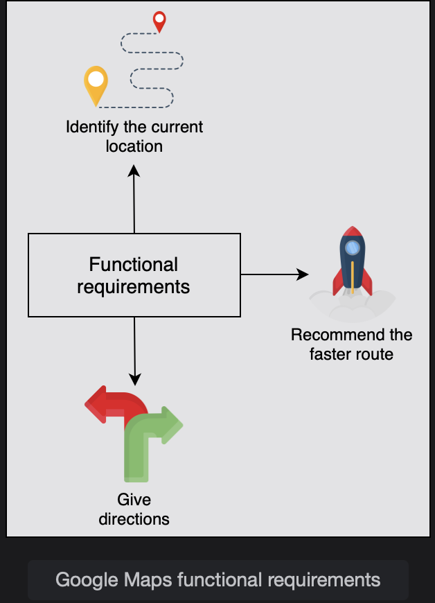
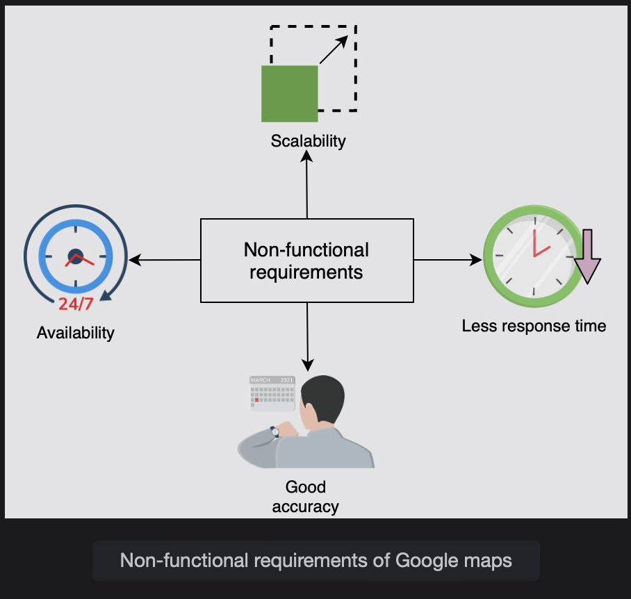
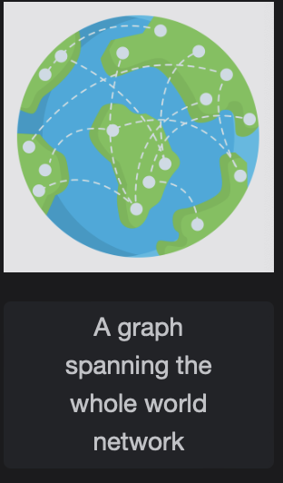
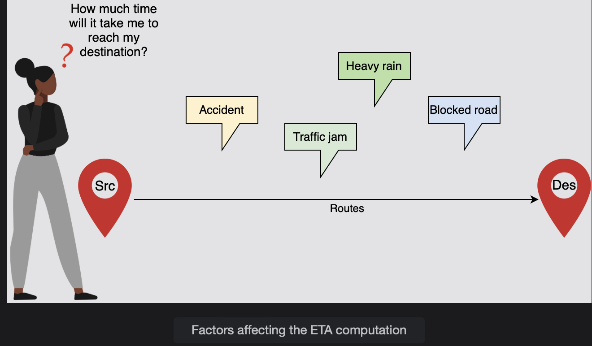
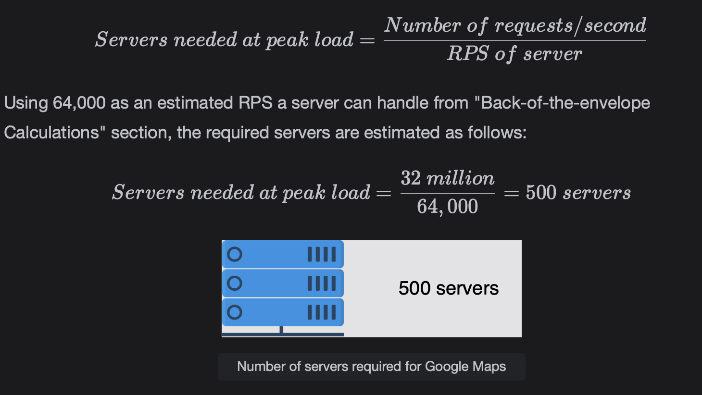
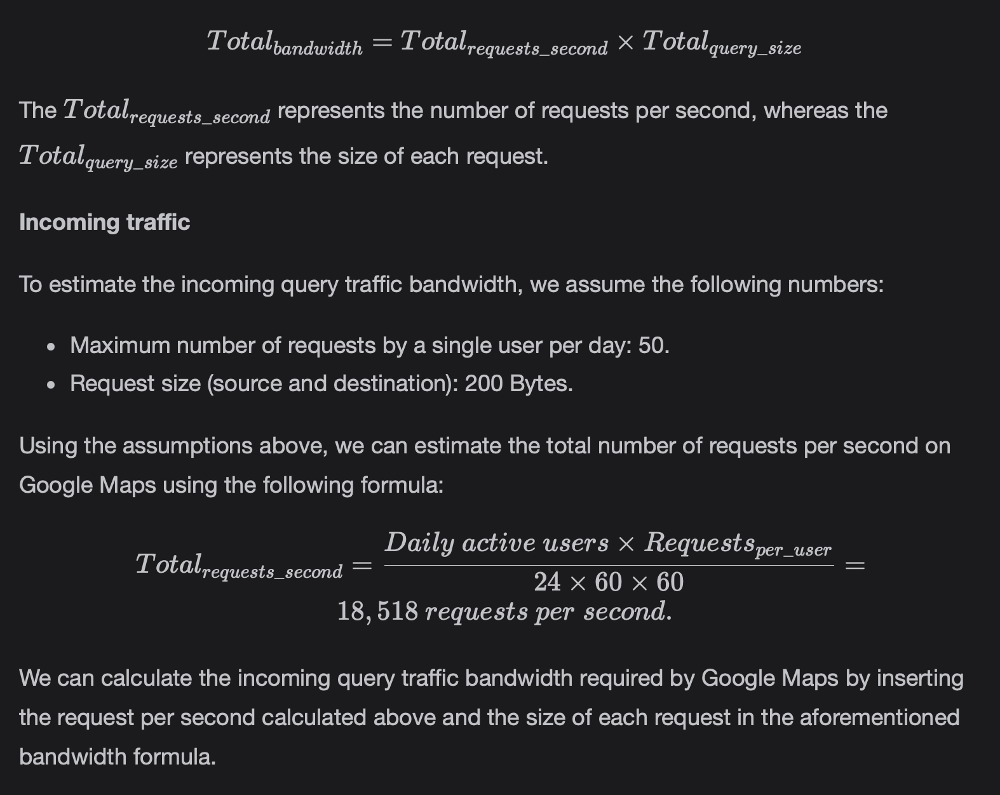
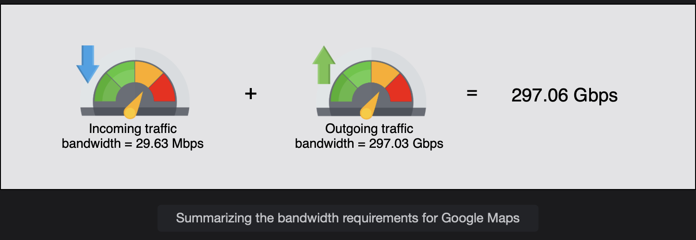
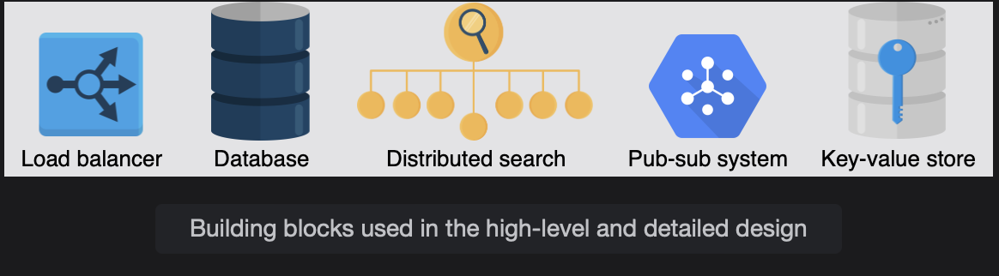

# Requirements of Google Maps' Design

Understand the requirements to design a maps application like Google Maps.

> We'll cover the following
>
> - Requirements
>   - Functional requirements
>   - Non-functional requirements
> - Challenges
> - Resource estimation
>   - Number of servers estimation
>   - Storage estimation
>   - Bandwidth estimation
> - Building blocks we will use

## Requirements

Before we start requirements, let’s clarify that we will design a system like Google Maps by picking a few key features because actual Google Maps is feature-rich and complex.

Let’s list the functional and non-functional requirements of the system under design.

#### Functional requirements

The functional requirements of our system are as follows.

Identify the current location: Users should be able to approximate their current location (latitude and longitude in decimal values) on the world map.
Recommend the fastest route: Given the source and destination (place names in text), the system should recommend the optimal route by distance and time, depending on the type of transportation.
Give directions: Once the user has chosen the route, the system should list directions in text format, where each item in the list guides the user to turn or continue in a specific direction to reach the destination.

## Non-functional requirements

The non-functional requirements of our system are as follows.

Availability: The system should be highly available.
Scalability: It should be scalable because both individuals and other enterprise applications like Uber and Lyft use Google Maps to find appropriate routes.
Less response time: It shouldn’t take more than two or three seconds to calculate the ETA and the route, given the source and the destination points.
Accuracy: The ETA we predict should not deviate too much from the actual travel time.

## Challenges

Some of the challenges that we need to focus on while designing a system like Google Maps are below:

Scalability: Serving millions of queries for different routes in a second, given a graph with billions of nodes and edges spanning over 194 countries, requires robust scalability measures. A simple approach, given the latitude and longitude of the source and destination, would be to apply an algorithm like Dijkstra to find the shortest path between the source and the destination. However, this approach wouldn’t scale well for billions of users sending millions of queries per second. This is because running any path-finding algorithm on a graph with billions of nodes running a million times per second is inefficient in terms of time and cost, ultimately leading to a bad user experience. Therefore, our solution needs to find alternative techniques to scale well.  

ETA computation: In an ideal situation with empty roads, it’s straightforward to compute ETA using the distance and the speed of the vehicle we want to ride on. However, we cannot ignore factors like the amount of traffic on the roads and road conditions, which affect the ETA directly. For example, a road under construction, collisions, and rush hours all might slow down traffic. Quantifying the factors above to design our system is not trivial. Therefore, we’ll, categorize the factors above in terms of traffic load to complete our design.  

## Resource estimation

Let’s estimate the total number of servers, storage, and bandwidth required by the system.

#### Number of servers estimation

To estimate the number of servers, we need to know the number of daily active users of Google Maps. Let’s assume that we have 32 million daily active users of Google Maps. Considering our assumption of using daily active users as a proxy for the number of requests per second, we get 32 million requests per second. Then, we use the following formula to calculate the number of servers:

#### Storage estimation

Google Maps is essentially a system with a one-time storage requirement. The road data from many countries has already been added, which is over 20 petabytes as of 2022. Since there are minimal changes on the road networks, the daily storage requirement is going to be negligible for Google Maps. Also, short-term changes in the road network is a small amount of data as compared to the full network data. Therefore, our storage needs don’t change rapidly.

#### Bandwidth estimation

As a standard practice, we have to estimate the bandwidth required for the incoming and outgoing traffic of our system. Most of the bandwidth requirements for Google Maps are due to requests sent by users. Therefore, we’ve devised the following formula to calculate bandwidth:

###### Outgoing traffic

Outgoing application traffic will include the response that the server generates for the user when they make a navigation request. The response consists of visuals and textual content, and typically includes the route shown on the map, estimated time, distance, and more detail about each step in the route. We assume the following numbers to estimate the outgoing traffic bandwidth:

Total requests per second (calculated above): 18,518.
Response size: 2 MB + 5 KB = 2005 KB.
Size of visual data on average: 2 MB.
Size of textual data on average: 5 KB.

## Building blocks we will use

Now that we’ve completed our estimates of resources required, let’s identify the building blocks that will be an integral part of our design for the Google Maps system. Below, we have the key building blocks:

- Load balancers are necessary to distribute user requests among different servers and services.
- Databases are required to store data in the form of a graph along with metadata information.
- Distributed search is needed to search different places on the map.
- A pub-sub system is required for generating and responding to important events during navigation and notifying the corresponding services.
- A key-value store is also used to store some metadata information.

Besides the building blocks mentioned above, other components will also be required for designing our maps system. These components will be discussed in the design lessons. We are now ready to explore the system and API design of Google Maps.
