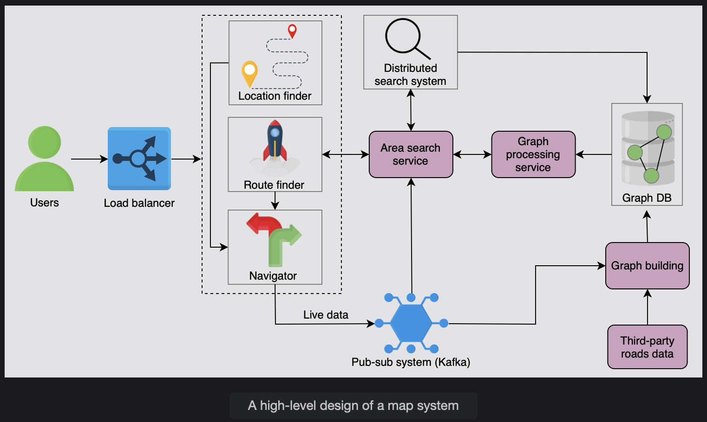

# Design of Google Maps

> We'll cover the following
>
> - High-level design
>   - Components
>   - Workflow
> - API design

## High-level design

Let’s start with the high-level design of a map system. We split the discussion into two sections:

1. The components we’ll need in our design.
2. The workflow that interconnects these components.

#### Components

We’ll use the following components in our design:

- Location finder: The location finder is a service used to find the user’s current location and show it on the map since we can’t possibly personally remember the latitude and longitude for every place in the world.
- Route finder: The route finder service is used to find the paths between two locations or points. It shows the path on the map to users, who are new to a place and needs help with navigation.
- Navigator: Suggesting a route through the route finder is not enough. A user may deviate from the optimal path. In that case, a navigator service is used. This service keeps track of users’ journeys and sends updated directions and notifications to the users as soon as they deviate from the suggested route.
- GPS/Wi-Fi/Cellular technology: These are the technologies that we used to find the user’s ground position.
- Distributed search: For converting place names to latitude/longitude values, we need a conversion system behind the source and destination fields. A distributed search maintains an index consisting of places names and their mapping to latitude and longitude. User’s entered keywords are searched using this service to find a location on the map.
- Area search service: The area search service coordinates between distributed search and graph processing services. It efficiently obtains the shortest path between two points by reducing the search space to a particular area, spanning the source and the destination points. The area search service requests the distributed search service to obtain the locations of the source and destination on the map. Then, it finds the area spanning these two points. Next, it will use the graph processing service to run the shortest path search on the subgraph of the located area to find the optimal path from the source to the destination.
- Graph processing service: There can be multiple paths from one place to another. The graph processing service runs the shortest path algorithm on a shorter graph based on the area spanning the source and destination points and helps us determine which path to follow.
- Database: As discussed in the previous lesson, we have the road data from various sources stored in the form of a graph. We’ll map this data to a database to develop the road network graph. We’re using a graph database like DataStax Graph to store the graph for our design.
- Pub-sub system: Users might deviate from the first suggested path. In that case, they’ll need information on a new path to their destination. Pub-sub is a system that listens to various events from a service and triggers another service accordingly. For example, when a user deviates from the suggested path, it pings the area search service to find a new route from the user’s current location to their destination point. It also collects the streams of location data for different users from the navigator. This data can be processed later to find traffic patterns on different roads at different times. We’ll use Kafka as a pub-sub system in our design.
- Third-party road data: How can we build a map system if we don’t have the road networks data? We need to collect the road data from third-party resources and preprocess the collected data to bring it into a single format that can be utilized to build the graph.
- Graph building: We’ll use a service that builds the graph from the given data, either collected from the third-party resources or from the users.
  User: This refers to a person or a program that uses the services of the map system.
- Load balancer: This is a system that is used to distribute user requests among different servers and services.

The illustration below shows how the above components are connected.

#### Workflow

We explain the workflow by assuming that a user has to travel between two points but doesn’t know their current location or how to get to their destination. So, let’s see how the maps system helps.

> For this exercise, we assume that the data about road networks and maps has already been collected from the third parties and the graph is built and stored in the Graph DB.

- In a maps system, the user has to enter their starting point and their destination to create a path between the two. For the starting source point, the user uses the current location service.
- The location finder determines the current location by maintaining a persistent connection with the user. The user will provide an updated location using GPS, Wi-Fi, and cellular technology. This will be the user’s source point.
- For the destination point, the user types an address in text format. It’s a good idea to make use of our Typeahead service here to provide useful suggestions and avoid spelling mistakes.
- After entering the source and the destination points, the user requests the optimal path.
- The user’s path request is forwarded to the route-finder service.
  - The route finder forwards the requests to an area search service with the source and the destination points.
  - The area search service uses the distributed search to find the latitude/longitude for the source and the destination. It then calculates the area on the map spanning the two (source’s and destination’s) latitude/longitude points.
  - After finding the area, the area search service asks the graph processing service to process part of the graph, depending on the area to find the optimal path.
  - The graph processing service fetches the edges and nodes within that specified area from the database, finds the shortest path, and returns it to the route-finder service that visualizes the optimal path with the distance and time necessary to comeplete the route. It also displays the steps the user should follow for navigation.
- Now that the user can visualize the shortest path on the map, they also want to get directions towards the destination. The direction request is handled by the navigator.
- The navigator tracks that the user is following the correct path, which it has from the route-finder service. It updates the user’s location on the map while the user is moving, and shows where to turn with the distance. If a user deviates from the path, it generates an event that is fed to Kafka.
- Upon receiving the event from the navigator, Kafka updates the subscribed topic of the area search service, which in turn recalculates the optimal path and suggests it to the user. The navigator also provides a stream of live location data to the graph, building it through the pub-sub system. Later, this data can be used to improve route suggestions provided to the users.

---

How can real-time traffic congestion data be collected and seamlessly integrated into the route-finding process of a mapping system like Google Maps?

To collect real-time congestion data, we can utilize GPS readings from user devices, ensuring privacy is maintained. Additionally, traffic sensors on roads and incident reports can serve as valuable data sources. This data can be integrated into the route-finding process by updating the weights of the edges in the graph that represents the map. This might involve using a time-dependent shortest path algorithm to account for the varying traffic conditions at different times of the day, ensuring that the routing is dynamic and reflects current traffic conditions accurately.

---

## API design

Let’s look at different APIs for the maps service.

- Show the user’s current location on the map

The currLocation function displays the user’s location on the map.

        currLocation(location)

location - This depicts whether the user location is on or off. This call will establish a persistent connection between the client and the server, where the client will periodically update the server about its current location. If the location is false, the service requests the user to turn on their location

- Find the optimal route

The findRoute function helps find the optimal route between two points.

        findRoute(source, destination, transport_type)

source - this is the place (in text format) where the users want to start their journey.  
destination - this is the place (in text format) where the users want to end their journey.  
transport_type (optional) - this can be a bicycle, car, airplane, and so on. The default transport type is set to a car if the user doesn't provide this parameter.

- Get directions

The directions function helps us get alerts in the form of texts or sounds that indicate when and where to turn next.

        directions(curr_location)

current_location - this is the latitude/longitude value of the user's current location on the map.

We described the high-level design by explaining the services we will need. We also discussed API design. Next, we’ll discuss how we met the scalability challenge through segments.
